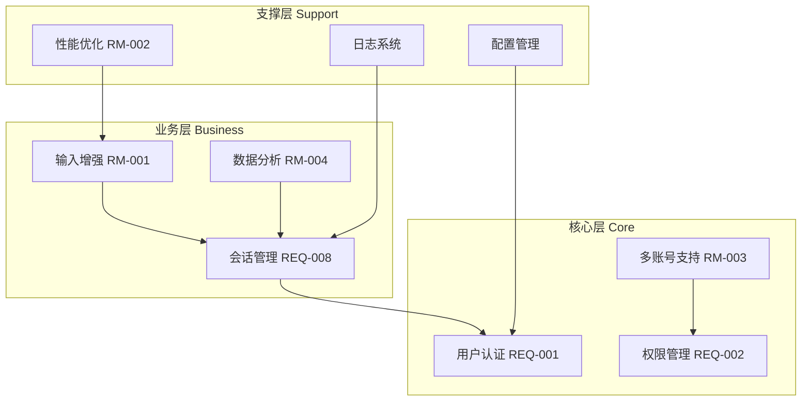
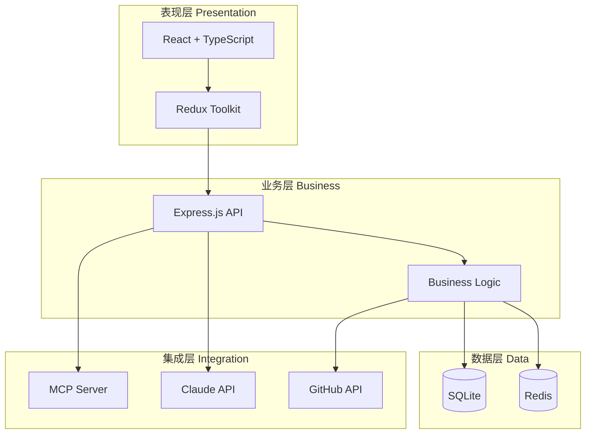
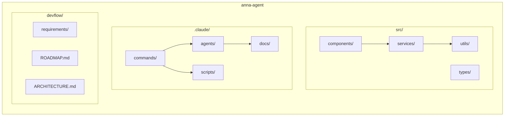
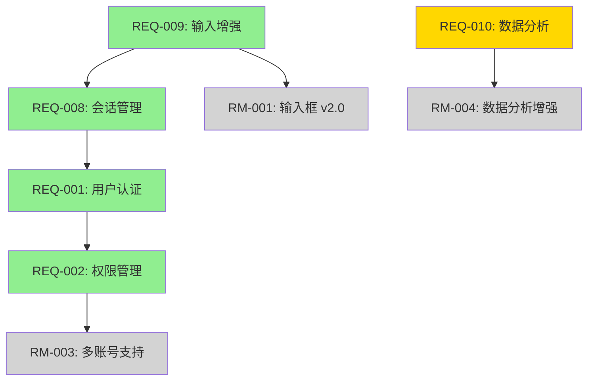

# Project Architecture: {{PROJECT_NAME}}

**Version**: {{VERSION}}
**Created**: {{CREATED_DATE}} 北京时间
**Updated**: {{UPDATED_DATE}} 北京时间
**Architecture Type**: {{ARCH_TYPE}}
**Deployment Model**: {{DEPLOYMENT_MODEL}}

**Input**:
- devflow/ROADMAP.md (路线图，包含所有 RM-IDs 和需求)
- devflow/requirements/REQ-*/TECH_DESIGN.md (已有需求的技术设计)
- devflow/project.md (技术栈信息)
- devflow/ARCHITECTURE.md (如果存在，用于更新模式)

**Prerequisites**: ROADMAP.md 已生成，至少有 1 个已完成的需求

## Execution Flow (Architecture 生成流程)
```
1. Load inputs
   → Read devflow/ROADMAP.md (extract RM-IDs, dependencies)
   → Read devflow/requirements/REQ-*/TECH_DESIGN.md (analyze tech stack, modules)
   → Read devflow/project.md (extract tech stack)
   → Check if devflow/ARCHITECTURE.md exists (update vs create mode)

2. Load ARCHITECTURE_TEMPLATE.md
   → Read template from .claude/docs/templates/ARCHITECTURE_TEMPLATE.md
   → Prepare to fill all sections

3. Analyze architecture type
   → Extract from project.md or infer from requirements
   → Architecture Type: Monolith | Microservices | Frontend-Backend | Serverless
   → Deployment Model: Desktop | Web | Mobile | CLI | Hybrid
   → Fill header metadata

4. Analyze tech stack
   → From project.md: extract Frontend, Backend, Database, Integration technologies
   → From TECH_DESIGN.md: extract additional libraries, frameworks
   → Organize by layer (Presentation, Business, Data, Integration)

5. Generate Diagram 1: Feature Architecture (功能架构图)
   → From ROADMAP.md: extract all RM-IDs and REQ-IDs
   → Group related features into clusters (Core, Business, Support)
   → Identify dependencies from ROADMAP.md dependency graph
   → Generate Mermaid graph syntax
   → Validate syntax (no missing brackets, valid node IDs)

6. Generate Diagram 2: Technical Architecture (技术架构图)
   → Design layered architecture (Presentation → Business → Data → Integration)
   → Map technologies to layers from tech stack analysis
   → Show interactions between layers
   → Generate Mermaid graph syntax
   → Validate syntax

7. Generate Diagram 3: Module Structure (模块划分图)
   → Scan actual codebase structure (src/, .claude/, devflow/, etc.)
   → Identify key directories and their relationships
   → Generate Mermaid graph syntax
   → Validate syntax

8. Generate Diagram 4: Requirement Dependency (需求依赖图)
   → From ROADMAP.md: extract dependency relationships
   → Include both REQ-to-RM and RM-to-RM dependencies
   → Color-code by status:
      • Completed REQs: #90EE90 (green)
      • In-progress REQs: #FFD700 (gold)
      • Planned RMs: #D3D3D3 (gray)
   → Generate Mermaid graph syntax
   → Validate syntax

9. Fill Architecture Decision Records (ADR)
   → For each major architectural decision:
      • What: Decision made
      • Why: Rationale
      • When: Date
      • Impact: Consequences
   → Include decisions from TECH_DESIGN.md
   → Format as structured sections

10. Validate completeness
    → All 4 diagrams generated
    → All Mermaid syntax valid
    → No {{PLACEHOLDER}} remaining
    → Architecture reflects ROADMAP.md content
    → If incomplete: ERROR "Complete missing sections"

11. Write devflow/ARCHITECTURE.md
    → Write complete file
    → Use UTF-8 encoding
    → Ensure markdown formatting correct

12. Return: SUCCESS (ARCHITECTURE.md generated)
```

**重要**: 这是一个自执行模板。architecture-designer agent 应该按照 Execution Flow 生成完整的 ARCHITECTURE.md 文件。

---

## 架构类型

- **应用类型**: {{ARCH_TYPE}}
  - Monolith (单体应用)
  - Microservices (微服务)
  - Frontend-Backend Separation (前后端分离)
  - Serverless (无服务器)

- **部署方式**: {{DEPLOYMENT_MODEL}}
  - Desktop Application (桌面应用 - Electron)
  - Web Application (Web 应用)
  - Mobile Application (移动应用)
  - CLI Tool (命令行工具)
  - Hybrid (混合模式)

---

## 技术栈

### Frontend
{{FRONTEND_STACK}}

_示例:_
- **Framework**: React 18 + TypeScript
- **State Management**: Redux Toolkit
- **UI Library**: Ant Design
- **Build Tool**: Vite

### Backend
{{BACKEND_STACK}}

_示例:_
- **Runtime**: Node.js 20
- **Framework**: Express.js
- **Language**: TypeScript
- **API Style**: RESTful

### Database
{{DATABASE_STACK}}

_示例:_
- **Primary**: SQLite (embedded)
- **Cache**: Redis (optional)
- **Migration**: Knex.js

### Integration
{{INTEGRATION_STACK}}

_示例:_
- **AI**: Claude API
- **MCP**: Model Context Protocol Servers
- **External APIs**: GitHub API, npm Registry

### DevOps & Tools
{{DEVOPS_STACK}}

_示例:_
- **Package Manager**: npm
- **Testing**: Jest + React Testing Library
- **Linting**: ESLint + Prettier
- **Build**: Electron Builder

---

## 1. 功能架构图（Feature Architecture）

### 核心模块划分

本项目按照功能领域划分为三层架构：

- **核心层 (Core)**: 提供基础认证、权限、安全等核心能力
- **业务层 (Business)**: 实现具体业务功能，如会话管理、数据处理
- **支撑层 (Support)**: 提供配置、日志、监控等支撑服务

{{FEATURE_ARCHITECTURE_DESCRIPTION}}

### 架构图

```mermaid
graph TB
    subgraph "核心层 Core"
        {{CORE_MODULE_1}}[{{CORE_LABEL_1}}]
        {{CORE_MODULE_2}}[{{CORE_LABEL_2}}]
    end

    subgraph "业务层 Business"
        {{BUSINESS_MODULE_1}}[{{BUSINESS_LABEL_1}}]
        {{BUSINESS_MODULE_2}}[{{BUSINESS_LABEL_2}}]
        {{BUSINESS_MODULE_3}}[{{BUSINESS_LABEL_3}}]
    end

    subgraph "支撑层 Support"
        {{SUPPORT_MODULE_1}}[{{SUPPORT_LABEL_1}}]
        {{SUPPORT_MODULE_2}}[{{SUPPORT_LABEL_2}}]
    end

    {{BUSINESS_MODULE_1}} --> {{CORE_MODULE_1}}
    {{BUSINESS_MODULE_2}} --> {{CORE_MODULE_2}}
    {{BUSINESS_MODULE_3}} --> {{BUSINESS_MODULE_1}}
    {{SUPPORT_MODULE_1}} --> {{CORE_MODULE_1}}
```

_填充规则:_
- Module ID 格式: 无空格无破折号（例如: `Auth`, `Session`, `Config`）
- Label 格式: 中文简短描述（例如: `用户认证`, `会话管理`）
- 箭头表示依赖关系：A → B 表示 A 依赖 B
- 从 ROADMAP.md 提取模块名称和依赖关系

_示例（完整图）:_


---

## 2. 技术架构图（Technical Architecture）

### 分层设计

本项目采用经典四层架构，确保关注点分离和可维护性：

- **表现层 (Presentation)**: 用户界面和交互逻辑
- **业务层 (Business)**: 核心业务逻辑和规则
- **数据层 (Data)**: 数据持久化和访问
- **集成层 (Integration)**: 外部系统集成

{{TECHNICAL_ARCHITECTURE_DESCRIPTION}}

### 架构图

```mermaid
graph TB
    subgraph "表现层 Presentation"
        {{PRES_COMPONENT_1}}[{{PRES_LABEL_1}}]
        {{PRES_COMPONENT_2}}[{{PRES_LABEL_2}}]
    end

    subgraph "业务层 Business"
        {{BUS_COMPONENT_1}}[{{BUS_LABEL_1}}]
        {{BUS_COMPONENT_2}}[{{BUS_LABEL_2}}]
    end

    subgraph "数据层 Data"
        {{DATA_COMPONENT_1}}[{{DATA_LABEL_1}}]
        {{DATA_COMPONENT_2}}[{{DATA_LABEL_2}}]
    end

    subgraph "集成层 Integration"
        {{INT_COMPONENT_1}}[{{INT_LABEL_1}}]
        {{INT_COMPONENT_2}}[{{INT_LABEL_2}}]
    end

    {{PRES_COMPONENT_1}} --> {{PRES_COMPONENT_2}}
    {{PRES_COMPONENT_2}} --> {{BUS_COMPONENT_1}}
    {{BUS_COMPONENT_1}} --> {{BUS_COMPONENT_2}}
    {{BUS_COMPONENT_2}} --> {{DATA_COMPONENT_1}}
    {{BUS_COMPONENT_2}} --> {{DATA_COMPONENT_2}}
    {{BUS_COMPONENT_1}} --> {{INT_COMPONENT_1}}
    {{BUS_COMPONENT_1}} --> {{INT_COMPONENT_2}}
```

_填充规则:_
- 从技术栈部分提取组件（React, Express, SQLite, Claude API, etc.）
- Component ID: 技术简称无空格（例如: `UI`, `State`, `API`, `DB`）
- Label: 技术全称（例如: `React + TypeScript`, `SQLite`）
- 箭头表示调用关系或数据流向

_示例（完整图）:_


---

## 3. 模块划分图（Module Structure）

### 代码组织

本项目代码仓库按职责划分为以下主要模块：

{{MODULE_STRUCTURE_DESCRIPTION}}

### 架构图

```mermaid
graph LR
    subgraph "{{PROJECT_NAME}}"
        subgraph "{{DIR_GROUP_1}}"
            {{DIR_1_1}}[{{DIR_LABEL_1_1}}]
            {{DIR_1_2}}[{{DIR_LABEL_1_2}}]
            {{DIR_1_3}}[{{DIR_LABEL_1_3}}]
        end

        subgraph "{{DIR_GROUP_2}}"
            {{DIR_2_1}}[{{DIR_LABEL_2_1}}]
            {{DIR_2_2}}[{{DIR_LABEL_2_2}}]
            {{DIR_2_3}}[{{DIR_LABEL_2_3}}]
        end

        subgraph "{{DIR_GROUP_3}}"
            {{DIR_3_1}}[{{DIR_LABEL_3_1}}]
            {{DIR_3_2}}[{{DIR_LABEL_3_2}}]
        end
    end

    {{DIR_2_2}} --> {{DIR_2_1}}
    {{DIR_2_1}} --> {{DIR_2_3}}
```

_填充规则:_
- 扫描实际目录结构: src/, .claude/, devflow/, etc.
- Dir Group: 主要目录（例如: "src/", ".claude/"）
- Dir Label: 子目录名称（例如: "components/", "services/"）
- 箭头表示依赖关系（可选）

_示例（完整图）:_


---

## 4. 需求依赖图（Requirement Dependency）

### 依赖关系

需求间依赖关系展示了功能演进的顺序和关系：

{{REQUIREMENT_DEPENDENCY_DESCRIPTION}}

### 架构图

```mermaid
graph TD
    {{REQ_NODE_1}}[{{REQ_LABEL_1}}] --> {{REQ_NODE_2}}[{{REQ_LABEL_2}}]
    {{REQ_NODE_2}} --> {{RM_NODE_1}}[{{RM_LABEL_1}}]
    {{REQ_NODE_3}}[{{REQ_LABEL_3}}] --> {{RM_NODE_2}}[{{RM_LABEL_2}}]

    style {{REQ_NODE_1}} fill:#90EE90
    style {{REQ_NODE_2}} fill:#90EE90
    style {{REQ_NODE_3}} fill:#FFD700
    style {{RM_NODE_1}} fill:#D3D3D3
    style {{RM_NODE_2}} fill:#D3D3D3
```

_填充规则:_
- 从 ROADMAP.md 的 Dependency Graph 提取依赖关系
- Node ID: 去除破折号（REQ001, REQ010, RM001）
- Node Label: 带破折号和标题（`REQ-001: 用户认证`）
- 颜色编码:
  - #90EE90 (浅绿): 已完成的 REQ
  - #FFD700 (金色): 进行中的 REQ
  - #D3D3D3 (浅灰): 计划中的 RM
- 箭头方向: 依赖项 → 被依赖项

_示例（完整图）:_


---

## 架构决策记录（Architecture Decision Records）

### ADR-{{ADR_NUMBER}}: {{DECISION_TITLE}}

- **日期**: {{ADR_DATE}} 北京时间
- **状态**: {{ADR_STATUS}} (Proposed | Accepted | Deprecated | Superseded)
- **决策者**: {{DECISION_MAKER}}

**背景 (Context)**:
{{ADR_CONTEXT}}

**决策 (Decision)**:
{{ADR_DECISION}}

**理由 (Rationale)**:
{{ADR_RATIONALE}}

**影响 (Consequences)**:
- **正面影响**:
  - {{POSITIVE_CONSEQUENCE_1}}
  - {{POSITIVE_CONSEQUENCE_2}}

- **负面影响**:
  - {{NEGATIVE_CONSEQUENCE_1}}
  - {{NEGATIVE_CONSEQUENCE_2}}

- **中性影响**:
  - {{NEUTRAL_CONSEQUENCE_1}}

**替代方案 (Alternatives Considered)**:
1. {{ALTERNATIVE_1}}
   - 优势: {{ALT_1_PROS}}
   - 劣势: {{ALT_1_CONS}}
   - 为何未选择: {{ALT_1_REASON}}

---

_填充规则:_
- ADR Number: 序号 001, 002, 003...
- 从 TECH_DESIGN.md 提取架构决策
- Status: 标记决策的当前状态
- Context: 说明为什么需要做这个决策（问题或需求）
- Decision: 明确说明做了什么决策
- Rationale: 为什么选择这个决策（技术、业务、团队等因素）
- Consequences: 这个决策带来的影响（好的、坏的、中性的）
- Alternatives: 考虑过但未选择的其他方案

_示例:_

### ADR-001: 选择 Electron 作为桌面应用框架

- **日期**: 2024-12-01 北京时间
- **状态**: Accepted
- **决策者**: Tech Team

**背景**: 需要开发跨平台桌面应用，支持 macOS、Windows、Linux。

**决策**: 使用 Electron 框架构建桌面应用。

**理由**:
- 团队熟悉 Web 技术栈（React + TypeScript）
- Electron 拥有成熟的生态系统和社区支持
- 可复用 Web 开发经验和组件库
- VS Code、Slack 等成功案例证明其可行性

**影响**:
- **正面影响**:
  - 开发效率高，团队无需学习新技术栈
  - 跨平台支持开箱即用
  - 丰富的第三方库和工具

- **负面影响**:
  - 内存占用较高（Chromium 内核）
  - 应用包体积较大（100MB+）
  - 启动速度相对原生应用较慢

- **中性影响**:
  - 需要额外关注性能优化

**替代方案**:
1. **Tauri (Rust + Web)**
   - 优势: 更小的包体积、更低的内存占用
   - 劣势: 团队不熟悉 Rust、生态系统相对不成熟
   - 为何未选择: 学习成本高，时间紧迫

2. **原生开发（Swift/Kotlin/C++）**
   - 优势: 性能最优、用户体验最佳
   - 劣势: 需要为每个平台单独开发，成本高
   - 为何未选择: 资源有限，无法支撑多平台原生开发

---

## 架构演进路径

### 当前状态（As-Is）

{{CURRENT_STATE}}

_描述当前架构的状态、已实现的功能模块、技术债务等_

### 目标状态（To-Be）

{{TARGET_STATE}}

_根据 ROADMAP.md 描述未来 3 个月的目标架构状态_

### 演进计划

| Phase | Timeline | Focus | Key Changes |
|-------|----------|-------|-------------|
| Phase 1 | {{PHASE_1_TIMELINE}} | {{PHASE_1_FOCUS}} | {{PHASE_1_CHANGES}} |
| Phase 2 | {{PHASE_2_TIMELINE}} | {{PHASE_2_FOCUS}} | {{PHASE_2_CHANGES}} |
| Phase 3 | {{PHASE_3_TIMELINE}} | {{PHASE_3_FOCUS}} | {{PHASE_3_CHANGES}} |

_填充规则:_
- 基于 ROADMAP.md 的季度规划
- 描述架构如何随路线图演进
- 标注关键变化点（新增模块、重构、技术升级）

---

## 非功能性需求（NFRs）

### 性能要求

| Metric | Current | Target | Timeline |
|--------|---------|--------|----------|
| 应用启动时间 | {{CURRENT_STARTUP}} | {{TARGET_STARTUP}} | {{STARTUP_TIMELINE}} |
| 内存占用 | {{CURRENT_MEMORY}} | {{TARGET_MEMORY}} | {{MEMORY_TIMELINE}} |
| API 响应时间 | {{CURRENT_API_LATENCY}} | {{TARGET_API_LATENCY}} | {{API_TIMELINE}} |

### 可扩展性要求

{{SCALABILITY_REQUIREMENTS}}

_描述如何支持用户增长、数据增长、功能扩展_

### 安全要求

{{SECURITY_REQUIREMENTS}}

_描述认证、授权、加密、审计等安全机制_

### 可维护性要求

{{MAINTAINABILITY_REQUIREMENTS}}

_描述代码质量、测试覆盖率、文档完整性等要求_

---

## Validation Checklist

验证此架构文档是否完整：

- [ ] 所有 4 种架构图已生成
- [ ] 所有 Mermaid 代码语法正确
- [ ] 架构图反映 ROADMAP.md 内容
- [ ] 技术栈与 project.md 一致
- [ ] 至少有 1 条 ADR 记录
- [ ] 架构演进路径清晰
- [ ] NFRs 已定义

**Ready for Team Review**: {{READY_STATUS}}

_填充规则:_
- 每个 checkbox 应被标记为 `[x]` 或 `[ ]`
- Ready Status: YES | NO (with reasons)

---

**生成说明**:
1. 所有 `{{PLACEHOLDER}}` 必须被实际内容替换
2. 所有 Mermaid 代码必须语法正确且能渲染
3. 架构图应基于 ROADMAP.md 和实际代码结构生成
4. ADR 应从 TECH_DESIGN.md 提取或新创建
5. 所有日期使用北京时间 + ISO 8601 格式
