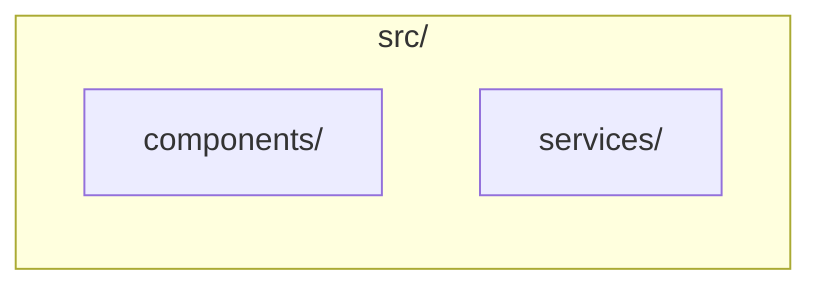

# Project Guidelines Generation System

**动态生成项目特定的开发指南技能**

## 概述

这个系统可以根据你的项目技术栈，自动生成定制化的开发指南（作为独立的 Claude Code skills）。

**核心理念**：职责分明 > 大而全

- `frontend-guidelines`: 前端专用技能（React/Vue/Angular）
- `backend-guidelines`: 后端专用技能（Express/Django/FastAPI）

## 快速开始

### 新项目

```bash
/core-guidelines
```

系统会询问你的技术栈选择，然后生成对应的指南。

### 现有项目

```bash
/core-guidelines
```

系统会自动检测你的技术栈，向你确认后生成指南。

### 只需前端或后端

```bash
/core-guidelines --frontend    # 只生成前端指南
/core-guidelines --backend     # 只生成后端指南
```

## 架构设计

### 文件结构

```
.claude/
├── skills/
│   ├── _reference-implementations/        # 参考实现（不激活）
│   │   ├── README.md
│   │   ├── frontend-react-mui/            # React+MUI 参考
│   │   └── backend-express-prisma/        # Express+Prisma 参考
│   │
│   ├── frontend-guidelines/               # 生成的前端技能
│   │   ├── SKILL.md
│   │   └── resources/
│   │
│   ├── backend-guidelines/                # 生成的后端技能
│   │   ├── SKILL.md
│   │   └── resources/
│   │
│   └── skill-rules.json                   # 自动更新
│
├── agents/
│   └── project-guidelines-generator.md    # 生成逻辑
│
└── commands/
    └── core-guidelines.md                 # 用户接口
```

### 职责划分

```
/core-guidelines (Command)
├── 检测项目类型（新 vs 现有）
├── 新项目 → 询问技术栈
├── 现有项目 → 自动检测 + 确认
└── 调用 agent 生成

project-guidelines-generator (Agent)
├── Phase 0: 架构发现（读取 ARCHITECTURE.md）
├── Phase 1: 读取参考实现
├── Phase 2: 获取官方文档（Context7 MCP）
├── Phase 3: 适配内容到目标技术栈
├── Phase 4: 生成 SKILL.md + resources/
├── Phase 5: 更新 skill-rules.json
└── Phase 6: 返回结果
```

## 数据源优先级（NEW）

系统使用**优先级回退策略**来获取技术栈和项目结构信息：

### 优先级顺序

```
1. ARCHITECTURE.md (最高优先级)
   ↓
2. package.json (中等优先级)
   ↓
3. Command Prompt (最低优先级)
```

### 为什么 ARCHITECTURE.md 优先？

| 数据源 | 优势 | 劣势 |
|--------|------|------|
| **ARCHITECTURE.md** | ✅ 人工审核，权威准确<br/>✅ 包含架构决策记录（WHY）<br/>✅ 模块结构完整<br/>✅ 技术栈按层次组织 | ⚠️ 可能不存在<br/>⚠️ 可能过期 |
| **package.json** | ✅ 总是最新<br/>✅ 自动同步 | ❌ 只有依赖列表<br/>❌ 无架构信息<br/>❌ 无 WHY 信息 |
| **Command Prompt** | ✅ 用户直接输入 | ❌ 可能不完整<br/>❌ 可能有误 |

### ARCHITECTURE.md 提供的额外价值

**1. 技术栈分层信息**
```markdown
## 技术栈

### Frontend
- **Framework**: React 18 + TypeScript
- **UI Library**: Material-UI v7
- **State Management**: Redux Toolkit
- **Router**: React Router v6
- **Build Tool**: Vite
```

**2. 实际模块结构**


**3. 架构决策记录（ADR）**
```markdown
### ADR-001: 选择 React 作为前端框架
- **背景**: 需要构建复杂的交互式 UI
- **决策**: 使用 React 18
- **理由**: 团队熟悉，生态系统成熟，组件复用性好
```

### 使用示例

#### 场景 1：有 ARCHITECTURE.md 的项目

```bash
$ /core-guidelines

✅ ARCHITECTURE.md found, parsing...
   Tech Stack: {"frontend":{"framework":"React 18",...}}
   Modules: src/, frontend/, .claude/
   ADRs: 3 records

📊 Data Source: architecture_md

✅ Using Module Structure from ARCHITECTURE.md
   Generated 12 path patterns from ARCHITECTURE.md

✅ Using Tech Stack from ARCHITECTURE.md for keywords
   Generated 8 keywords from ARCHITECTURE.md
```

#### 场景 2：无 ARCHITECTURE.md 的项目

```bash
$ /core-guidelines

⚠️  ARCHITECTURE.md not found, fallback to command prompt data

📊 Data Source: command_prompt

⚠️  No ARCHITECTURE.md, using project_structure from command prompt
⚠️  No ARCHITECTURE.md, using tech_stack from command prompt
```

#### 场景 3：ARCHITECTURE.md 过期

```bash
$ /core-guidelines

✅ ARCHITECTURE.md found, parsing...

⚠️  ARCHITECTURE.md may be outdated:
   - Directories exist but not in ARCHITECTURE.md: packages/
     Recommendation: Run /core-architecture to update

⚠️  Proceeding with available data, but results may be inaccurate.
```

### 更新 ARCHITECTURE.md

如果你的项目结构或技术栈发生变化，运行：

```bash
/core-architecture
```

这会重新生成 `devflow/ARCHITECTURE.md`，包括最新的：
- 技术架构图
- 模块结构图
- 功能架构图
- 需求依赖图

然后重新运行 `/core-guidelines --force` 更新 guidelines。

---

## 支持的技术栈

### Frontend

| Framework | UI Libraries | Data Fetching | Status |
|-----------|--------------|---------------|--------|
| React | MUI, Ant Design, Chakra, Tailwind | TanStack Query, SWR, Apollo | ✅ |
| Vue | Vuetify, Element Plus, Ant Design Vue | VueQuery, Pinia | ✅ |
| Angular | Angular Material, PrimeNG | HttpClient, NGRX | ✅ |
| Svelte | SvelteUI, Carbon | Native fetch | ✅ |
| Next.js | MUI, Tailwind, Shadcn | Server Components, TanStack Query | ✅ |

### Backend

| Framework | Language | ORM | Status |
|-----------|----------|-----|--------|
| Express | Node.js | Prisma, TypeORM, Sequelize | ✅ |
| Fastify | Node.js | Prisma, TypeORM | ✅ |
| NestJS | Node.js | TypeORM, Prisma | ✅ |
| Django | Python | Django ORM | ✅ |
| FastAPI | Python | SQLAlchemy, Tortoise | ✅ |
| Gin/Echo | Go | GORM | ✅ |

## 工作流程

### 1. 新项目场景

```bash
$ /core-guidelines

━━━━━━━━━━━━━━━━━━━━━━━━━━━━━━━━━━━━━
🚀 NEW PROJECT SETUP
━━━━━━━━━━━━━━━━━━━━━━━━━━━━━━━━━━━━━

What are you building?
a) Frontend only
b) Backend only
c) Full-stack

Choice: c

━━━━━━━━━━━━━━━━━━━━━━━━━━━━━━━━━━━━━
📱 FRONTEND TECH STACK
━━━━━━━━━━━━━━━━━━━━━━━━━━━━━━━━━━━━━

Framework: a) React

UI Library: a) Material-UI

Data Fetching: a) TanStack Query

━━━━━━━━━━━━━━━━━━━━━━━━━━━━━━━━━━━━━
⚙️  BACKEND TECH STACK
━━━━━━━━━━━━━━━━━━━━━━━━━━━━━━━━━━━━━

Framework: a) Express

ORM: a) Prisma

━━━━━━━━━━━━━━━━━━━━━━━━━━━━━━━━━━━━━

Generating...
```

### 2. 现有项目场景

```bash
$ /core-guidelines

Detected Frontend:
  ✓ React 18.2.0
  ✓ Material-UI v7
  ✓ TanStack Query

Detected Backend:
  ✓ Express 4.18.2
  ✓ Prisma ORM

Is this correct? (y/n) y

Generating...
```

### 3. 生成结果

```
✅ DEVELOPMENT GUIDELINES GENERATED!

━━━━━━━━━━━━━━━━━━━━━━━━━━━━━━━━━━━━━
📱 FRONTEND GUIDELINES
━━━━━━━━━━━━━━━━━━━━━━━━━━━━━━━━━━━━━

Tech Stack: React + Material-UI v7
Location: .claude/skills/frontend-guidelines/

Files Created:
  ✓ SKILL.md (487 lines)
  ✓ resources/component-patterns.md
  ✓ resources/data-fetching.md
  ✓ resources/styling-guide.md
  ✓ resources/performance.md

Triggers:
  • src/**/*.tsx, frontend/**/*.ts
  • Keywords: component, React, MUI

Test: Edit src/App.tsx → skill activates

━━━━━━━━━━━━━━━━━━━━━━━━━━━━━━━━━━━━━
⚙️  BACKEND GUIDELINES
━━━━━━━━━━━━━━━━━━━━━━━━━━━━━━━━━━━━━

Tech Stack: Express + Prisma
Location: .claude/skills/backend-guidelines/

Files Created:
  ✓ SKILL.md (452 lines)
  ✓ resources/architecture-overview.md
  ✓ resources/routing-controllers.md
  ✓ resources/database-patterns.md

Triggers:
  • backend/**/*.ts, api/**/*.ts
  • Keywords: controller, service, API

Test: Edit backend/user.ts → skill activates
```

## 独立激活机制

**前端技能**只在编辑前端文件时激活：
```bash
# 激活 frontend-guidelines
src/components/App.tsx
frontend/pages/Home.vue
client/routes/index.ts
```

**后端技能**只在编辑后端文件时激活：
```bash
# 激活 backend-guidelines
backend/controllers/user.ts
api/services/auth.py
server/routes/post.go
```

## 更新和维护

### 重新生成指南

```bash
# 技术栈更新后重新生成
/core-guidelines --force

# 只更新前端
/core-guidelines --frontend --force

# 只更新后端
/core-guidelines --backend --force
```

### 手动定制

生成后，你可以手动编辑：
```bash
# 编辑主文档
.claude/skills/frontend-guidelines/SKILL.md

# 编辑资源文件
.claude/skills/frontend-guidelines/resources/component-patterns.md
```

添加项目特定的模式和最佳实践。

## 技术实现

### Context7 集成

系统通过 Context7 MCP 获取官方文档：

```typescript
// 获取 React 官方文档
const reactDocs = await mcp__context7__get-library-docs({
    context7CompatibleLibraryID: "/facebook/react",
    topic: "hooks components patterns",
    tokens: 10000
});

// 提取代码示例
const hookExample = extractCodeBlock(reactDocs, "useState");
```

### 参考实现适配

```typescript
// React 参考 → Vue 适配
"React.FC<Props>" → "defineComponent"
"useState" → "ref"
"useEffect" → "onMounted"

// Express 参考 → Django 适配
"router.get('/users')" → "path('users/', views.users)"
"prisma.user.findMany()" → "User.objects.all()"
```

## 常见问题

### Q: 我的技术栈不在支持列表中怎么办？

A: 系统会尽力适配。如果 Context7 没有你的库，会使用通用模式并建议你手动添加官方示例。

### Q: 生成的内容不准确怎么办？

A: 你可以：
1. 编辑 resources/ 文件添加项目特定模式
2. 重新运行 `/core-guidelines --force` 尝试重新生成
3. 手动调整 SKILL.md 和 resources/ 的内容

### Q: 如何只生成前端或后端？

A: 使用 `--frontend` 或 `--backend` 参数：
```bash
/core-guidelines --frontend
/core-guidelines --backend
```

### Q: 生成的技能会覆盖现有技能吗？

A: 默认不会。使用 `--force` 参数强制覆盖：
```bash
/core-guidelines --force
```

### Q: 技能没有激活怎么办？

A: 检查：
1. 文件路径是否匹配 skill-rules.json 中的 pathPatterns
2. 尝试编辑触发路径的文件（如 src/App.tsx）
3. 检查 skill-rules.json 是否是有效 JSON

## 后续计划

### Phase 2 增强

- [ ] 智能更新检测（package.json 变化自动重新生成）
- [ ] 多版本支持（React 17 vs 18 的差异）
- [ ] 自定义模板（团队共享模板库）
- [ ] 学习模式（分析用户代码习惯）

## 相关文档

- [参考实现 README](./../skills/_reference-implementations/README.md)
- [core-guidelines 命令文档](./../commands/core-guidelines.md)
- [project-guidelines-generator Agent](./../agents/project-guidelines-generator.md)

---

**Remember**: 职责分明 > 大而全。每个 skill 专注做一件事，做到极致。
