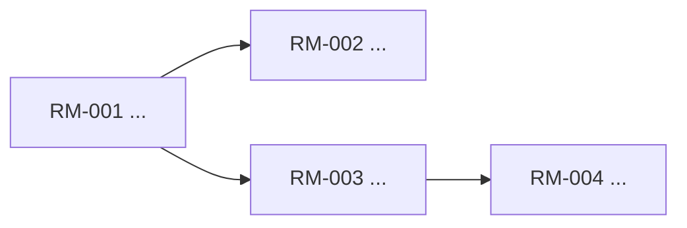

# ROADMAP

## Roadmap Meta

- Roadmap version:
- Skill version:
- Status:
- Last updated:
- Owner / decider:
- Current focus stage:
- Confidence:
- Supersedes roadmap version:

## Context Snapshot

- Product / repo:
- Project stage:
- Users:
- Pain:
- Existing workaround:
- Strongest demand evidence:
- Why now:
- Distribution path:
- Deadline / forcing function:
- Team / capacity:
- Hard constraints:
- Adoption / trust bottleneck:
- Known unknowns:
- Relevant capabilities:

## Evidence Ledger

| Signal | Evidence | Confidence | Source | Why it matters |
|--------|----------|------------|--------|----------------|
| Demand |  | High / Med / Low |  |  |
| Timing |  | High / Med / Low |  |  |
| Feasibility |  | High / Med / Low |  |  |
| Distribution |  | High / Med / Low |  |  |

## Route Options

| Shape | Why this could work | Why this may fail | Decision |
|-------|---------------------|-------------------|----------|
| wedge-first |  |  | Recommended / Rejected |
| platform-first |  |  | Rejected |
| rescue-first |  |  | Rejected |

## Recommended Route

- Recommendation:
- Why this route wins now:
- Why the rejected routes lose now:
- First signal to watch:
- Kill signal / stop condition:

## Product Thesis

- Users:
- Pain:
- Why now:
- Strategic wedge:
- Product promise:
- What we refuse to build yet:
- 6-12 month pull:

## Stage Overview

| Stage | Goal | Why now | Primary capabilities | Dependencies | Exit signal | Kill signal | Non-goals |
|-------|------|---------|----------------------|--------------|-------------|-------------|-----------|
| Stage 1 |  |  |  |  |  |  |  |
| Stage 2 |  |  |  |  |  |  |  |
| Stage 3 |  |  |  |  |  |  |  |

## Stage Detail

### Stage 1

- Goal:
- Users unlocked:
- Why this stage exists:
- Entry assumptions:
- Deliverables:
- Dependencies:
- Win condition:
- Key risks:
- Kill signal:
- What must stay out:
- Candidate roadmap items:

### Stage 2

- Goal:
- Users unlocked:
- Why this stage exists:
- Entry assumptions:
- Deliverables:
- Dependencies:
- Win condition:
- Key risks:
- Kill signal:
- What must stay out:
- Candidate roadmap items:

### Stage 3

- Goal:
- Users unlocked:
- Why this stage exists:
- Entry assumptions:
- Deliverables:
- Dependencies:
- Win condition:
- Key risks:
- Kill signal:
- What must stay out:
- Candidate roadmap items:

## RM Dependency Graph

- Dependency rule: `Depends On` only lists hard blockers.
- Serial spine:
- Parallel-ready branches:

## Parallel Waves

| Wave | Ready when | Items | Why parallel |
|------|------------|-------|--------------|
| Wave 1 |  |  |  |
| Wave 2 |  |  |  |

## Decision Notes

- Rejected path A:
- Rejected path B:
- Open assumptions to verify next:
- What changed in this version:

## Implementation Tracking

- Tracking source: `devflow/roadmap-tracking.json`

<!-- roadmap-tracking:start -->
| RM-ID | Item | Stage | Priority | Primary Capability | Secondary Capabilities | Expected Spec Delta | Depends On | Status | REQ | Progress |
|------|------|-------|----------|--------------------|------------------------|---------------------|------------|--------|-----|----------|
| RM-001 |  | Stage 1 | P1 | cap-example | - | tighten current truth | - | Planned | - | 0% |
<!-- roadmap-tracking:end -->
