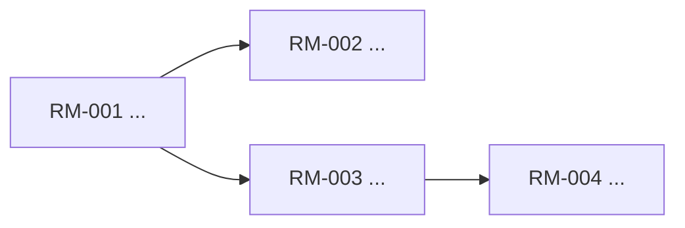
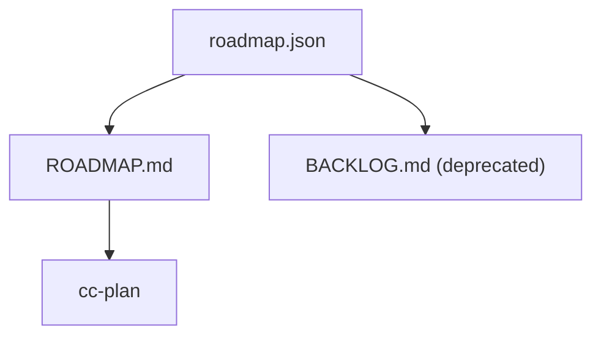

# ROADMAP

## Roadmap Meta

- Roadmap state source: `devflow/roadmap.json`
- Roadmap version:
- Skill version:
- Output language:
- Status:
- Last updated:
- Owner / decider:
- Current focus stage:
- Confidence:
- Supersedes roadmap version:

## Context Snapshot

- Product / repo:
- Project direction mode:
- Direction mode rationale:
- Planning posture:
- Project stage:
- Evidence maturity:
- Users:
- Pain:
- Existing workaround:
- Strongest demand evidence:
- Framing check:
- Why now:
- Distribution path:
- Deadline / forcing function:
- Team / capacity:
- Hard constraints:
- Adoption / trust bottleneck:
- Target developer / operator:
- Time to first value:
- Magic moment:
- Install / run / debug / upgrade bottleneck:
- Language sources loaded:
- Canonical terms:
- Language conflicts:
- Durable decision sources loaded:
- Spec / roadmap decision conflicts:
- Known unknowns:
- Relevant capabilities:

## Evidence Ledger

| Signal | Evidence | Confidence | Source | Why it matters |
|--------|----------|------------|--------|----------------|
| Demand |  | High / Med / Low |  |  |
| Timing |  | High / Med / Low |  |  |
| Feasibility |  | High / Med / Low |  |  |
| Distribution |  | High / Med / Low |  |  |

## Roadmap Funnel Transcript

| Round | Question | Answer source | Answer / decision | Evidence | Decision impact | Status |
|-------|----------|---------------|-------------------|----------|-----------------|--------|
| F0 Direction Mode |  | repo-evidence / user-answer / skipped |  |  |  | pending |
| F1 Demand / Operator Reality |  | repo-evidence / user-answer / skipped |  |  |  | pending |
| F2 Status Quo |  | repo-evidence / user-answer / skipped |  |  |  | pending |
| F3 Specific Human / Sponsor |  | repo-evidence / user-answer / skipped |  |  |  | pending |
| F4 Narrowest Wedge / Lake Boundary |  | repo-evidence / user-answer / skipped |  |  |  | pending |
| F5 Observation / Feedback Signal |  | repo-evidence / user-answer / skipped |  |  |  | pending |
| F6 Future Fit |  | repo-evidence / user-answer / skipped |  |  |  | pending |
| F7 Premise Challenge |  | repo-evidence / user-answer / skipped |  |  |  | pending |
| F8 Alternatives |  | repo-evidence / user-answer / skipped |  |  |  | pending |
| F9 Route Approval |  | repo-evidence / user-answer / skipped |  |  |  | pending |

- Premises confirmed:
- Premises rejected / revised:
- Alternatives reviewed:
- Approved route:
- Open concerns:
- Skipped rounds and reasons:
- Dialogue Checkpoints:
  - CP-001:
    - Round range:
    - Next question:
    - Decisions made:
    - Rejected routes and reasons:
    - Remaining open questions:
    - Evidence read:
    - Premise / alternatives findings so far:
    - Release status:

## AI Leverage Route Lens

- Real user / operator:
- Status quo workaround:
- Human-team effort for full scope:
- CC / agent effort for full scope:
- AI compression ratio:
- Complete-lake boundary:
- Ocean boundary:
- Scope recommendation: `boil-lake` | `sharp-wedge`
- First success signal:
- Kill signal:
- Verdict: `boil-lake` | `sharp-wedge` | `needs-evidence` | `pivot`
- Missing evidence before ready-for-cc-plan:

## Route Options

| Shape | Why this could work | Why this may fail | Decision |
|-------|---------------------|-------------------|----------|
| wedge-first |  |  | Recommended / Rejected |
| platform-first |  |  | Rejected |
| rescue-first |  |  | Rejected |
| decompose-first |  |  | Recommended / Rejected |

## Recommended Route

- Recommendation:
- Why this route wins now:
- Why the rejected routes lose now:
- First signal to watch:
- Kill signal / stop condition:

## Product Thesis

- Users:
- Pain:
- Why now:
- Strategic wedge:
- Product promise:
- What we refuse to build yet:
- 6-12 month pull:

## Native Language & Durable Decisions

- Canonical terms this roadmap uses:
- Terms avoided / aliases:
- Existing capability spec / roadmap decisions preserved:
- Capability spec / roadmap decisions reopened:
- Decisions worth capability spec sync:
- Handoff notes for `cc-plan`:

## Evidence-Maturity Routing

- Project direction mode:
- Direction-specific questions selected:
- Direction-specific questions skipped:
- Founder / builder / infra guardrails applied:
- Planning posture:
- Evidence maturity:
- Questions selected:
- Questions intentionally skipped:
- Reason this route matches maturity:
- Evidence that would change the route:

## DX / Operator Adoption Context

- Applies: Yes / No
- Target developer / operator:
- Current first-success path:
- Target time to first value:
- Magic moment:
- Install / run / debug / upgrade risks:
- Adoption bottleneck:

## Subsystem Decomposition

| Subsystem / RM candidate | User value | Can ship independently? | Merge / split decision | Reason |
|--------------------------|------------|-------------------------|------------------------|--------|
| RM-001 |  | Yes / No | Merge / Split |  |

> 如果一个目标里塞了多个独立子系统，先拆阶段和 `RM`，再谈优先级。不要把大杂烩写成一个阶段。

## Stage Overview

| Stage | Goal | Why now | Primary capabilities | Dependencies | Exit signal | Kill signal | Non-goals |
|-------|------|---------|----------------------|--------------|-------------|-------------|-----------|
| Stage 1 |  |  |  |  |  |  |  |
| Stage 2 |  |  |  |  |  |  |  |
| Stage 3 |  |  |  |  |  |  |  |

## Stage Detail

### Stage 1

- Goal:
- Users unlocked:
- Why this stage exists:
- Entry assumptions:
- Deliverables:
- Dependencies:
- Win condition:
- Key risks:
- Kill signal:
- What must stay out:
- Candidate roadmap items:

### Stage 2

- Goal:
- Users unlocked:
- Why this stage exists:
- Entry assumptions:
- Deliverables:
- Dependencies:
- Win condition:
- Key risks:
- Kill signal:
- What must stay out:
- Candidate roadmap items:

### Stage 3

- Goal:
- Users unlocked:
- Why this stage exists:
- Entry assumptions:
- Deliverables:
- Dependencies:
- Win condition:
- Key risks:
- Kill signal:
- What must stay out:
- Candidate roadmap items:

## RM Dependency Graph

- Dependency rule: `Depends On` only lists hard blockers.
- Serial spine:
- Parallel-ready branches:

## Technical Architecture

## Parallel Waves

| Wave | Ready when | Items | Why parallel |
|------|------------|-------|--------------|
| Wave 1 |  |  |  |
| Wave 2 |  |  |  |

## Decision Notes

- Rejected path A:
- Rejected path B:
- Rejected maturity route:
- Project direction mode decision:
- Promotional / brand-neutrality check:
- Language / spec decision conflicts:
- Developer / operator adoption assumptions:
- Open assumptions to verify next:
- What changed in this version:

## Implementation Tracking

- Roadmap state source: `devflow/roadmap.json`

<!-- roadmap-tracking:start -->
| RM-ID | Item | Stage | Priority | Primary Capability | Secondary Capabilities | Expected Spec Delta | Depends On | Status | REQ | Progress |
|------|------|-------|----------|--------------------|------------------------|---------------------|------------|--------|-----|----------|
| RM-001 |  | Stage 1 | P1 | cap-example | - | tighten current truth | - | Planned | - | 0% |
<!-- roadmap-tracking:end -->
