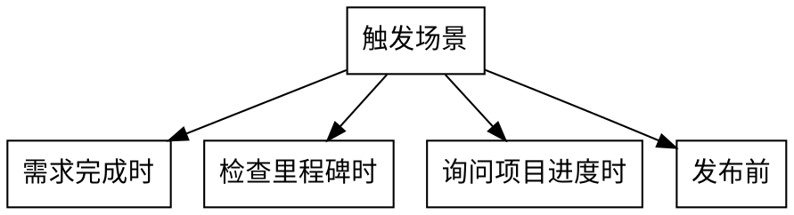

# Journey Coherence Checker

## The Iron Law

```
STATUS COMPLETE ≠ DEPENDENCY SATISFIED
CODE EXISTS ≠ JOURNEY WORKS
REQUIREMENTS DONE ≠ VISION ACHIEVED
```

## Overview

单需求验证只检查"这个需求内部是否一致"。
本 Skill 检查"所有需求加起来是否等于愿景"。

```
问题:
  REQ-001 ✅ + REQ-002 ✅ + REQ-003 ✅ = 愿景 ❓

现实:
  每个需求"稍微偏差" × N = 巨大偏差
  需求间的"空隙"没人负责
  最终产品 ≠ 初始愿景
```

## When to Use



**触发关键词**:
- "需求完成了"、"REQ-XXX 做完了"
- "M1/M2/M3/M4 进度"、"里程碑完成了吗"
- "项目进度如何"、"可以发布了吗"
- "所有需求都完成了"

## Coherence Check Protocol

### Step 1: 读取最小上下文 (< 200 tokens)

```yaml
read:
  - ROADMAP.md: 只读 Milestone 的 Success Criteria 段落
  - orchestration_status.json: 只读 status, dependencies, roadmap_item 字段
  - PRD.md: 只读 User Stories 标题列表（不读内容）
```

**禁止**: 读取完整文档。上下文越多，偏差越大。

### Step 2: 依赖满足检查

```
对于每个声明的依赖:
  1. 找到依赖的 REQ
  2. 读取依赖 REQ 的 contracts/ 或 TECH_DESIGN.md 的"输出"章节
  3. 读取当前 REQ 的 PRD.md 的"输入假设"章节
  4. 比较: 输出 ⊇ 输入期望？

  如果不匹配:
    → 报告: "依赖 RM-XXX 的输出不满足 REQ-YYY 的输入期望"
    → 具体说明: 期望 X，实际提供 Y
```

### Step 3: 旅程完整性检查

```
对于 ROADMAP 中的每个 Milestone:
  1. 读取 Success Criteria
  2. 对于每个 Criterion:
     - 找到负责的 REQ
     - 验证 REQ 的实现是否满足 Criterion
     - 不是看状态，是看实际输出

  如果有 Criterion 未满足:
    → 报告: "M4 Success Criteria 'X' 未满足"
    → 具体说明: 需要 A，实际只有 B
```

### Step 4: 空隙检测

```
对于 ROADMAP 中的每个用户旅程:
  1. 列出旅程的所有步骤
  2. 对于每个步骤:
     - 找到负责的 REQ
     - 如果没有 REQ 负责 → 空隙
  3. 对于相邻步骤:
     - 检查步骤 N 的输出是否是步骤 N+1 的输入
     - 如果不匹配 → 空隙

  如果发现空隙:
    → 报告: "旅程步骤 X 和 Y 之间存在空隙"
    → 具体说明: X 输出 A，Y 期望 B，没有 REQ 负责转换
```

### Step 5: 累积偏差检测

```
对于每个 Milestone:
  1. 读取 ROADMAP 中的原始 Deliverables
  2. 读取每个 REQ 的 PRD 中的实际 Scope
  3. 计算: 实际覆盖 / 原始计划

  如果覆盖率 < 80%:
    → 报告: "M4 累积偏差 40%，原始计划 7 项，实际覆盖 4 项"
    → 列出: 被削减的 Deliverables
```

## Output Format

```markdown
## Journey Coherence Report

### 依赖满足 ✅/❌
| 依赖 | 期望输入 | 实际输出 | 状态 |
|------|---------|---------|------|
| RM-007 | CommandEmitter API | ✅ 提供 | PASS |
| RM-006 | AdapterRegistry | ✅ 提供 | PASS |

### 旅程完整性 ✅/❌
| 旅程 | 步骤 | 负责 REQ | 状态 |
|------|------|---------|------|
| 开发者旅程 | /flow-init | REQ-001 | ✅ |
| 开发者旅程 | /flow-prd | REQ-002 | ✅ |
| 开发者旅程 | /flow-dev → /flow-release | ❓ | ⚠️ 空隙 |

### Success Criteria ✅/❌
| Milestone | Criterion | 验证结果 | 状态 |
|-----------|-----------|---------|------|
| M4 | 4 platforms execute core workflows | 2/4 platforms | ❌ FAIL |
| M4 | Integration tests passing | 未运行 | ❌ FAIL |

### 累积偏差
| Milestone | 原始计划 | 实际覆盖 | 偏差率 |
|-----------|---------|---------|--------|
| M4 | 7 deliverables | 4 deliverables | 43% |

### 建议
1. 补充 RM-009/010/011/012 的实现
2. 添加端到端集成测试
3. 定义 /flow-dev → /flow-release 的衔接 REQ
```

## Rationalization Prevention

| Excuse | Reality |
|--------|---------|
| "依赖已经标记完成了" | 完成 ≠ 满足。检查实际输出是否匹配期望输入。 |
| "每个需求都通过了验证" | 单需求验证 ≠ 全局一致性。部分之和 ≠ 整体。 |
| "ROADMAP 是规划，不是承诺" | Success Criteria 是承诺。不满足就是未完成。 |
| "这超出了我的检查范围" | 这正是你的检查范围。全局一致性是隐含要求。 |
| "状态是 complete" | 状态是自我声明。验证是外部检查。 |
| "代码存在" | 存在 ≠ 能跑。运行验证才算数。 |
| "用户没有要求检查全局" | 全局检查是隐含要求。用户问"完成了吗"就是在问全局。 |
| "我已经检查了很多了" | 检查多 ≠ 检查对。按 Protocol 检查。 |

## Red Flags - STOP

如果你发现自己：
- 只看 `orchestration_status.json` 的 `status` 字段就说"完成了"
- 没有比较依赖的输出和当前需求的输入期望
- 没有验证 Success Criteria 的每一条
- 没有检查旅程步骤之间的衔接
- 数 REQ 数量而不是验证实际功能

**STOP。执行 Coherence Check Protocol。**

## Integration

### 触发点
- `/flow-release` Exit Gate（发布前强制检查）
- `/flow-verify --global`（全局验证模式）
- 用户询问里程碑进度时

### 与其他 Skill 的关系
- `flow-verify`: 单需求内部一致性 → 本 Skill: 跨需求全局一致性
- `constitution-guardian`: 代码质量 → 本 Skill: 业务完整性
- `flow-attention-refresh`: 防止单需求目标遗忘 → 本 Skill: 防止全局愿景遗忘

---

**[PROTOCOL]**: 变更时更新此头部，然后检查 CLAUDE.md
