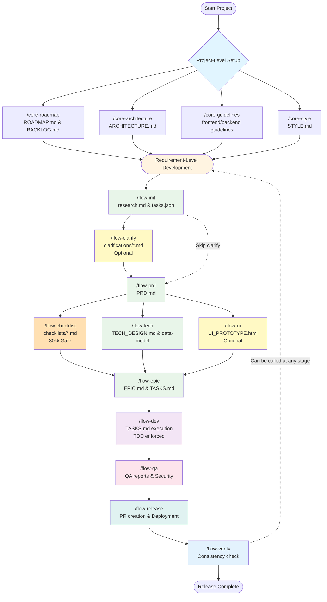

# 🚀 cc-devflow

> One-Command Requirement Development Flow for Claude Code

A comprehensive development workflow system built on Claude Code's official sub-agents, hooks, and settings mechanisms. Transform your requirements from planning to code delivery with a single command.

[中文文档](./README.zh-CN.md) | [English](./README.md)

---

## 🎯 One-Line Introduction

Complete automated workflow from PRD generation to code delivery with `/flow-new "REQ-123|Feature|URLs"`.

---

## ✨ Core Features

- 🎯 **One-Command Flow** - Complete PRD → Code → Test → Release with a single command
- 🔄 **Staged Commands** - 8 independent stage commands for fine-grained control
- 📋 **Document-Driven** - Automatic PRD → UI Prototype → EPIC → TASKS → Implementation chain
- 📝 **Template-Driven** - Self-executable templates (PRD_TEMPLATE, EPIC_TEMPLATE, TASKS_TEMPLATE)
- 🔄 **Smart Recovery** - `/flow-restart` auto-detects restart points for interrupted development
- 🛡️ **Quality Gates** - Automated TypeScript checking, testing, linting, and security scanning
- 🤖 **Sub-Agent Orchestration** - 12 specialized research agents for different development phases
- 🎨 **UI Prototype Generation** - Conditional HTML prototype with artistic design inspiration
- 🔗 **GitHub Integration** - Automated PR creation, branch management, and conventional commits
- 📊 **Progress Tracking** - Real-time status monitoring and intelligent restart points
- 🔍 **Consistency Verification** - Enterprise-grade consistency checking with intelligent conflict detection
- 🧪 **TDD Enforced** - Strict Test-Driven Development with TEST VERIFICATION CHECKPOINT
- 📜 **Constitution** - 10 Articles governing quality, security, and architecture
- 🔌 **Multi-Platform Support** - Compile workflows for Codex, Cursor, Qwen, Antigravity via `npm run adapt`

---

## 💡 Core Concepts

### Hooks System

Real-time quality guardian: PreToolUse blocks non-compliant operations, PostToolUse auto-records changes.

<details>
<summary>📖 Hooks Details (Click to Expand)</summary>

**Hook Types**:

| Hook | Trigger Timing | Functionality |
|------|----------------|---------------|
| **UserPromptSubmit** | When user input is submitted | Intelligently recommends relevant Skills |
| **PreToolUse** | Before tool use | Blocks non-compliant operations (TDD violations, etc.) |
| **PostToolUse** | After tool use | Automatically records file changes |
| **Stop** | When session stops | Provides error handling hints |

**Guardrail Workflow**:
```
User edits file → PreToolUse Hook triggers
  ↓ Path normalization
  ↓ Rule matching
  ↓ Content checking
  ↓ Violation? Block operation : Allow operation
```

**Skipping Guardrails**:
```bash
# Method 1: File marker
echo "@skip-tdd-check" >> devflow/requirements/REQ-123/TASKS.md

# Method 2: Environment variable
export SKIP_TDD_ENFORCER=1
```

📚 [Complete Hooks Documentation](docs/guides/hooks-system.md)
</details>

### Skills System

Intelligent knowledge base activation, auto-recommending relevant domain knowledge.

<details>
<summary>📖 Skills Details (Click to Expand)</summary>

**Available Skills**:

| Skill | Type | Trigger Scenarios |
|-------|------|-------------------|
| `cc-devflow-orchestrator` | domain | Requirement management, process guidance |
| `devflow-tdd-enforcer` | guardrail | Editing TASKS.md |
| `constitution-guardian` | guardrail | Editing PRD/EPIC/TASKS |
| `devflow-file-standards` | domain | File naming, directory structure |
| `skill-developer` | domain | Skill development, Hook system |

**Trigger Mechanisms**:
1. **Keyword Trigger** - Input contains specific keywords
2. **Intent Matching** - Regex matching user intent
3. **File Trigger** - Editing specific path files
4. **Content Matching** - File content matches specific patterns

📚 [Complete Skills Documentation](docs/guides/skills-system.md)
</details>

### Agent Orchestration

Dual-layer execution model: Research Agents (11, read-only analysis) + Main Agent (execution).

<details>
<summary>📖 Agent Orchestration Details (Click to Expand)</summary>

**Execution Model**:
- **Research Agents**: Read-only analysis, generate Markdown plans and reports
- **Main Agent (Claude)**: Executes all code operations, owns complete context
- **Workflow**: Agent Research → Output Plans → Main Agent Executes → Iterate

**Tool Distribution**:
- Research Agents: Read, Grep, Glob (analysis)
- Main Agent: Edit, Write, Bash, Git (execution)

📚 [Execution Model Details](docs/architecture/execution-model.md)
</details>

---

## 🚀 Quick Start

### Installation

```bash
npx tiged Dimon94/cc-devflow/.claude .claude
```

### Optional Dependencies

```bash
# Chinese branch naming support (converts Chinese to pinyin)
pip install pypinyin
```

### Verify Installation

```bash
.claude/scripts/verify-setup.sh
```

### First Requirement

```bash
/flow-new "REQ-001|User Authentication|https://docs.example.com/auth"
```

<details>
<summary>🔍 Complete Getting Started Guide (Click to Expand)</summary>

**Interactive Demo**:
```bash
python3 .claude/scripts/demo.py
```

**Core Scripts**:
```bash
# Environment check
bash .claude/scripts/check-prerequisites.sh

# View task status
bash .claude/scripts/check-task-status.sh --verbose

# Mark task complete
bash .claude/scripts/mark-task-complete.sh T001

# Generate status report
bash .claude/scripts/generate-status-report.sh --format markdown
```

**Run Tests**:
```bash
# Run all tests
bash .claude/tests/run-all-tests.sh --scripts

# Constitution tests
bash .claude/tests/constitution/run_all_constitution_tests.sh
```

📚 [Complete Getting Started Guide](docs/guides/getting-started.md)
</details>

---

## 📋 Command Quick Reference

### 🏢 Project-Level Commands

**Purpose**: Project-wide planning and architecture design, typically executed once per project at the beginning

| Command | Purpose | Quick Example | Detailed Docs |
|---------|---------|---------------|---------------|
| `/core-roadmap` | 🗺️ Generate Product Roadmap | `/core-roadmap` | [→](docs/commands/core-roadmap.md) |
| `/core-architecture` | 🏗️ Generate System Architecture | `/core-architecture` | [→](docs/commands/core-architecture.md) |
| `/core-guidelines` | 📘 Generate Project Guidelines | `/core-guidelines` | [→](docs/commands/core-guidelines.md) |

### 📦 Requirement-Level Commands

**Purpose**: Specific requirement development, executed once per requirement (REQ-XXX)

| Command | Purpose | Quick Example | Detailed Docs |
|---------|---------|---------------|---------------|
| `/flow-new` | 🎯 Start New Requirement | `/flow-new "REQ-123\|Feature"` | [→](docs/commands/flow-new.md) |
| `/flow-init` | 📦 Initialize Requirement | `/flow-init "REQ-123\|Feature"` | [→](docs/commands/flow-init.md) |
| `/flow-clarify` | 🔎 Clarify Ambiguities | `/flow-clarify "REQ-123"` | [→](.claude/commands/flow-clarify.md) |
| `/flow-checklist` | ✅ Requirement Quality Check | `/flow-checklist --type ux` | [→](.claude/commands/flow-checklist.md) |
| `/flow-verify` | 🔍 Verify Consistency | `/flow-verify "REQ-123"` | [→](docs/commands/flow-verify.md) |
| `/flow-qa` | 🧪 Quality Assurance | `/flow-qa "REQ-123"` | [→](docs/commands/flow-qa.md) |
| `/flow-release` | 🚢 Create Release | `/flow-release "REQ-123"` | [→](docs/commands/flow-release.md) |

📚 [Complete Command Reference](docs/commands/README.md)

<details>
<summary>🎯 Which Command Should I Use? (Click to Expand)</summary>

```
Your Scenario:
├─ Plan product direction? → /core-roadmap
├─ Design system architecture? → /core-architecture
├─ Establish coding standards? → /core-guidelines
├─ Start brand new feature development? → /flow-new "REQ-123|Feature|URLs"
├─ Only create requirement directory? → /flow-init "REQ-123|Feature"
├─ Clarify ambiguous requirements? → /flow-clarify "REQ-123"
├─ Validate requirement quality? → /flow-checklist --type ux,api,security
├─ Continue interrupted development? → /flow-restart "REQ-123"
├─ Check development progress? → /flow-status REQ-123
├─ Found document inconsistencies? → /flow-verify "REQ-123"
├─ Development complete, need testing? → /flow-qa "REQ-123"
├─ Fix production bug? → /flow-fix "BUG-001|Description"
└─ Ready to release? → /flow-release "REQ-123"
```
</details>

---

## 🔄 Workflow Diagram

The following Mermaid diagram illustrates the complete cc-devflow workflow, including both project-level and requirement-level processes:



**Workflow Notes**:
- **Project-Level Commands** (light blue): Execute once at project initialization, establish global standards (SSOT)
- **Requirement-Level Commands** (light orange): Execute once per requirement (REQ-XXX)
- **Optional Steps** (yellow): `/flow-clarify` and `/flow-ui` are optional; clarify can be skipped if requirements are clear
- **Quality Gate** (orange): `/flow-checklist` validates requirement quality with 80% completion threshold before `/flow-epic`
- **Quality Gates**: Each stage has entry/exit gates ensuring document quality and Constitution compliance
- **TDD Enforcement**: `/flow-dev` strictly enforces Test-Driven Development order
- **Consistency Check**: `/flow-verify` can be called at any stage to ensure document consistency

---

## 🏗️ System Architecture

**Execution Model**: Research Agents (11, read-only) + Main Agent (execution)
**Document Structure**: Single-track architecture, one requirement directory contains all artifacts
**Quality Assurance**: Constitution v2.0.0 + TDD Enforcement + Real-time Guardrail

<details>
<summary>📖 Architecture Details (Click to Expand)</summary>

### Sub-Agents Workflow

```text
clarify-analyst     → Clarification questions (11-dimension scan)
prd-writer          → PRD generation (must use PRD_TEMPLATE)
checklist-agent     → Requirement quality validation (5 dimensions, 6 types) ⭐ NEW
ui-designer         → UI prototype (conditional trigger)
tech-architect      → Technical design (Anti-Tech-Creep enforcement)
planner             → EPIC & TASKS (must use EPIC_TEMPLATE, TASKS_TEMPLATE)
dev-implementer     → Implementation plan (research only)
qa-tester           → Test plan + Test report
security-reviewer   → Security plan + Security report
release-manager     → Release plan
```

### Single-Track Architecture

```text
devflow/
├── ROADMAP.md               # Product roadmap
├── ARCHITECTURE.md          # System architecture design
├── BACKLOG.md               # Requirement backlog
└── requirements/REQ-123/
    ├── PRD.md
    ├── EPIC.md
    ├── TASKS.md
    ├── EXECUTION_LOG.md
    ├── checklists/          # Requirement quality checklists
    │   ├── ux.md
    │   ├── api.md
    │   └── security.md
    ├── TEST_PLAN.md
    ├── TEST_REPORT.md
    ├── SECURITY_PLAN.md
    ├── SECURITY_REPORT.md
    └── RELEASE_PLAN.md
```

### Quality Gates

- Pre-push Guard (TypeScript, tests, linting, security, build)
- Checklist Gate (`/flow-checklist` 80% completion threshold before `/flow-epic`)
- Constitution Compliance (enforced at every stage)
- TDD Checkpoint (TEST VERIFICATION CHECKPOINT)
- Guardrail Hooks (PreToolUse real-time blocking of non-compliant operations)

📚 [Complete Architecture Documentation](docs/architecture/)
</details>

---

## ⚙️ Configuration

**Minimum Configuration** (`.claude/settings.json`):

```json
{
  "permissions": {
    "allowGitOperations": true,
    "allowNetworkRequests": true,
    "allowSubprocesses": true
  }
}
```

<details>
<summary>🔧 Complete Configuration Options (Click to Expand)</summary>

### Hooks Configuration

```json
{
  "hooks": {
    "PreToolUse": [{
      "matcher": "Edit|Write",
      "hooks": [{"type": "command", "command": "..."}]
    }]
  }
}
```

### Environment Variables

```bash
# Flow behavior
export FLOW_AUTO_APPROVE=false
export MIN_TEST_COVERAGE=80
export STRICT_TYPE_CHECKING=true

# Guardrail skip
export SKIP_TDD_ENFORCER=1
export SKIP_CONSTITUTION_CHECK=1
```

📚 [Complete Configuration Guide](docs/guides/configuration.md)
</details>

---

## 🧪 Test Coverage

**Script Tests**: 8/8 Passed ✅ (100%)
**Constitution Tests**: 38/38 Passed ✅ (100%)

```bash
# Run all tests
bash .claude/tests/run-all-tests.sh --scripts
```

<details>
<summary>📊 Test Framework Details (Click to Expand)</summary>

### Test Suites

| Test Suite | Test Cases | Status |
|------------|-----------|--------|
| `test_check_prerequisites` | 18 | ✅ 100% |
| `test_check_task_status` | 18 | ✅ 100% |
| `test_common` | 15 | ✅ 100% |
| `test_mark_task_complete` | 15 | ✅ 100% |
| `test_setup_epic` | 13 | ✅ 100% |
| `test_validate_constitution` | 4 | ✅ 100% |

📚 [Test Framework Details](docs/guides/testing-guide.md)
</details>

---

## 📝 Version History

### v2.2.0 (2025-12-19) - Latest Release

**🔌 Multi-Platform Adaptation: Agent Adapter Architecture + Command Emitter**

v2.2.0 introduces comprehensive multi-platform support, enabling cc-devflow workflows to run on multiple AI coding assistants:

- **Agent Adapter Architecture (REQ-004)** - Pluggable adapter layer for platform differences
  - Unified Agent Adapter abstraction (environment detection, command execution, capability declaration)
  - Adapter Registry with auto-detection and explicit override support
  - Built-in adapters: Claude Code (default), Codex CLI, Cursor, Qwen, Antigravity
  - Security-first design: capability allow-list with default deny for high-risk operations
  - Structured logging for debugging and auditing

- **Command Emitter Compiler (REQ-005)** - Single Source of Truth compilation
  - `.claude/` as SSOT, compiles to platform-native formats
  - `npm run adapt` CLI for multi-platform compilation
  - Supported platforms: Codex (`.codex/`), Cursor (`.cursor/`), Qwen (`.qwen/`), Antigravity (`.agent/`)
  - Placeholder expansion: `{SCRIPT:*}`, `{TEMPLATE:*}`, `{GUIDE:*}`, `{AGENT_SCRIPT}`, `$ARGUMENTS`
  - Template/Guide inlining with automatic content embedding
  - Resource copying with path rewriting (scripts, templates, guides → platform directories)
  - Manifest-based incremental compilation with drift detection

- **Adapter Compiler (REQ-006)** - Multi-platform rules entry file generation
  - Platform-specific rules emitters for 4 platforms (Cursor MDC, Codex SKILL.md, Qwen TOML, Antigravity with 12K splitting)
  - Skills registry compilation (merges `skill-rules.json` + `skill.md` metadata)
  - Manifest v2.0 extension with `skills` and `rulesEntry` tracking
  - `--rules` and `--skills` CLI options for selective compilation
  - **Bug Fix**: Disabled template inlining by default (keeps path references instead of inline expansion)
  - 173 tests, 87% coverage for new modules

**📦 New CLI Tool**:
```bash
npm run adapt                        # Compile for all platforms
npm run adapt -- --platform codex    # Compile for specific platform
npm run adapt -- --check             # Check for drift without compiling
npm run adapt -- --verbose           # Show detailed output
```

### v2.1.0 (2025-11-07)

**🏢 Core Breakthrough: Introduction of Project-Level Commands**

v2.1.0's core breakthrough is the introduction of **Project-Level Commands**, forming a two-tier system with previous **Requirement-Level Commands**:

- **Project-Level Commands** - Project-wide planning and architecture design (executed once per project at the beginning)
  - `/core-roadmap` - Interactive product roadmap generation (6-stage dialogue)
  - `/core-architecture` - 4 architecture diagram generation (Mermaid format)
  - `/core-guidelines` - Project guidelines generation (frontend/backend separation)

- **Requirement-Level Commands Enhancement** - Stage 1.5 Roadmap & Architecture context loading (flow-init)
  - Automatically load project-level context when initializing requirements
  - Automatic requirement-to-roadmap mapping (RM-ID, Milestone, Quarter)
  - Automatic architecture context association (Feature Layer, Tech Stack, Module)

**📚 Documentation Improvements**:
- README complete refactoring (complete TOC + folding + external documentation links)
- Added 25+ detailed documents

📋 [Complete Changelog](CHANGELOG.md)

---

## 🤝 Contributing & Support

**Contributing**: [Contributing Guide](CONTRIBUTING.md)
**Issues**: [GitHub Issues](https://github.com/Dimon94/cc-devflow/issues)
**Documentation**: [Complete Documentation](docs/)

---

## 📄 License

MIT License - See [LICENSE](LICENSE) file

---

**🌟 Star this repository if cc-devflow helps streamline your development workflow!**
