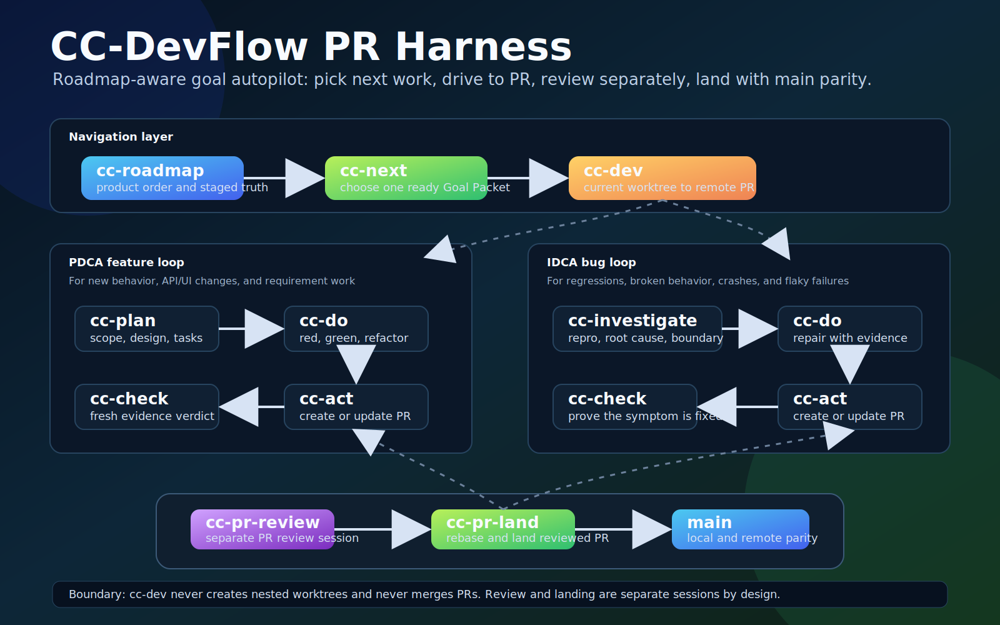
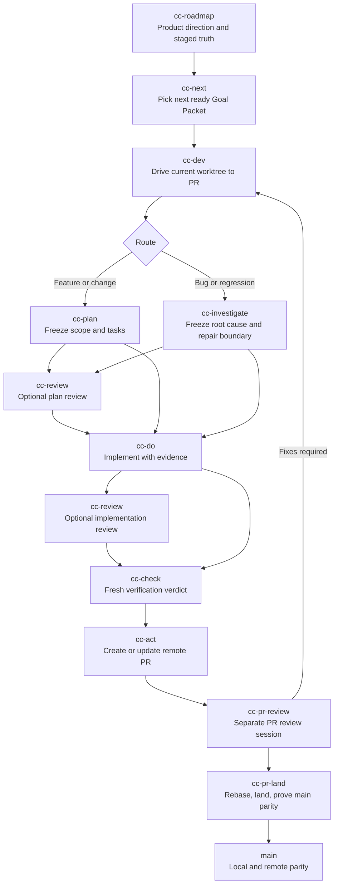

# cc-devflow

> Agent-first development workflow for roadmap, planning, investigation, implementation, verification, and shipping.

[](https://github.com/Dimon94/cc-devflow/stargazers)
[](https://www.npmjs.com/package/cc-devflow)
[](./package.json)
[](./LICENSE)

[中文文档](./README.zh-CN.md) | [English](./README.md) | [Getting Started](./docs/guides/getting-started.md) | [Contributing](./CONTRIBUTING.md) | [Security](./SECURITY.md)

CC-DevFlow is a small, explicit workflow system for agent coding. It gives an AI agent one roadmap entry point, then routes every change through either a feature loop or a bug-investigation loop before work can be called done.



## Why cc-devflow

- **Small public surface**: core workflow skills, a PR Harness lane, one optional deep review skill, plus a CLI for installation and platform adaptation.
- **Evidence before done**: implementation must pass through verification proof before shipping or handoff.
- **Skill-first distribution**: the public contract lives in `.claude/skills/<skill>/SKILL.md` and `PLAYBOOK.md`, not in hidden runtime behavior.
- **Multi-platform output**: install once, then adapt for Codex, Cursor, Qwen, Antigravity, and related agent environments.
- **Durable project memory**: roadmap, specs, planning, review, and handoff artifacts stay in `devflow/`; temporary worker scratch stays outside durable truth.

## Quick Start

Prerequisites:

- Node.js 18+
- npm or a compatible package runner
- A Git repository
- Claude Code or another supported agent environment

Install the whole skill pack:

```bash
npx cc-devflow@latest init --dir /path/to/your/project
```

Generate platform outputs:

```bash
npx cc-devflow@latest adapt --cwd /path/to/your/project --platform codex
npx cc-devflow@latest adapt --cwd /path/to/your/project --platform cursor
npx cc-devflow@latest adapt --cwd /path/to/your/project --platform qwen
npx cc-devflow@latest adapt --cwd /path/to/your/project --platform antigravity
```

Refresh every supported platform output:

```bash
npx cc-devflow@latest adapt --cwd /path/to/your/project --all
```

After installation, ask your agent to use the workflow skills directly. Start with `cc-roadmap` for product direction. Use `cc-next` to select the next roadmap-aware target, `cc-dev` to drive the current worktree through PDCA or IDCA until a remote PR is opened, `cc-pr-review` to review that PR in a separate session, and `cc-pr-land` to land reviewed PRs into main. For manual core workflow work, use `cc-plan` for new work, use `cc-investigate` for bugs, optionally run `cc-review` on complex frozen plans or investigations, then continue through `cc-do`, optional implementation `cc-review`, `cc-check`, and `cc-act`.

## Workflow Map

```text
cc-roadmap

PR Harness: cc-next -> cc-dev -> cc-pr-review -> cc-pr-land

PDCA: cc-plan        -> [cc-review] -> cc-do -> [cc-review] -> cc-check -> cc-act
IDCA: cc-investigate -> [cc-review] -> cc-do -> [cc-review] -> cc-check -> cc-act
```


```mermaid
flowchart TD
  Roadmap["cc-roadmap\nProduct direction and staged truth"] --> Next["cc-next\nPick next ready Goal Packet"]
  Next --> Dev["cc-dev\nDrive current worktree to PR"]

  Dev --> Route{"Route"}
  Route -->|Feature or change| Plan["cc-plan\nFreeze scope and tasks"]
  Route -->|Bug or regression| Investigate["cc-investigate\nFreeze root cause and repair boundary"]

  Plan --> PlanReview["cc-review\nOptional plan review"]
  Investigate --> PlanReview
  PlanReview --> Do["cc-do\nImplement with evidence"]
  Plan --> Do
  Investigate --> Do

  Do --> ImplReview["cc-review\nOptional implementation review"]
  ImplReview --> Check["cc-check\nFresh verification verdict"]
  Do --> Check
  Check --> Act["cc-act\nCreate or update remote PR"]
  Act --> PRReview["cc-pr-review\nSeparate PR review session"]
  PRReview --> PRLand["cc-pr-land\nRebase, land, prove main parity"]
  PRReview -->|Fixes required| Dev
  PRLand --> Main["main\nLocal and remote parity"]
```

## Workflow Skills

| Skill | Use it when | Main output |
| --- | --- | --- |
| `cc-roadmap` | You need product direction, staged scope, or backlog order | `devflow/roadmap.json`, `devflow/ROADMAP.md`, deprecated `devflow/BACKLOG.md` |
| `cc-next` | You need to pick the next roadmap-aware ready target from roadmap, unarchived local changes, and issue truth | one Goal Packet for `cc-dev` |
| `cc-dev` | A selected objective should be driven in the current worktree to a remote PR | `task.md`, Git commits, and a PR or handoff |
| `cc-plan` | A feature or change needs scope, design, and task freezing | `task.md#Contract Summary` |
| `cc-investigate` | A bug needs symptom, reproduction, root cause, and repair boundary | `task.md#Root Cause Contract` |
| `cc-do` | Planned or investigated work needs implementation | code, tests, `task.md` status, Git commit |
| `cc-review` | Complex plans, investigations, or diffs need optional deep review before implementation or verification | plan findings in `task.md`; implementation findings and repair options in the response |
| `cc-pr-review` | A remote PR needs an independent review session before landing | PR review packet, findings, and landing verdict |
| `cc-pr-land` | Reviewed PRs need rebase-first landing into main with parity proof | integrated main plus local/remote parity evidence |
| `cc-check` | Work needs fresh verification evidence | pass/fail/blocked response and Git commit |
| `cc-act` | Verified work needs a PR, local handoff, or closeout | optional `handoff/pr-brief.md`, Git/PR truth, or incident postmortem |

Maintenance skills are shipped with the pack:

- `cc-spec-init`: initialize and maintain durable capability specs under `devflow/specs/`
- `cc-simplify`: review changed code for reuse, quality, efficiency, and spec drift

## Planning Quality Gates

`cc-roadmap` now records planning posture, evidence maturity, canonical project language, and durable decision context before recommending a route. That keeps idea-stage, active-user, paying-customer, infrastructure, and recovery work from being forced through the same questions, and prevents roadmap items from inventing a second vocabulary. Developer-facing or operator-facing roadmap items also carry target user, time to first value, magic moment, adoption bottleneck, and domain handoff into `cc-plan`.

Canonical language and durable decisions stay inside cc-devflow-native sources: `devflow/specs/`, `devflow/roadmap.json`, `devflow/ROADMAP.md`, `task.md`, Git history, and PR truth. Legacy planning artifacts are readable fallback inputs only.

`cc-plan` freezes more implementation decisions before `cc-do` starts. Non-trivial plans compare minimal viable and ideal architecture options, full designs include decision horizon plus error/rescue mapping, and test-first plans record test framework evidence, public test seams, spec-style test names, public verification paths, behavior assertions, mock boundaries, coverage quality, mandatory regression tests, interface depth, Green minimality guards, refactor candidates, and vertical tracer-bullet slices when existing behavior changes. Before handoff, `cc-plan` and `cc-investigate` also reconcile the source roadmap item so RM status, REQ/FIX binding, progress, and spec diagnosis do not drift from the frozen change artifacts.

Every shipped skill carries its own `references/checklist-contract.md`; there is no shared checklist reference. The checklist is a pause-point contract for that skill only, and its proof must land in the skill's normal evidence sink such as `task.md`, the response, PR truth, Git history, or release verification.

Every post-planning stage starts from `task.md`, current Git history/status, and PR or handoff truth when present. There is no runtime context query layer; disputed facts must be re-read from source artifacts. Use `npm run benchmark:skills` to keep public skill entrypoints thin; deeper planning rules should live behind conditional references instead of default context.

`cc-review` is optional and deeper than `cc-check`. It can run immediately after `cc-plan` / `cc-investigate` to review the frozen plan or root-cause contract, or after `cc-do` to review the implementation. Plan and investigation review findings are written directly into `task.md`. Implementation review findings are returned in the response with repair options; the user chooses the repair path before code is edited. PR reviews stay in the response or GitHub review. No local review report, ledger, findings JSON, or other review output file is written.

## Verification And Ship Gates

`cc-check` now treats QA as a feedback-loop problem, not only a green-test problem. Bugfix and behavior work records the loop used to prove reality, expected versus actual behavior, reproduction steps, test boundary quality, and architecture follow-ups when no clean public test seam exists.

`cc-act` carries that evidence into PR briefs, handoffs, or incident postmortems when needed. It checks source roadmap progress during closeout, updates `devflow/roadmap.json`, and regenerates `devflow/ROADMAP.md` / `devflow/BACKLOG.md` when verified reality changes. Follow-ups must be durable behavior briefs with current behavior, desired behavior, key interfaces, acceptance criteria, and explicit out-of-scope notes before they are written back to roadmap or backlog.

## Installation Modes

### Whole-pack install

Use this when you want the complete `.claude` skill pack:

```bash
npx cc-devflow@latest init --dir /path/to/your/project
npx cc-devflow@latest init --dir /path/to/your/project --force
```

`--force` upgrades only cc-devflow-managed distributed skills and preserves unrelated project files under `.claude`.

### Source checkout

When developing this repository locally:

```bash
node bin/cc-devflow-cli.js --help
node bin/cc-devflow-cli.js init --dir /tmp/example-project
node bin/cc-devflow-cli.js adapt --cwd /tmp/example-project --platform codex
```

### Single-skill install with skills.sh

[skills.sh](https://skills.sh/) is supported as a single-skill distribution channel:

```bash
npx skills add https://github.com/Dimon94/cc-devflow --skill cc-roadmap
npx skills add https://github.com/Dimon94/cc-devflow --skill cc-next
npx skills add https://github.com/Dimon94/cc-devflow --skill cc-dev
npx skills add https://github.com/Dimon94/cc-devflow --skill cc-plan
npx skills add https://github.com/Dimon94/cc-devflow --skill cc-investigate
npx skills add https://github.com/Dimon94/cc-devflow --skill cc-do
npx skills add https://github.com/Dimon94/cc-devflow --skill cc-review
npx skills add https://github.com/Dimon94/cc-devflow --skill cc-pr-review
npx skills add https://github.com/Dimon94/cc-devflow --skill cc-pr-land
npx skills add https://github.com/Dimon94/cc-devflow --skill cc-check
npx skills add https://github.com/Dimon94/cc-devflow --skill cc-act
```

Use `cc-devflow init` for the full pack, `cc-devflow adapt` for generated platform outputs, and `skills add` only when you want one skill at a time.

## Configuration

CC-DevFlow reads layered YAML config before durable workflow documents are written:

```text
~/.cc-devflow/config.yml
<repo>/.cc-devflow/config.yml
<repo>/.cc-devflow/config.local.yml
```

Precedence is deterministic: defaults < user < project < local < environment < CLI. `output.document_language` is machine-enforced and currently supports `en` and `zh-CN`. It controls durable planning, review, and handoff Markdown headings, prose, placeholders, evidence summaries, and PR/body drafts; code, commands, paths, schema keys, API names, and commit type/scope literals stay unchanged. Non-standard preferences belong under `agent_preferences`; they guide style but do not override workflow contracts.

```yaml
version: 1
output:
  document_language: en
agent_preferences:
  general:
    - Start with the conclusion.
  documentation:
    - Keep headings short and avoid marketing language.
```

Useful commands:

```bash
npx cc-devflow config init --cwd /path/to/your/project --project
npx cc-devflow config set output.document_language zh-CN --cwd /path/to/your/project --project
npx cc-devflow config resolve --cwd /path/to/your/project --format policy
npx cc-devflow config doctor --cwd /path/to/your/project
```

See [`config/user-config.template.yml`](./config/user-config.template.yml) for the full sample.

## Repository Format

Distributed skills live in `.claude/skills/`:

```text
.claude/skills/<skill>/
├── SKILL.md
├── PLAYBOOK.md
├── assets/
├── references/
└── scripts/
```

Each shipped skill keeps its runtime contract local:

- `SKILL.md` has YAML frontmatter plus the `Harness Contract`
- `PLAYBOOK.md` has the `Visible State Machine`
- local resources stay beside the skill that owns them

The currently distributed skill folders are:

- `.claude/skills/cc-roadmap/`
- `.claude/skills/cc-next/`
- `.claude/skills/cc-dev/`
- `.claude/skills/cc-plan/`
- `.claude/skills/cc-investigate/`
- `.claude/skills/cc-do/`
- `.claude/skills/cc-review/`
- `.claude/skills/cc-pr-review/`
- `.claude/skills/cc-pr-land/`
- `.claude/skills/cc-check/`
- `.claude/skills/cc-act/`
- `.claude/skills/cc-spec-init/`
- `.claude/skills/cc-simplify/`

## Durable vs Ephemeral

- `devflow/specs/` stores durable capability truth: `INDEX.md` plus `capabilities/*.md`.
- New change directories use `REQ-<number>-<description>` for requirements or `FIX-<number>-<description>` for bug fixes. `REQ` and `FIX` numbers advance independently, so the same number may exist in both prefixes. Parallel worktrees may also create repeated numbers; the full change key must use a specific description to distinguish the work.
- `devflow/changes/<change>/` stores durable change truth in `task.md`, optional `handoff/pr-brief.md`, and Git commits. Real recurring failures may also write incident postmortems under `devflow/postmortems/`.
- New changes default to one human-authored Markdown artifact: `task.md`. Feature plans put the frozen design in `## Contract Summary`; bug investigations put root-cause truth in `## Root Cause Contract`. Legacy planning and review artifacts are readable fallback inputs only.
- Workflow state is Git-owned: keep `task.md` current, commit each completed stage/environment, and do not create extra process files.
- Use `npm run verify:examples` and `npm run benchmark:skills` to keep workflow truth and skill entrypoints small and measurable.
- `devflow/workspaces/<change>/` stores ephemeral runtime scratch such as worker assignment, journals, prompts, and session logs.
- Regenerable files should not be persisted under `devflow/changes/`.

Artifact contract quick checks:

```bash
npm run verify:examples
npm run benchmark:skills
```

For complete artifact examples, start with [`docs/examples/START-HERE.md`](./docs/examples/START-HERE.md). Example version bindings live in [`docs/examples/example-bindings.json`](./docs/examples/example-bindings.json). Migration and authoring guidance for the minimized artifact contract lives in [`docs/guides/minimize-artifacts.md`](./docs/guides/minimize-artifacts.md).

## Development

```bash
git clone https://github.com/Dimon94/cc-devflow.git
cd cc-devflow
npm install
npm test
npm run verify
```

Publish validation:

```bash
npm run verify:publish
```

The main contributor guide is [`CONTRIBUTING.md`](./CONTRIBUTING.md). It explains the public surface rules, local CLI smoke tests, documentation rules, and PR expectations.

## Discussion

Scan the QR code to join the cc-devflow WeChat group for feedback, usage notes, and feature requests.


If the QR code expires, please open an issue so the maintainers can refresh it.

## Community

- Star the project if the workflow is useful: [GitHub stars](https://github.com/Dimon94/cc-devflow/stargazers)
- Open issues for reproducible bugs, stale docs, or missing platform adapters.
- Keep PRs focused: one skill, one CLI behavior, one compiler/adaptation fix, or one documentation cleanup.
- If a shipped skill changes, update its `version`, local `CHANGELOG.md`, examples, and affected public docs in the same PR.
- Read the [Code of Conduct](./CODE_OF_CONDUCT.md) before participating in project discussions.
- Report vulnerabilities through the [Security Policy](./SECURITY.md), not public issues.

## Star History

<a href="https://www.star-history.com/#Dimon94/cc-devflow&Date">
  <picture>
    <source media="(prefers-color-scheme: dark)" srcset="https://api.star-history.com/svg?repos=Dimon94/cc-devflow&type=Date&theme=dark" />
    <source media="(prefers-color-scheme: light)" srcset="https://api.star-history.com/svg?repos=Dimon94/cc-devflow&type=Date" />
    
  </picture>
</a>

## License

[MIT](./LICENSE)
