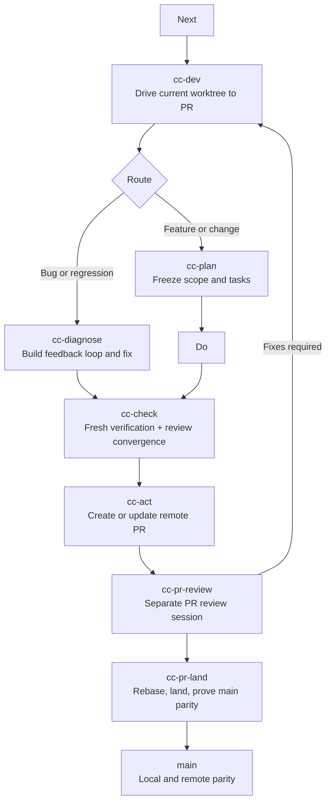

# cc-devflow

> Agent-first development workflow for planning, diagnosis, implementation, verification, and shipping.

[](https://github.com/Dimon94/cc-devflow/stargazers)
[](https://www.npmjs.com/package/cc-devflow)
[](./package.json)
[](./LICENSE)

[中文文档](./README.zh-CN.md) | [English](./README.md) | [Getting Started](./docs/guides/getting-started.md) | [Contributing](./CONTRIBUTING.md) | [Security](./SECURITY.md)

CC-DevFlow is a small, explicit workflow system for agent coding. It gives an AI agent a PDCA feature loop, a PR Harness lane, and a lightweight `cc-diagnose` hotfix/debugging path.

## Why cc-devflow

- **Small public surface**: core workflow skills, a PR Harness lane, one optional deep review skill, plus a CLI for installation and platform adaptation.
- **Evidence before done**: implementation must pass through verification proof before shipping or handoff.
- **Skill-first distribution**: the public contract lives in `.claude/skills/<skill>/SKILL.md` and `PLAYBOOK.md`, not in hidden runtime behavior.
- **Multi-platform output**: install once, then adapt for Codex, Cursor, Qwen, Antigravity, and related agent environments.
- **Durable project memory**: specs, planning, review, and handoff artifacts stay in `devflow/`; temporary worker scratch stays outside durable truth.

## Quick Start

Prerequisites:

- Node.js 18+
- npm or a compatible package runner
- A Git repository
- Claude Code or another supported agent environment

Install the whole skill pack:

```bash
npx cc-devflow@latest init --dir /path/to/your/project
```

Generate platform outputs:

```bash
npx cc-devflow@latest adapt --cwd /path/to/your/project --platform codex
npx cc-devflow@latest adapt --cwd /path/to/your/project --platform cursor
npx cc-devflow@latest adapt --cwd /path/to/your/project --platform qwen
npx cc-devflow@latest adapt --cwd /path/to/your/project --platform antigravity
```

Refresh every supported platform output:

```bash
npx cc-devflow@latest adapt --cwd /path/to/your/project --all
```

After installation, ask your agent to use the workflow skills directly. Start with `cc-plan` for planned work or `cc-diagnose` for bugs. Use `cc-next` when you want the agent to rank local changes and issues, `cc-dev` to drive selected work until `cc-act` selects delivery, `cc-pr-review` to review remote PRs in a separate session, and `cc-pr-land` to land reviewed PRs into main.

## Workflow Map

```text
PR Harness: cc-next -> cc-dev -> cc-pr-review -> cc-pr-land

PDCA: cc-plan -> cc-do -> cc-check(review convergence) -> cc-act
Parallel PDCA: cc-plan -> cc-dev dispatch loop -> child cc-* environments -> integrate -> cc-check -> cc-act
Hotfix: cc-diagnose -> focused fix -> regression proof
```


```mermaid
flowchart TD
  Next --> Dev["cc-dev\nDrive current worktree to PR"]

  Dev --> Route{"Route"}
  Route -->|Feature or change| Plan["cc-plan\nFreeze scope and tasks"]
  Route -->|Bug or regression| Diagnose["cc-diagnose\nBuild feedback loop and fix"]

  Plan --> Do
  Diagnose --> Check

  Do --> Check["cc-check\nFresh verification + review convergence"]
  Check --> Act["cc-act\nCreate or update remote PR"]
  Act --> PRReview["cc-pr-review\nSeparate PR review session"]
  PRReview --> PRLand["cc-pr-land\nRebase, land, prove main parity"]
  PRReview -->|Fixes required| Dev
  PRLand --> Main["main\nLocal and remote parity"]
```

## Workflow Skills

| Skill | Use it when | Main output |
| --- | --- | --- |
| `cc-next` | You need to pick the next ready target from active local changes and issue truth | one Goal Packet for `cc-dev`, including review gate hints |
| `cc-dev` | A selected objective should be driven in the current worktree to a remote PR | `task.md`, Git commits, and a PR or handoff |
| `cc-plan` | A feature or change needs scope, design, and task freezing | `task.md#Contract Summary` |
| `cc-diagnose` | A bug, regression, crash, flaky failure, or performance regression needs a tight feedback loop and hotfix discipline | response evidence, focused code/test changes, and regression proof |
| `cc-do` | Frozen planned work needs implementation | code, tests, `task.md` status, Git commit |
| `cc-review` | Complex plans, diffs, complexity reports, optimization hotspots, hardening risks, or harsh structural quality reviews need optional deep review before implementation or verification | plan findings in `task.md`; implementation findings and repair options in the response |
| `cc-pr-review` | A remote PR needs an independent review session before landing, including PR-scoped complexity, hardening, and productization review when relevant | PR review packet, findings, facet coverage, and landing verdict |
| `cc-pr-land` | Reviewed PRs need production-gate-aware, rebase-first landing into main with parity proof | gate carry-forward plus integrated main and local/remote parity evidence |
| `cc-check` | Work needs fresh verification evidence | pass/fail/blocked response and Git commit |
| `cc-act` | Verified work needs a PR, local handoff, or closeout | optional `handoff/pr-brief.md`, Git/PR truth, or incident postmortem |

Maintenance skills are shipped with the pack:

- `cc-archive`: archive, restore, or list `devflow/changes/<change-key>/`
- `cc-simplify`: review changed code for reuse, quality, efficiency, and spec drift

## Planning Quality Gates

`cc-plan` freezes implementation decisions before `cc-do` starts. Non-trivial plans compare minimal viable and ideal architecture options, full designs include decision horizon plus error/rescue mapping, and test-first plans record test framework evidence, public test seams, behavior assertions, mock boundaries, coverage quality, mandatory regression tests, refactor candidates, vertical tracer-bullet slices, and confidence-per-minute test strategy when existing behavior changes. It records the expected final `cc-check` review convergence gate instead of spawning default `cc-review` child threads. `cc-diagnose` is deliberately lighter: reproduce with the sharpest loop available, rank falsifiable hypotheses, instrument narrowly, fix, prove the original repro is gone, and keep debug probes out of the final tree.

When large work needs parallel execution, `cc-plan` first freezes an execution
environment graph in `task.md#Execution Environments`: dependencies, touched
surfaces, routed skill, verification commands, and merge gates. `cc-dev` then
uses that graph to create sibling worktrees / child sessions, dispatch
`cc-do`, explicit standalone `cc-review`, `cc-check`, `cc-diagnose`, or bounded `cc-act`, and keep
integration authority in the orchestrator thread through serial cherry-picks,
phase gates, and final `cc-check`. Child sessions own only their assigned
environment; they do not unlock phases, merge main, or make final delivery
decisions. Codex child dispatch uses a fixed dispatch packet, real thread-tool
preflight, and read-only integration audit evidence before cherry-pick.

Canonical language and durable decisions stay inside cc-devflow-native sources: `task.md`, Git history, PR truth, and handoff artifacts. Legacy planning artifacts are readable fallback inputs only.


Every shipped skill carries its own `references/checklist-contract.md`; there is no shared checklist reference. The checklist is a pause-point contract for that skill only, and its proof must land in the skill's normal evidence sink such as `task.md`, the response, PR truth, Git history, or release verification.

Every post-planning stage starts from `task.md`, current Git history/status, and PR or handoff truth when present. There is no runtime context query layer; disputed facts must be re-read from source artifacts. Use `npm run benchmark:skills` to keep public skill entrypoints thin; deeper planning rules should live behind conditional references instead of default context.


## Verification And Ship Gates

`cc-check` now treats QA as a feedback-loop problem, not only a green-test problem. Bugfix and behavior work records the loop used to prove reality, expected versus actual behavior, reproduction steps, confidence-per-minute proof value, test boundary quality, and architecture follow-ups when no clean public test seam exists. It also launches review subAgents to run repeated `cc-review` against `task.md`, the current diff, and fresh verification evidence until no P0/P1/P2 finding remains; any unresolved P0/P1/P2 routes back to `cc-plan`, `cc-do`, or `cc-diagnose` instead of passing. Green tests with no meaningful proof value, broad snapshots, duplicate happy paths, no-op smoke tests, brittle internal assertions, or overmocked internals route back to `cc-do` or `cc-plan` instead of supporting a pass. It also classifies `task.md#Failure Ledger` entries, including eligible review escape candidates, as confirmed lessons, noise, or unresolved risks before closeout.

`cc-act` carries that evidence into PR briefs, handoffs, or incident postmortems when needed. PR and handoff output carries a release-readiness gate ledger for local checks, config/env, migrations/data, deploy/health, smoke/cleanup, rollback, and watch items; it also records remote issue closeout state, using verified closure for terminal directly completed issues, auto-close-on-merge for open PRs, and related-only references for parent or partial work. Skipped, blocked, and not-applicable gates must say why.


## Installation Modes

### Whole-pack install

Use this when you want the complete `.claude` skill pack:

```bash
npx cc-devflow@latest init --dir /path/to/your/project
npx cc-devflow@latest init --dir /path/to/your/project --force
```

`--force` upgrades only cc-devflow-managed distributed skills and preserves unrelated project files under `.claude`.

### Source checkout

When developing this repository locally:

```bash
node bin/cc-devflow-cli.js --help
node bin/cc-devflow-cli.js init --dir /tmp/example-project
node bin/cc-devflow-cli.js adapt --cwd /tmp/example-project --platform codex
```

### Single-skill install with skills.sh

[skills.sh](https://skills.sh/) is supported as a single-skill distribution channel:

```bash
npx skills add https://github.com/Dimon94/cc-devflow --skill cc-next
npx skills add https://github.com/Dimon94/cc-devflow --skill cc-dev
npx skills add https://github.com/Dimon94/cc-devflow --skill cc-plan
npx skills add https://github.com/Dimon94/cc-devflow --skill cc-diagnose
npx skills add https://github.com/Dimon94/cc-devflow --skill cc-do
npx skills add https://github.com/Dimon94/cc-devflow --skill cc-review
npx skills add https://github.com/Dimon94/cc-devflow --skill cc-pr-review
npx skills add https://github.com/Dimon94/cc-devflow --skill cc-pr-land
npx skills add https://github.com/Dimon94/cc-devflow --skill cc-check
npx skills add https://github.com/Dimon94/cc-devflow --skill cc-act
```

Use `cc-devflow init` for the full pack, `cc-devflow adapt` for generated platform outputs, and `skills add` only when you want one skill at a time.

## Configuration

CC-DevFlow reads layered YAML config before durable workflow documents are written:

```text
~/.cc-devflow/config.yml
<repo>/.cc-devflow/config.yml
<repo>/.cc-devflow/config.local.yml
```

Precedence is deterministic: defaults < user < project < local < environment < CLI. `output.document_language` is machine-enforced and currently supports `en` and `zh-CN`. It controls durable planning, review, and handoff Markdown headings, prose, placeholders, evidence summaries, and PR/body drafts; code, commands, paths, schema keys, API names, and commit type/scope literals stay unchanged. Non-standard preferences belong under `agent_preferences`; they guide style but do not override workflow contracts.

```yaml
version: 1
output:
  document_language: en
agent_preferences:
  general:
    - Start with the conclusion.
  documentation:
    - Keep headings short and avoid marketing language.
```

Useful commands:

```bash
npx cc-devflow config init --cwd /path/to/your/project --project
npx cc-devflow config set output.document_language zh-CN --cwd /path/to/your/project --project
npx cc-devflow config resolve --cwd /path/to/your/project --format policy
npx cc-devflow config doctor --cwd /path/to/your/project
```

See [`config/user-config.template.yml`](./config/user-config.template.yml) for the full sample.

## Repository Format

Distributed skills live in `.claude/skills/`:

```text
.claude/skills/<skill>/
├── SKILL.md
├── PLAYBOOK.md
├── assets/
├── references/
└── scripts/
```

Each shipped skill keeps its runtime contract local:

- `SKILL.md` has YAML frontmatter plus the `Harness Contract`
- `PLAYBOOK.md` has the `Visible State Machine`
- local resources stay beside the skill that owns them

The currently distributed skill folders are:

- `.claude/skills/cc-next/`
- `.claude/skills/cc-dev/`
- `.claude/skills/cc-plan/`
- `.claude/skills/cc-diagnose/`
- `.claude/skills/cc-do/`
- `.claude/skills/cc-review/`
- `.claude/skills/cc-pr-review/`
- `.claude/skills/cc-pr-land/`
- `.claude/skills/cc-check/`
- `.claude/skills/cc-act/`
- `.claude/skills/cc-archive/`
- `.claude/skills/cc-simplify/`

## Durable vs Ephemeral

- New change directories use `REQ-<number>-<description>` for requirements or `FIX-<number>-<description>` for bug fixes. `REQ` and `FIX` numbers advance independently, so the same number may exist in both prefixes. Parallel worktrees may also create repeated numbers; the full change key must use a specific description to distinguish the work.
- `devflow/changes/<change>/` stores durable change truth in `task.md`, optional `handoff/pr-brief.md`, and Git commits. Real failures start in `task.md#Failure Ledger`; confirmed recurring lessons may also be compressed into incident postmortems under `devflow/postmortems/`.
- New planned changes default to one human-authored Markdown artifact: `task.md`, with frozen design in `## Contract Summary`. Hotfix diagnosis does not require a `task.md` handoff unless the work is deliberately promoted into the PDCA tail. Legacy planning and review artifacts are readable fallback inputs only.
- Workflow state is Git-owned: keep `task.md` current, commit each completed stage/environment, and do not create extra process files.
- Use `npm run verify:examples` and `npm run benchmark:skills` to keep workflow truth and skill entrypoints small and measurable.
- `devflow/workspaces/<change>/` stores ephemeral runtime scratch such as worker assignment, journals, prompts, and session logs.
- Regenerable files should not be persisted under `devflow/changes/`.

Artifact contract quick checks:

```bash
npm run verify:examples
npm run benchmark:skills
```

For complete artifact examples, start with [`docs/examples/START-HERE.md`](./docs/examples/START-HERE.md). Example version bindings live in [`docs/examples/example-bindings.json`](./docs/examples/example-bindings.json). Migration and authoring guidance for the minimized artifact contract lives in [`docs/guides/minimize-artifacts.md`](./docs/guides/minimize-artifacts.md).

## Development

```bash
git clone https://github.com/Dimon94/cc-devflow.git
cd cc-devflow
npm install
npm test
npm run verify
```

Publish validation:

```bash
npm run verify:publish
```

The main contributor guide is [`CONTRIBUTING.md`](./CONTRIBUTING.md). It explains the public surface rules, local CLI smoke tests, documentation rules, and PR expectations.

## Discussion

Scan the QR code to join the cc-devflow WeChat group for feedback, usage notes, and feature requests.


If the QR code expires, please open an issue so the maintainers can refresh it.

## Community

- Star the project if the workflow is useful: [GitHub stars](https://github.com/Dimon94/cc-devflow/stargazers)
- Open issues for reproducible bugs, stale docs, or missing platform adapters.
- Keep PRs focused: one skill, one CLI behavior, one compiler/adaptation fix, or one documentation cleanup.
- If a shipped skill changes, update its `version`, local `CHANGELOG.md`, examples, and affected public docs in the same PR.
- Read the [Code of Conduct](./CODE_OF_CONDUCT.md) before participating in project discussions.
- Report vulnerabilities through the [Security Policy](./SECURITY.md), not public issues.

## Star History

<a href="https://www.star-history.com/#Dimon94/cc-devflow&Date">
  <picture>
    <source media="(prefers-color-scheme: dark)" srcset="https://api.star-history.com/svg?repos=Dimon94/cc-devflow&type=Date&theme=dark" />
    <source media="(prefers-color-scheme: light)" srcset="https://api.star-history.com/svg?repos=Dimon94/cc-devflow&type=Date" />
    
  </picture>
</a>

## License

[MIT](./LICENSE)
