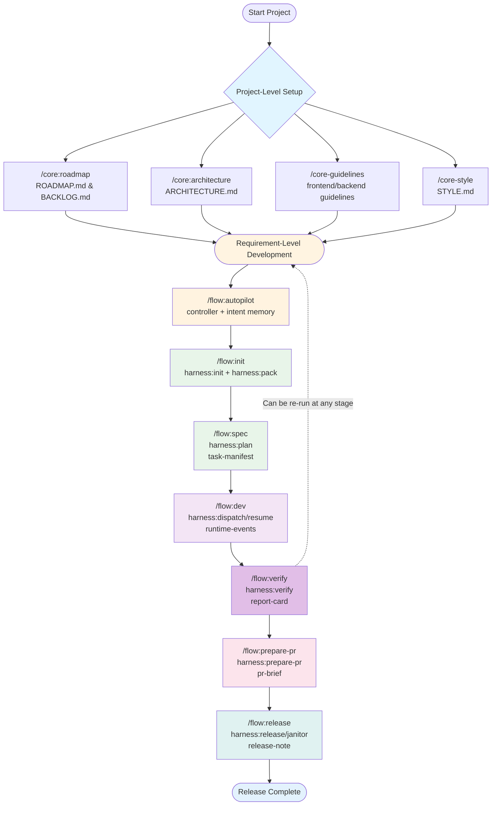

# 🚀 cc-devflow

> Autopilot-First Requirement Development Flow for Claude Code

A comprehensive development workflow system built on Claude Code's official sub-agents, hooks, and settings mechanisms. Transform requirements from planning to code delivery with a deterministic command chain.

[中文文档](./README.zh-CN.md) | [English](./README.md)

---

## 🎯 One-Line Introduction

Autopilot-first requirement delivery: `/flow:autopilot` converges intent into executable work, drives the thin harness chain, emits a PR-ready brief, then hands off to `/flow:release`.

---

## ✨ Core Features

- 🎯 **Autopilot-First Mainline** - Recommended path is `/flow:autopilot` → `/flow:prepare-pr` → `/flow:release`
- 🔄 **Thin Harness Spine** - Flow commands map to `harness:*` runtime operations with checkpoints, resume, and auditable artifacts
- 📝 **Markdown-First Memory** - `devflow/intent/*` stores summary, facts, decision log, plan, delegation map, resume index, and PR brief
- 📋 **Manifest-Driven Execution** - Requirements converge into `task-manifest.json`, then execute through dispatch, delegated workers, and verify gates
- 🔄 **Smart Recovery** - `harness:resume` and intent checkpoints restore interrupted execution from persisted state instead of chat history
- 🛡️ **Quality Gates** - Automated TypeScript checking, testing, linting, and security scanning
- 🤖 **Local Subagents and Workers** - Autopilot can hand off scoped tasks to local workers while keeping one truth surface
- 🎨 **UI Prototype Generation** - Conditional HTML prototype with artistic design inspiration
- 🔗 **GitHub Integration** - PR-ready brief generation, release notes, and conventional commit support
- 📊 **Progress Tracking** - Real-time status monitoring, stage derivation, and intelligent restart points
- 🔍 **Consistency Verification** - Enterprise-grade consistency checking with intelligent conflict detection
- 🧪 **TDD Enforced** - Strict Test-Driven Development with automatic TDD order validation in harness planner
- 📜 **Constitution** - 10 Articles governing quality, security, and architecture
- 🔄 **OpenSpec Interop** - Bidirectional conversion between OpenSpec and CC-DevFlow formats with automatic TDD task generation
- 🔄 **Autonomous Development** - Ralph × Manus Integration for memory-enhanced continuous iteration
- 🔌 **Multi-Platform Support** - Compile workflows for Codex, Cursor, Qwen, Antigravity via `npm run adapt`
- 🔄 **Multi-Module Compiler** - Full module compilation: skills, commands, agents, rules, hooks

---

## 💡 Core Concepts

### Hooks System

Real-time quality guardian: PreToolUse blocks non-compliant operations, PostToolUse auto-records changes.

<details>
<summary>📖 Hooks Details (Click to Expand)</summary>

**Hook Types**:

| Hook | Trigger Timing | Functionality |
|------|----------------|---------------|
| **UserPromptSubmit** | When user input is submitted | Intelligently recommends relevant Skills |
| **PreToolUse** | Before tool use | Blocks non-compliant operations (TDD violations, etc.) |
| **PostToolUse** | After tool use | Automatically records file changes |
| **Stop** | When session stops | Provides error handling hints |

**Guardrail Workflow**:
```
User edits file → PreToolUse Hook triggers
  ↓ Path normalization
  ↓ Rule matching
  ↓ Content checking
  ↓ Violation? Block operation : Allow operation
```

**Skipping Guardrails**:
```bash
# Method 1: File marker
echo "@skip-tdd-check" >> devflow/requirements/REQ-123/TASKS.md

# Method 2: Environment variable
export SKIP_TDD_ENFORCER=1
```

📚 [Complete Hooks Documentation](docs/guides/hooks-system.md)
</details>

### Skills System (v4.0 Skills-First Architecture)

Intelligent knowledge base activation with grouped Skills and automatic context injection.

<details>
<summary>📖 Skills Details (Click to Expand)</summary>

**Skills-First Architecture** (v4.0):

```
.claude/skills/
├── workflow.yaml           # Skill dependency graph (OpenSpec-inspired)
├── workflow/               # 9 Workflow Skills (flow-init, flow-spec, flow-dev, etc.)
├── domain/                 # 7 Domain Skills (tdd, debugging, brainstorming)
├── guardrail/              # 3 Guardrail Skills (constitution-guardian, tdd-enforcer)
└── utility/                # 8 Utility Skills (npm-release, skill-creator)
```

**Key Skills by Category**:

| Category | Skills | Purpose |
|----------|--------|---------|
| **Workflow** | flow-init, flow-spec, flow-dev, flow-verify, flow-release | Core development workflow |
| **Domain** | tdd, debugging, brainstorming, verification | Domain expertise |
| **Guardrail** | constitution-guardian, tdd-enforcer | Real-time compliance |
| **Utility** | npm-release, skill-creator, writing-skills | Development tools |

**Context Injection** (Trellis-inspired):
- Each Skill has `context.jsonl` defining required context files
- `inject-skill-context.ts` hook auto-loads context before Skill execution
- Variable substitution: `{REQ}` → actual requirement ID

📚 [Complete Skills Documentation](docs/guides/skills-system.md)
</details>

### Agent Orchestration

Current execution model: autopilot controller + local subagents/workers + thin harness runtime.

<details>
<summary>📖 Agent Orchestration Details (Click to Expand)</summary>

**Execution Model**:
- **Autopilot controller**: Converges intent, advances stages, and maintains the markdown truth surface
- **Local subagents/workers**: Execute scoped tasks through delegated worker handoffs when the task boundary is clear
- **Thin harness runtime**: Persists checkpoints, report-card, PR brief, and release artifacts

**Tool Distribution**:
- Controller/runtime: state derivation, artifact sync, stage transitions
- Workers/subagents: scoped execution, verification, and result materialization

📚 [Execution Model Details](docs/architecture/execution-model.md)
</details>

---

## 🚀 Quick Start

### Installation

#### Method 1: Install from npm (Recommended)

```bash
# Install globally
npm install -g cc-devflow
# or
pnpm add -g cc-devflow

# Initialize in your project
cc-devflow init

# Compile for specific platform (optional)
cc-devflow adapt --platform cursor
cc-devflow adapt --platform codex
cc-devflow adapt --platform antigravity
cc-devflow adapt --platform qwen
```

#### Method 2: Manual Installation

```bash
pnpm dlx tiged Dimon94/cc-devflow/.claude .claude
```

#### Update

To update to the latest version and synchronize your local project:

```bash
# Update globally
npm install -g cc-devflow@latest

# Update local project files (will overwrite conflicts)
cc-devflow init
```

### CLI Usage

```bash
# Initialize in current directory
cc-devflow init

# Initialize in specific directory
cc-devflow init --dir /path/to/project

# Compile for specific platform
cc-devflow adapt --platform codex
cc-devflow adapt --cwd /path/to/project --platform cursor

# Run harness runtime directly (for npm script delegation)
cc-devflow harness release --change-id REQ-123
```

`cc-devflow init` and `cc-devflow adapt` now auto-bootstrap missing `harness:*` npm scripts in `package.json` using portable `cc-devflow harness <subcommand>` entries (no machine-specific absolute paths), so `/flow:*` can execute the runtime chain without manual script patching.

### Optional Dependencies

```bash
# Chinese branch naming support (converts Chinese to pinyin)
pip install pypinyin
```

### Verify Installation

```bash
.claude/scripts/verify-setup.sh
```

### First Requirement

```bash
/flow:autopilot "REQ-001|User Authentication|https://docs.example.com/auth"
/flow:prepare-pr "REQ-001"
/flow:release "REQ-001"
```

<details>
<summary>🔍 Complete Getting Started Guide (Click to Expand)</summary>

**Interactive Demo**:
```bash
python3 .claude/scripts/demo.py
```

**Core Scripts**:
```bash
# Environment check
bash .claude/scripts/check-prerequisites.sh

# View task status
bash .claude/scripts/check-task-status.sh --verbose

# Mark task complete
bash .claude/scripts/mark-task-complete.sh T001

# Generate status report
bash .claude/scripts/generate-status-report.sh --format markdown
```

**Run Tests**:
```bash
# Run all tests
bash .claude/tests/run-all-tests.sh --scripts

# Constitution tests
bash .claude/tests/constitution/run_all_constitution_tests.sh
```

📚 [Complete Getting Started Guide](docs/guides/getting-started.md)
</details>

---

## 📋 Command Quick Reference

### 🏢 Project-Level Commands

**Purpose**: Project-wide planning and architecture design, typically executed once per project at the beginning

| Command | Purpose | Quick Example | Detailed Docs |
|---------|---------|---------------|---------------|
| `/core:roadmap` | 🗺️ Generate Product Roadmap | `/core:roadmap` | [→](docs/commands/core-roadmap.md) |
| `/core:architecture` | 🏗️ Generate System Architecture | `/core:architecture` | [→](docs/commands/core-architecture.md) |
| `/core-guidelines` | 📘 Generate Project Guidelines | `/core-guidelines` | [→](docs/commands/core-guidelines.md) |

### 📦 Requirement-Level Commands

**Purpose**: Specific requirement development, executed once per requirement (REQ-XXX)

| Command | Purpose | Quick Example | Detailed Docs |
|---------|---------|---------------|---------------|
| `/flow:autopilot` | 🤖 Converge intent and drive the recommended mainline | `/flow:autopilot "REQ-123\|Feature"` | [→](.claude/commands/flow/autopilot.md) |
| `/flow:init` | 📦 Initialize Requirement Context | `/flow:init "REQ-123\|Feature"` | [→](.claude/commands/flow/init.md) |
| `/flow:spec` | 📋 Build Task Manifest | `/flow:spec "REQ-123"` | [→](.claude/commands/flow/spec.md) |
| `/flow:dev` | 🛠️ Dispatch and Execute Tasks | `/flow:dev "REQ-123"` | [→](.claude/commands/flow/dev.md) |
| `/flow:verify` | ✅ Run Report Card Gates | `/flow:verify "REQ-123" --strict` | [→](.claude/commands/flow/verify.md) |
| `/flow:prepare-pr` | 🧾 Generate PR-ready brief from verified artifacts | `/flow:prepare-pr "REQ-123"` | [→](.claude/commands/flow/prepare-pr.md) |
| `/flow:release` | 🚢 Release + Cleanup | `/flow:release "REQ-123"` | [→](.claude/commands/flow/release.md) |
| `/flow:fix` | 🐛 Systematic Bug Fix | `/flow:fix "BUG-123\|Description"` | [→](.claude/commands/flow/fix.md) |
| `/flow:new` | ⚠️ Deprecated alias | Use `/flow:autopilot` (recommended) or `/flow:init` (manual control) | [→](.claude/commands/flow/new.md) |
| `/flow:clarify` | ⚠️ Deprecated | Merged into `/flow:spec` | [→](.claude/commands/flow/clarify.md) |
| `/flow:checklist` | ⚠️ Deprecated | Use `/flow:verify --strict` | [→](.claude/commands/flow/checklist.md) |
| `/flow:quality` | ⚠️ Deprecated | Use `/flow:verify` | [→](.claude/commands/flow/quality.md) |

📚 [Complete Command Reference](docs/commands/README.md)

<details>
<summary>🎯 Which Command Should I Use? (Click to Expand)</summary>

```
Your Scenario:
├─ Plan product direction? → /core:roadmap
├─ Design system architecture? → /core:architecture
├─ Establish coding standards? → /core-guidelines
├─ Start requirement delivery on the recommended path? → /flow:autopilot "REQ-123|Feature|URLs"
├─ Need manual stage control? → /flow:init "REQ-123|Feature|URLs"
├─ Generate task manifest manually? → /flow:spec "REQ-123"
├─ Execute planned tasks manually? → /flow:dev "REQ-123"
├─ Run strict quality gate? → /flow:verify "REQ-123" --strict
├─ Generate PR materials after verify? → /flow:prepare-pr "REQ-123"
├─ Continue interrupted development? → /flow:restart "REQ-123"
├─ Check development progress? → /flow:status REQ-123
├─ Re-check consistency anytime? → /flow:verify "REQ-123"
├─ Fix production bug? → /flow:fix "BUG-001|Description"
└─ Ready to release? → /flow:release "REQ-123"
```
</details>

---

## 🔄 Workflow Diagram

The following Mermaid diagram illustrates the complete cc-devflow workflow, including both project-level and requirement-level processes:


```mermaid
graph TB
    Start([Start Project]) --> ProjectLevel{Project-Level Setup}

    ProjectLevel --> CoreRoadmap["/core:roadmap<br/>ROADMAP.md & BACKLOG.md"]
    ProjectLevel --> CoreArch["/core:architecture<br/>ARCHITECTURE.md"]
    ProjectLevel --> CoreGuidelines["/core-guidelines<br/>frontend/backend guidelines"]
    ProjectLevel --> CoreStyle["/core-style<br/>STYLE.md"]

    CoreRoadmap --> ReqLevel
    CoreArch --> ReqLevel
    CoreGuidelines --> ReqLevel
    CoreStyle --> ReqLevel

    ReqLevel([Requirement-Level Development]) --> FlowAutopilot["/flow:autopilot<br/>controller + intent memory"]
    FlowAutopilot --> FlowInit["/flow:init<br/>harness:init + harness:pack"]
    FlowInit --> FlowSpec["/flow:spec<br/>harness:plan<br/>task-manifest"]
    FlowSpec --> FlowDev["/flow:dev<br/>harness:dispatch/resume<br/>runtime-events"]
    FlowDev --> FlowVerify["/flow:verify<br/>harness:verify<br/>report-card"]
    FlowVerify --> FlowPreparePr["/flow:prepare-pr<br/>harness:prepare-pr<br/>pr-brief"]
    FlowPreparePr --> FlowRelease["/flow:release<br/>harness:release/janitor<br/>release-note"]
    FlowRelease --> End([Release Complete])

    FlowVerify -.->|Can be re-run at any stage| ReqLevel

    style ProjectLevel fill:#e1f5ff
    style ReqLevel fill:#fff4e1
    style FlowAutopilot fill:#fff3e0
    style FlowInit fill:#e8f5e9
    style FlowSpec fill:#e8f5e9
    style FlowDev fill:#f3e5f5
    style FlowVerify fill:#e1bee7
    style FlowPreparePr fill:#fce4ec
    style FlowRelease fill:#e0f2f1
    style End fill:#e3f2fd
```

**Workflow Notes**:
- **Project-Level Commands** (light blue): Execute once at project initialization, establish global standards (SSOT)
- **Requirement-Level Commands** (light orange): Execute once per requirement (REQ-XXX)
- **Canonical Mainline**: `/flow:autopilot` → `/flow:init` → `/flow:spec` → `/flow:dev` → `/flow:verify` → `/flow:prepare-pr` → `/flow:release`
- **Harness Runtime Chain**: Each stage delegates to `npm run harness:*` operations with persisted checkpoints
- **Unified /flow:spec**: Consolidates planning output into a task manifest
- **Report Card Gate**: `/flow:verify --strict` blocks release when quality gates fail
- **TDD Checkpoint**: `/flow:dev` keeps fail-first verification before implementation
- **Deprecated Commands**: `/flow:new`, `/flow:clarify`, `/flow:checklist`, `/flow:quality` remain as migration stubs

---

## 🏗️ System Architecture

**Execution Model**: Autopilot controller + local subagents/workers + thin harness runtime
**Document Structure**: `intent/` + `requirements/` dual-surface architecture, markdown memory first
**Quality Assurance**: Constitution v2.0.0 + TDD Enforcement + Real-time Guardrail

<details>
<summary>📖 Architecture Details (Click to Expand)</summary>

### Sub-Agents Workflow

```text
clarify-analyst     → Clarify constraints and unresolved questions
tech-architect      → Summarize implementation boundaries and interfaces
ui-designer         → Add UI/UX constraints when needed
planner             → Compile approved plan into executable tasks
dev-implementer     → Execute manifest tasks and write result artifacts
security-reviewer   → Add focused security verification when risk justifies it
```

### Current Artifact Surfaces

```text
devflow/
├── intent/REQ-123/
│   ├── summary.md
│   ├── facts.md
│   ├── decision-log.md
│   ├── plan.md
│   ├── resume-index.md
│   └── artifacts/
│       ├── results/
│       └── pr-brief.md
└── requirements/REQ-123/
    ├── context-package.md
    ├── harness-state.json
    ├── TASKS.md
    ├── task-manifest.json
    ├── report-card.json
    └── RELEASE_NOTE.md
```

### Quality Gates

- Pre-push Guard (TypeScript, tests, linting, security, build)
- Report Card Gate (`/flow:verify --strict` before `/flow:prepare-pr` and `/flow:release`)
- Constitution Compliance (enforced at every stage)
- TDD Checkpoint (TEST VERIFICATION CHECKPOINT)
- Guardrail Hooks (PreToolUse real-time blocking of non-compliant operations)

📚 [Complete Architecture Documentation](docs/architecture/)
</details>

---

## ⚙️ Configuration

**Minimum Configuration** (`.claude/settings.json`):

```json
{
  "permissions": {
    "allowGitOperations": true,
    "allowNetworkRequests": true,
    "allowSubprocesses": true
  }
}
```

<details>
<summary>🔧 Complete Configuration Options (Click to Expand)</summary>

### Hooks Configuration

```json
{
  "hooks": {
    "PreToolUse": [{
      "matcher": "Edit|Write",
      "hooks": [{"type": "command", "command": "..."}]
    }]
  }
}
```

### Environment Variables

```bash
# Flow behavior
export FLOW_AUTO_APPROVE=false
export MIN_TEST_COVERAGE=80
export STRICT_TYPE_CHECKING=true

# Guardrail skip
export SKIP_TDD_ENFORCER=1
export SKIP_CONSTITUTION_CHECK=1
```

📚 [Complete Configuration Guide](docs/guides/configuration.md)
</details>

---

## 🧪 Test Coverage

**Script Tests**: 8/8 Passed ✅ (100%)
**Constitution Tests**: 38/38 Passed ✅ (100%)

```bash
# Run all tests
bash .claude/tests/run-all-tests.sh --scripts
```

<details>
<summary>📊 Test Framework Details (Click to Expand)</summary>

### Test Suites

| Test Suite | Test Cases | Status |
|------------|-----------|--------|
| `test_check_prerequisites` | 18 | ✅ 100% |
| `test_check_task_status` | 18 | ✅ 100% |
| `test_common` | 15 | ✅ 100% |
| `test_mark_task_complete` | 15 | ✅ 100% |
| `test_setup_epic` | 13 | ✅ 100% |
| `test_validate_constitution` | 4 | ✅ 100% |

📚 [Test Framework Details](docs/guides/testing-guide.md)
</details>

---

## 📝 Version History

Note: entries before v6.0.0 keep their original command syntax for historical accuracy.

### v6.0.0 (2026-02-18) - Latest Release

**🧩 Harness-First Mainline: Historical bridge into today's autopilot-first spine**

Historical note: this release standardized the harness runtime around a five-stage chain. The current recommended entrypoint has since moved to `/flow:autopilot` + `/flow:prepare-pr`, but v6.0.0 remains the transition point that made the thin runtime possible.

- **Default Command Chain at v6.0.0**
  - `/flow:init` → `/flow:spec` → `/flow:dev` → `/flow:verify` → `/flow:release`
  - This later evolved into today's `/flow:autopilot` → `/flow:prepare-pr` → `/flow:release` recommendation

- **Runtime Artifacts**
  - `context-package.md` + `harness-state.json` for bootstrap state
  - `task-manifest.json` + `runtime-events.jsonl` for execution trace
  - `report-card.json` + `release-note.md` for quality and release evidence

- **Deprecated Command Migrations**
  - `/flow:new` → at the time, run the 5-stage mainline explicitly
  - `/flow:clarify` → merged into `/flow:spec` planning loop
  - `/flow:checklist` and `/flow:quality` → replaced by `/flow:verify`

**📊 v6.0 Improvements**:
| Metric | Before | After | Improvement |
|--------|--------|-------|-------------|
| Default requirement commands | 8+ mixed paths | 5-stage fixed chain at the time | Simplified |
| Resume capability | Command-specific | Unified `harness:resume` | Deterministic |
| Quality evidence | Fragmented outputs | Single report card gate | Auditable |

### v4.7.0 (2026-02-07)

**🤝 Claude Team Integration: historical parallel-dev branch**

Historical note: this was an exploratory team-mode branch. The current canonical path is still `direct -> delegate -> team`, but team is no longer the headline default and should be read here as version history, not current setup guidance.

- **Team Mode for /flow:dev** - Parallel task execution with multiple agents
  - `--team` flag enables Team mode (default 3 agents)
  - `--agents N` specifies agent count (2-5)
  - Automatic task dependency analysis and conflict detection
  - File conflict tasks assigned to same agent for sequential execution

- **New Hooks** - Team lifecycle management
  - `TeammateIdle Hook` - Task assignment and scheduling
  - `TaskCompleted Hook` - Quality verification on completion
  - Timeout detection and alerting

- **Task Dependency Parser** - Intelligent task analysis
  - `parse-task-dependencies.js` - Parses TASKS.md format
  - Recognizes `[P]` parallel markers, `[US*]` user story groups
  - Phase-based dependency resolution

- **State Recovery** - Checkpoint and resume
  - `team-state-recovery.sh` - Snapshot and restore Team state
  - Support for interrupted session recovery

- **New Files**
  - `.claude/scripts/parse-task-dependencies.js` - Task parser
  - `.claude/scripts/detect-file-conflicts.sh` - Conflict detection
  - `.claude/scripts/team-dev-init.sh` - Dev team initialization
  - `.claude/scripts/team-state-recovery.sh` - State recovery
  - `.claude/docs/guides/TEAM_MODE_GUIDE.md` - Complete usage guide

**📊 v4.7 Improvements**:
| Metric | Before | After | Improvement |
|--------|--------|-------|-------------|
| Parallel agents | 1 | 3-5 | +400% |
| Requirement completion time | 90 min | 50 min | -45% |
| Task scheduling | Manual | Automatic | 100% |
| Quality verification | Single-point | Distributed | 100% |

### v4.3.0 (2026-02-07)

**🌿 Git Worktree Integration: historical experiment, later removed**

Historical note: built-in worktree management was later removed from the canonical workflow. This entry is kept only to explain the v4.3.0 shape of the project.

- **Git Worktree Mode (Default)** - Isolated development environments
  - Creates `../repo-name-REQ-xxx/` worktree directories
  - Each worktree has independent Claude Code session
  - Switch between requirements with `cd` instead of `git checkout`
  - `--branch-only` flag for traditional branch mode

- **New Skill: using-git-worktrees** - Complete worktree management
  - `worktree-create.sh` - Create new worktree
  - `worktree-list.sh` - List all worktrees
  - `worktree-switch.sh` - Switch to worktree
  - `worktree-cleanup.sh` - Clean up merged worktrees
  - Shell aliases template (za/zl/zm/zw)

- **Modified Commands**
  - `/flow:init` - Default worktree mode, `--branch-only` for direct branch mode
  - `/flow:release` - Automatic worktree cleanup

**📊 v4.3 Improvements**:
| Metric | Before | After | Improvement |
|--------|--------|-------|-------------|
| Parallel requirements | 1 | 3-5 | +400% |
| Context switch time | 30s | 1s | -97% |
| Session isolation | None | Full | 100% |

### v4.1.0 (2026-02-07)

**🎯 Unified Specification Phase: /flow:spec Command**

v4.1.0 establishes `/flow:spec` as the unified planning entry that later evolves into today's manifest-first planning chain:

- **Unified /flow:spec Command** - One command for entire specification phase
  - Compiles clarified requirement context into executable planning output
  - Supports lighter planning paths for smaller requirements
  - Keeps optional design analysis subordinate to the task graph

- **Parallel Agent Execution** - Tech + UI agents run concurrently
  - ~35% time reduction in design phase
  - Shared template components in `_shared/` directory

- **Simplified Workflows** (v4.1)
  ```
  Quick:    /flow:init → /flow:spec → /flow:dev
  Standard: /flow:init → /flow:spec → /flow:dev → /flow:verify
  Full:     /flow:autopilot → /flow:init → /flow:spec → /flow:dev → /flow:verify → /flow:prepare-pr → /flow:release
  ```

**📊 v4.1 Improvements**:
| Metric | Before (v4.0) | After (v4.1) | Improvement |
|--------|---------------|--------------|-------------|
| Command calls | 4 | 1 | -75% |
| Design phase time | 8-12 min | 5-8 min | -35% |
| Entry/Exit Gate code | ~280 lines | ~100 lines | -64% |

### v4.0.0 (2026-02-07)

**🏗️ Skills-First Architecture: Unified Skills with Context Injection**

v4.0.0 introduces a major architectural refactor, reorganizing 135 files into a unified Skills-First Architecture inspired by Trellis and OpenSpec:

- **Skills-First Architecture** - All Skills organized into 4 groups
  - `workflow/`: 9 core workflow Skills (flow-init, flow-spec, flow-dev, etc.)
  - `domain/`: 7 domain expertise Skills (tdd, debugging, brainstorming, verification)
  - `guardrail/`: 3 real-time compliance Skills (constitution-guardian, tdd-enforcer)
  - `utility/`: 8 development tool Skills (npm-release, skill-creator, writing-skills)

- **JSONL Context Injection** (Trellis-inspired)
  - Each Skill has `context.jsonl` defining required context files
  - `inject-skill-context.ts` hook auto-loads context before Skill execution
  - Variable substitution: `{REQ}` replaced with actual requirement ID
  - Optional files supported with `"optional": true`

- **workflow.yaml Dependency Graph** (OpenSpec-inspired)
  - Defines Skill dependencies with `requires` and `generates`
  - File existence state detection for workflow status
  - Clear visualization of Skill execution order

- **Self-Contained Skills**
  - Each Skill directory contains: SKILL.md + context.jsonl + scripts/ + references/ + assets/
  - SKILL.md limited to <500 lines for focused instructions
  - Agent instructions moved to `references/` subdirectory
  - Templates moved to `assets/` subdirectory

- **Multi-Module Cross-Platform Compiler** (v3.0)
  - Complete multi-module compilation: skills, commands, agents, rules, hooks
  - Platform-specific output formats:
    - **Codex**: `.codex/skills/`, `.codex/prompts/`, `AGENTS.md`
    - **Cursor**: `.cursor/rules/*.mdc`, `.cursor/subagents/`, `hooks.json`
    - **Qwen**: `.qwen/commands/*.toml`, `.qwen/agents/`, `CONTEXT.md`
    - **Antigravity**: `.agent/skills/`, `.agent/workflows/`, `.agent/rules/`
  - `context.jsonl` compilation-time expansion with platform-specific formats
  - 197 tests passing (24 new multi-module tests)

**📊 v4.0 Improvements**:
| Metric | Before | After | Improvement |
|--------|--------|-------|-------------|
| Maintenance points | 4 directories | 1 directory | -75% |
| Context loading | Manual full load | On-demand auto | -70% tokens |
| Dependency visibility | Implicit | Explicit (workflow.yaml) | +100% |
| Platform module support | Commands only | All modules | +400% |

**📁 New Files**:
- `.claude/skills/workflow.yaml` - Skill dependency graph
- `.claude/hooks/inject-skill-context.ts` - Context injection hook
- `.claude/skills/*/context.jsonl` - Per-Skill context definitions
- `devflow/spec/{frontend,backend,shared}/index.md` - Specification indexes
- `lib/compiler/context-expander.js` - Context.jsonl expansion module
- `lib/compiler/__tests__/multi-module-emitters.test.js` - Multi-module tests

### v2.3.0 (2026-01-08)

**🛡️ Discipline System: Iron Law + Rationalization Defense + Pressure Testing**

v2.3.0 upgrades the Constitution from a "document" to an "executable discipline system", borrowing best practices from superpowers project:

- **Iron Law + Rationalization Tables** - Pre-block AI Agent rationalization attempts
  - Each of 10 Constitution Articles now has an Iron Law (absolute prohibition)
  - Rationalization Tables with `| Excuse | Reality |` format
  - Red Flags for AI self-check triggers
  - Centralized `rationalization-library.md` for all rationalizations

- **Two-Stage Code Review** - `/flow-review` command (NEW)
  - Stage 1: Spec Compliance (don't trust implementer reports, read code directly)
  - Stage 2: Code Quality (only runs after Stage 1 passes)
  - `spec-reviewer.md` and `code-quality-reviewer.md` agents

- **Verification Before Completion** - Evidence before assertions
  - `verification-before-completion` skill
  - `verify-gate.sh` script for all flow exit gates
  - No completion claims without fresh verification evidence

- **Systematic Debugging** - `/flow-fix` enhanced with 4-phase debugging
  - Phase 1: Root Cause Investigation (NO FIXES YET)
  - Phase 2: Pattern Analysis
  - Phase 3: Hypothesis and Testing
  - Phase 4: TDD Implementation
  - `flow-debugging` and `flow-tdd` skills

- **Brainstorming Integration** - `/flow:init` now includes brainstorming
  - `BRAINSTORM.md` as requirement "North Star"
  - `/flow:spec` requires BRAINSTORM alignment check
  - `flow-brainstorming` skill

- **Pressure Testing Framework** - TDD for Skills
  - `tests/pressure-scenarios/` with 4 scenarios
  - Tests AI behavior under time/sunk cost/authority/exhaustion pressure
  - `run-pressure-tests.sh` runner

- **Skills Fusion** - Superpowers skills migrated to local
  - `flow-tdd`, `flow-debugging`, `flow-receiving-review`, `flow-finishing-branch`
  - All `superpowers:xxx` references replaced with local skills

- **Ralph × Manus Integration** - Autonomous development with memory (NEW)
  - Merged into `/flow:dev` (Autonomous by default)
  - `flow-attention-refresh` skill with 4 refresh protocols
  - `ERROR_LOG.md` structured error tracking
  - `research/attempts/` failure trace recording
  - Stop Hook for self-referential loops
  - Manus method in `/flow:init` Stage 2.5 Research
  - Target: ≥85% task completion rate without human intervention

**📋 Constitution v2.1.0**:
- All 10 Articles now have Iron Law + Rationalization Defense + Red Flags
- Cross-reference to `rationalization-library.md`

**📁 New Files**:
- `.claude/commands/util/cancel-ralph.md` - Cancel Ralph loop command
- `.claude/skills/flow-attention-refresh/SKILL.md` - 4 attention refresh protocols
- `.claude/hooks/ralph-stop-hook.sh` - Stop Hook for self-referential loops
- `.claude/hooks/hooks.json` - Hook registration configuration
- `.claude/scripts/setup-ralph-loop.sh` - Ralph state initialization script
- `.claude/docs/templates/ERROR_LOG_TEMPLATE.md` - Execution error log format
- `.claude/docs/templates/ATTEMPT_TEMPLATE.md` - Research attempt log format
- `.claude/agents/spec-reviewer.md` - Stage 1 spec compliance reviewer
- `.claude/agents/code-quality-reviewer.md` - Stage 2 code quality reviewer
- `.claude/commands/flow-review.md` - Historical two-stage review command, superseded by current flow review/verify chain
- `.claude/rules/rationalization-library.md` - Centralized rationalization defense
- `.claude/scripts/verify-gate.sh` - Exit gate verification script
- `.claude/skills/flow-brainstorming/` - Brainstorming skill
- `.claude/skills/flow-debugging/` - Systematic debugging skill
- `.claude/skills/flow-tdd/` - TDD enforcement skill
- `.claude/skills/flow-receiving-review/` - Review feedback handling skill
- `.claude/skills/flow-finishing-branch/` - Branch completion decision skill
- `.claude/skills/verification-before-completion/` - Completion verification skill
- `tests/` - Pressure testing framework

### v2.2.0 (2025-12-19)

**🔌 Multi-Platform Adaptation: Agent Adapter Architecture + Command Emitter**

v2.2.0 introduces comprehensive multi-platform support, enabling cc-devflow workflows to run on multiple AI coding assistants:

- **Agent Adapter Architecture (REQ-004)** - Pluggable adapter layer for platform differences
  - Unified Agent Adapter abstraction (environment detection, command execution, capability declaration)
  - Adapter Registry with auto-detection and explicit override support
  - Built-in adapters: Claude Code (default), Codex CLI, Cursor, Qwen, Antigravity
  - Security-first design: capability allow-list with default deny for high-risk operations
  - Structured logging for debugging and auditing

- **Command Emitter Compiler (REQ-005)** - Single Source of Truth compilation
  - `.claude/` as SSOT, compiles to platform-native formats
  - `npm run adapt` CLI for multi-platform compilation
  - Supported platforms: Codex (`.codex/`), Cursor (`.cursor/`), Qwen (`.qwen/`), Antigravity (`.agent/`)
  - Placeholder expansion: `{SCRIPT:*}`, `{TEMPLATE:*}`, `{GUIDE:*}`, `{AGENT_SCRIPT}`, `$ARGUMENTS`
  - Template/Guide inlining with automatic content embedding
  - Resource copying with path rewriting (scripts, templates, guides → platform directories)
  - Manifest-based incremental compilation with drift detection

- **Adapter Compiler (REQ-006)** - Multi-platform rules entry file generation
  - Platform-specific rules emitters for 4 platforms (Cursor MDC, Codex SKILL.md, Qwen TOML, Antigravity with 12K splitting)
  - Skills registry compilation (merges `skill-rules.json` + `skill.md` metadata)
  - Manifest v2.0 extension with `skills` and `rulesEntry` tracking
  - `--rules` and `--skills` CLI options for selective compilation
  - **Bug Fix**: Disabled template inlining by default (keeps path references instead of inline expansion)
  - 173 tests, 87% coverage for new modules

**📦 New CLI Tool**:
```bash
npm run adapt                        # Compile for all platforms
npm run adapt -- --platform codex    # Compile for specific platform
npm run adapt -- --check             # Check for drift without compiling
npm run adapt -- --verbose           # Show detailed output
```

### v2.1.0 (2025-11-07)

**🏢 Core Breakthrough: Introduction of Project-Level Commands**

v2.1.0's core breakthrough is the introduction of **Project-Level Commands**, forming a two-tier system with previous **Requirement-Level Commands**:

- **Project-Level Commands** - Project-wide planning and architecture design (executed once per project at the beginning)
  - `/core:roadmap` - Interactive product roadmap generation (6-stage dialogue)
  - `/core:architecture` - 4 architecture diagram generation (Mermaid format)
  - `/core-guidelines` - Project guidelines generation (frontend/backend separation)

- **Requirement-Level Commands Enhancement** - Stage 1.5 Roadmap & Architecture context loading (flow-init)
  - Automatically load project-level context when initializing requirements
  - Automatic requirement-to-roadmap mapping (RM-ID, Milestone, Quarter)
  - Automatic architecture context association (Feature Layer, Tech Stack, Module)

**📚 Documentation Improvements**:
- README complete refactoring (complete TOC + folding + external documentation links)
- Added 25+ detailed documents

📋 [Complete Changelog](CHANGELOG.md)

---

## 🤝 Contributing & Support

**Contributing**: [Contributing Guide](CONTRIBUTING.md)
**Issues**: [GitHub Issues](https://github.com/Dimon94/cc-devflow/issues)
**Documentation**: [Complete Documentation](docs/)

---

## 📄 License

MIT License - See [LICENSE](LICENSE) file

---

**🌟 Star this repository if cc-devflow helps streamline your development workflow!**
