# 🚀 cc-devflow

> One-Command Requirement Development Flow for Claude Code

A comprehensive development workflow system built on Claude Code's official sub-agents, hooks, and settings mechanisms. Transform your requirements from planning to code delivery with a single command.

[中文文档](./README.zh-CN.md) | [English](./README.md)

---

## 🎯 One-Line Introduction

Complete automated workflow from PRD generation to code delivery with `/flow-new "REQ-123|Feature|URLs"`.

---

## ✨ Core Features

- 🎯 **One-Command Flow** - Complete PRD → Code → Test → Release with a single command
- 🔄 **Staged Commands** - 8 independent stage commands for fine-grained control
- 📋 **Document-Driven** - Automatic PRD → UI Prototype → EPIC → TASKS → Implementation chain
- 📝 **Template-Driven** - Self-executable templates (PRD_TEMPLATE, EPIC_TEMPLATE, TASKS_TEMPLATE)
- 🔄 **Smart Recovery** - `/flow-restart` auto-detects restart points for interrupted development
- 🛡️ **Quality Gates** - Automated TypeScript checking, testing, linting, and security scanning
- 🤖 **Sub-Agent Orchestration** - 12 specialized research agents for different development phases
- 🎨 **UI Prototype Generation** - Conditional HTML prototype with artistic design inspiration
- 🔗 **GitHub Integration** - Automated PR creation, branch management, and conventional commits
- 📊 **Progress Tracking** - Real-time status monitoring and intelligent restart points
- 🔍 **Consistency Verification** - Enterprise-grade consistency checking with intelligent conflict detection
- 🧪 **TDD Enforced** - Strict Test-Driven Development with TEST VERIFICATION CHECKPOINT
- 📜 **Constitution** - 10 Articles governing quality, security, and architecture
- 🔄 **Autonomous Development** - Ralph × Manus Integration for memory-enhanced continuous iteration
- 🔌 **Multi-Platform Support** - Compile workflows for Codex, Cursor, Qwen, Antigravity via `npm run adapt`

---

## 💡 Core Concepts

### Hooks System

Real-time quality guardian: PreToolUse blocks non-compliant operations, PostToolUse auto-records changes.

<details>
<summary>📖 Hooks Details (Click to Expand)</summary>

**Hook Types**:

| Hook | Trigger Timing | Functionality |
|------|----------------|---------------|
| **UserPromptSubmit** | When user input is submitted | Intelligently recommends relevant Skills |
| **PreToolUse** | Before tool use | Blocks non-compliant operations (TDD violations, etc.) |
| **PostToolUse** | After tool use | Automatically records file changes |
| **Stop** | When session stops | Provides error handling hints |

**Guardrail Workflow**:
```
User edits file → PreToolUse Hook triggers
  ↓ Path normalization
  ↓ Rule matching
  ↓ Content checking
  ↓ Violation? Block operation : Allow operation
```

**Skipping Guardrails**:
```bash
# Method 1: File marker
echo "@skip-tdd-check" >> devflow/requirements/REQ-123/TASKS.md

# Method 2: Environment variable
export SKIP_TDD_ENFORCER=1
```

📚 [Complete Hooks Documentation](docs/guides/hooks-system.md)
</details>

### Skills System (v4.0 Skills-First Architecture)

Intelligent knowledge base activation with grouped Skills and automatic context injection.

<details>
<summary>📖 Skills Details (Click to Expand)</summary>

**Skills-First Architecture** (v4.0):

```
.claude/skills/
├── workflow.yaml           # Skill dependency graph (OpenSpec-inspired)
├── workflow/               # 9 Workflow Skills (flow-init, flow-prd, etc.)
├── domain/                 # 7 Domain Skills (tdd, debugging, brainstorming)
├── guardrail/              # 3 Guardrail Skills (constitution-guardian, tdd-enforcer)
└── utility/                # 8 Utility Skills (npm-release, skill-creator)
```

**Key Skills by Category**:

| Category | Skills | Purpose |
|----------|--------|---------|
| **Workflow** | flow-init, flow-prd, flow-epic, flow-dev, flow-quality, flow-release | Core development workflow |
| **Domain** | tdd, debugging, brainstorming, verification | Domain expertise |
| **Guardrail** | constitution-guardian, tdd-enforcer | Real-time compliance |
| **Utility** | npm-release, skill-creator, writing-skills | Development tools |

**Context Injection** (Trellis-inspired):
- Each Skill has `context.jsonl` defining required context files
- `inject-skill-context.ts` hook auto-loads context before Skill execution
- Variable substitution: `{REQ}` → actual requirement ID

📚 [Complete Skills Documentation](docs/guides/skills-system.md)
</details>

### Agent Orchestration

Dual-layer execution model: Research Agents (11, read-only analysis) + Main Agent (execution).

<details>
<summary>📖 Agent Orchestration Details (Click to Expand)</summary>

**Execution Model**:
- **Research Agents**: Read-only analysis, generate Markdown plans and reports
- **Main Agent (Claude)**: Executes all code operations, owns complete context
- **Workflow**: Agent Research → Output Plans → Main Agent Executes → Iterate

**Tool Distribution**:
- Research Agents: Read, Grep, Glob (analysis)
- Main Agent: Edit, Write, Bash, Git (execution)

📚 [Execution Model Details](docs/architecture/execution-model.md)
</details>

---

## 🚀 Quick Start

### Installation

#### Method 1: Install from npm (Recommended)

```bash
# Install globally
npm install -g cc-devflow
# or
pnpm add -g cc-devflow

# Initialize in your project
cc-devflow init

# Compile for specific platform (optional)
cc-devflow adapt --platform cursor
cc-devflow adapt --platform codex
cc-devflow adapt --platform antigravity
cc-devflow adapt --platform qwen
```

#### Method 2: Manual Installation

```bash
pnpm dlx tiged Dimon94/cc-devflow/.claude .claude
```

#### Update

To update to the latest version and synchronize your local project:

```bash
# Update globally
npm install -g cc-devflow@latest

# Update local project files (will overwrite conflicts)
cc-devflow init
```

### CLI Usage

```bash
# Initialize in current directory
cc-devflow init

# Initialize in specific directory
cc-devflow init --dir /path/to/project

# Compile for specific platform
cc-devflow adapt --platform codex
cc-devflow adapt --cwd /path/to/project --platform cursor
```

### Optional Dependencies

```bash
# Chinese branch naming support (converts Chinese to pinyin)
pip install pypinyin
```

### Verify Installation

```bash
.claude/scripts/verify-setup.sh
```

### First Requirement

```bash
/flow-new "REQ-001|User Authentication|https://docs.example.com/auth"
```

<details>
<summary>🔍 Complete Getting Started Guide (Click to Expand)</summary>

**Interactive Demo**:
```bash
python3 .claude/scripts/demo.py
```

**Core Scripts**:
```bash
# Environment check
bash .claude/scripts/check-prerequisites.sh

# View task status
bash .claude/scripts/check-task-status.sh --verbose

# Mark task complete
bash .claude/scripts/mark-task-complete.sh T001

# Generate status report
bash .claude/scripts/generate-status-report.sh --format markdown
```

**Run Tests**:
```bash
# Run all tests
bash .claude/tests/run-all-tests.sh --scripts

# Constitution tests
bash .claude/tests/constitution/run_all_constitution_tests.sh
```

📚 [Complete Getting Started Guide](docs/guides/getting-started.md)
</details>

---

## 📋 Command Quick Reference

### 🏢 Project-Level Commands

**Purpose**: Project-wide planning and architecture design, typically executed once per project at the beginning

| Command | Purpose | Quick Example | Detailed Docs |
|---------|---------|---------------|---------------|
| `/core-roadmap` | 🗺️ Generate Product Roadmap | `/core-roadmap` | [→](docs/commands/core-roadmap.md) |
| `/core-architecture` | 🏗️ Generate System Architecture | `/core-architecture` | [→](docs/commands/core-architecture.md) |
| `/core-guidelines` | 📘 Generate Project Guidelines | `/core-guidelines` | [→](docs/commands/core-guidelines.md) |

### 📦 Requirement-Level Commands

**Purpose**: Specific requirement development, executed once per requirement (REQ-XXX)

| Command | Purpose | Quick Example | Detailed Docs |
|---------|---------|---------------|---------------|
| `/flow-new` | 🎯 Start New Requirement | `/flow-new "REQ-123\|Feature"` | [→](docs/commands/flow-new.md) |
| `/flow-init` | 📦 Initialize Requirement | `/flow-init "REQ-123\|Feature"` | [→](docs/commands/flow-init.md) |
| `/flow-clarify` | 🔎 Clarify Ambiguities | `/flow-clarify "REQ-123"` | [→](.claude/commands/flow-clarify.md) |
| `/flow-checklist` | ✅ Requirement Quality Check | `/flow-checklist --type ux` | [→](.claude/commands/flow-checklist.md) |
| `/flow-review` | �� Two-Stage Code Review | `/flow-review "REQ-123"` | [→](.claude/commands/flow-review.md) |
| `/flow-fix` | 🐛 Systematic Bug Fix | `/flow-fix "BUG-123\|Description"` | [→](.claude/commands/flow-fix.md) |
| `/flow-verify` | 🔍 Verify Consistency | `/flow-verify "REQ-123"` | [→](docs/commands/flow-verify.md) |
| `/flow-qa` | 🧪 Quality Assurance | `/flow-qa "REQ-123"` | [→](docs/commands/flow-qa.md) |
| `/flow-release` | 🚢 Create Release | `/flow-release "REQ-123"` | [→](docs/commands/flow-release.md) |

📚 [Complete Command Reference](docs/commands/README.md)

<details>
<summary>🎯 Which Command Should I Use? (Click to Expand)</summary>

```
Your Scenario:
├─ Plan product direction? → /core-roadmap
├─ Design system architecture? → /core-architecture
├─ Establish coding standards? → /core-guidelines
├─ Start brand new feature development? → /flow-new "REQ-123|Feature|URLs"
├─ Only create requirement directory? → /flow-init "REQ-123|Feature"
├─ Clarify ambiguous requirements? → /flow-clarify "REQ-123"
├─ Validate requirement quality? → /flow-checklist --type ux,api,security
├─ Continue interrupted development? → /flow-restart "REQ-123"
├─ Check development progress? → /flow-status REQ-123
├─ Found document inconsistencies? → /flow-verify "REQ-123"
├─ Development complete, need testing? → /flow-qa "REQ-123"
├─ Fix production bug? → /flow-fix "BUG-001|Description"
└─ Ready to release? → /flow-release "REQ-123"
```
</details>

---

## 🔄 Workflow Diagram

The following Mermaid diagram illustrates the complete cc-devflow workflow, including both project-level and requirement-level processes:

```mermaid
graph TB
    Start([Start Project]) --> ProjectLevel{Project-Level Setup}

    ProjectLevel --> CoreRoadmap["/core-roadmap<br/>ROADMAP.md & BACKLOG.md"]
    ProjectLevel --> CoreArch["/core-architecture<br/>ARCHITECTURE.md"]
    ProjectLevel --> CoreGuidelines["/core-guidelines<br/>frontend/backend guidelines"]
    ProjectLevel --> CoreStyle["/core-style<br/>STYLE.md"]

    CoreRoadmap --> ReqLevel
    CoreArch --> ReqLevel
    CoreGuidelines --> ReqLevel
    CoreStyle --> ReqLevel

    ReqLevel([Requirement-Level Development]) --> FlowInit["/flow-init<br/>research.md & BRAINSTORM.md"]

    FlowInit --> FlowClarify["/flow-clarify<br/>clarifications/*.md<br/>Optional"]
    FlowClarify --> FlowPRD["/flow-prd<br/>PRD.md<br/>BRAINSTORM alignment"]
    FlowInit -.->|Skip clarify| FlowPRD
    FlowPRD --> FlowChecklist["/flow-checklist<br/>checklists/*.md<br/>80% Gate"]
    FlowPRD --> FlowTech["/flow-tech<br/>TECH_DESIGN.md & data-model"]
    FlowPRD --> FlowUI["/flow-ui<br/>UI_PROTOTYPE.html<br/>Optional"]

    FlowChecklist --> FlowEpic
    FlowTech --> FlowEpic["/flow-epic<br/>EPIC.md & TASKS.md<br/>bite-sized tasks"]
    FlowUI --> FlowEpic

    FlowEpic --> FlowDev["/flow-dev<br/>TASKS.md execution<br/>TDD Checkpoint"]

    FlowDev --> FlowReview["/flow-review<br/>Two-Stage Review<br/>Spec → Quality"]

    FlowReview --> FlowQA["/flow-qa<br/>QA reports & Security"]

    FlowQA --> FlowRelease["/flow-release<br/>PR creation<br/>Branch decision"]

    FlowRelease --> FlowVerify["/flow-verify<br/>Consistency check"]

    FlowVerify --> End([Release Complete])

    FlowVerify -.->|Can be called at any stage| ReqLevel

    style ProjectLevel fill:#e1f5ff
    style ReqLevel fill:#fff4e1
    style FlowInit fill:#e8f5e9
    style FlowClarify fill:#fff9c4
    style FlowPRD fill:#e8f5e9
    style FlowChecklist fill:#ffe0b2
    style FlowTech fill:#e8f5e9
    style FlowUI fill:#fff9c4
    style FlowEpic fill:#e8f5e9
    style FlowDev fill:#f3e5f5
    style FlowReview fill:#e1bee7
    style FlowQA fill:#fce4ec
    style FlowRelease fill:#e0f2f1
    style FlowVerify fill:#e3f2fd
```



**Workflow Notes**:
- **Project-Level Commands** (light blue): Execute once at project initialization, establish global standards (SSOT)
- **Requirement-Level Commands** (light orange): Execute once per requirement (REQ-XXX)
- **Brainstorming** (v2.3.0): `/flow-init` now generates `BRAINSTORM.md` as requirement "North Star"
- **Two-Stage Review** (v2.3.0): `/flow-review` validates Spec Compliance before Code Quality
- **Optional Steps** (yellow): `/flow-clarify` and `/flow-ui` are optional; clarify can be skipped if requirements are clear
- **Quality Gate** (orange): `/flow-checklist` validates requirement quality with 80% completion threshold before `/flow-epic`
- **TDD Checkpoint** (v2.3.0): `/flow-dev` includes mandatory TDD checkpoint (tests must FAIL first)
- **Quality Gates**: Each stage has entry/exit gates ensuring document quality and Constitution compliance
- **Consistency Check**: `/flow-verify` can be called at any stage to ensure document consistency

---

## 🏗️ System Architecture

**Execution Model**: Research Agents (11, read-only) + Main Agent (execution)
**Document Structure**: Single-track architecture, one requirement directory contains all artifacts
**Quality Assurance**: Constitution v2.0.0 + TDD Enforcement + Real-time Guardrail

<details>
<summary>📖 Architecture Details (Click to Expand)</summary>

### Sub-Agents Workflow

```text
clarify-analyst     → Clarification questions (11-dimension scan)
prd-writer          → PRD generation (must use PRD_TEMPLATE)
checklist-agent     → Requirement quality validation (5 dimensions, 6 types) ⭐ NEW
ui-designer         → UI prototype (conditional trigger)
tech-architect      → Technical design (Anti-Tech-Creep enforcement)
planner             → EPIC & TASKS (must use EPIC_TEMPLATE, TASKS_TEMPLATE)
dev-implementer     → Implementation plan (research only)
qa-tester           → Test plan + Test report
security-reviewer   → Security plan + Security report
release-manager     → Release plan
```

### Single-Track Architecture

```text
devflow/
├── ROADMAP.md               # Product roadmap
├── ARCHITECTURE.md          # System architecture design
├── BACKLOG.md               # Requirement backlog
└── requirements/REQ-123/
    ├── PRD.md
    ├── EPIC.md
    ├── TASKS.md
    ├── EXECUTION_LOG.md
    ├── checklists/          # Requirement quality checklists
    │   ├── ux.md
    │   ├── api.md
    │   └── security.md
    ├── TEST_PLAN.md
    ├── TEST_REPORT.md
    ├── SECURITY_PLAN.md
    ├── SECURITY_REPORT.md
    └── RELEASE_PLAN.md
```

### Quality Gates

- Pre-push Guard (TypeScript, tests, linting, security, build)
- Checklist Gate (`/flow-checklist` 80% completion threshold before `/flow-epic`)
- Constitution Compliance (enforced at every stage)
- TDD Checkpoint (TEST VERIFICATION CHECKPOINT)
- Guardrail Hooks (PreToolUse real-time blocking of non-compliant operations)

📚 [Complete Architecture Documentation](docs/architecture/)
</details>

---

## ⚙️ Configuration

**Minimum Configuration** (`.claude/settings.json`):

```json
{
  "permissions": {
    "allowGitOperations": true,
    "allowNetworkRequests": true,
    "allowSubprocesses": true
  }
}
```

<details>
<summary>🔧 Complete Configuration Options (Click to Expand)</summary>

### Hooks Configuration

```json
{
  "hooks": {
    "PreToolUse": [{
      "matcher": "Edit|Write",
      "hooks": [{"type": "command", "command": "..."}]
    }]
  }
}
```

### Environment Variables

```bash
# Flow behavior
export FLOW_AUTO_APPROVE=false
export MIN_TEST_COVERAGE=80
export STRICT_TYPE_CHECKING=true

# Guardrail skip
export SKIP_TDD_ENFORCER=1
export SKIP_CONSTITUTION_CHECK=1
```

📚 [Complete Configuration Guide](docs/guides/configuration.md)
</details>

---

## 🧪 Test Coverage

**Script Tests**: 8/8 Passed ✅ (100%)
**Constitution Tests**: 38/38 Passed ✅ (100%)

```bash
# Run all tests
bash .claude/tests/run-all-tests.sh --scripts
```

<details>
<summary>📊 Test Framework Details (Click to Expand)</summary>

### Test Suites

| Test Suite | Test Cases | Status |
|------------|-----------|--------|
| `test_check_prerequisites` | 18 | ✅ 100% |
| `test_check_task_status` | 18 | ✅ 100% |
| `test_common` | 15 | ✅ 100% |
| `test_mark_task_complete` | 15 | ✅ 100% |
| `test_setup_epic` | 13 | ✅ 100% |
| `test_validate_constitution` | 4 | ✅ 100% |

📚 [Test Framework Details](docs/guides/testing-guide.md)
</details>

---

## 📝 Version History

### v4.0.0 (2026-02-07) - Latest Release

**🏗️ Skills-First Architecture: Unified Skills with Context Injection**

v4.0.0 introduces a major architectural refactor, reorganizing 135 files into a unified Skills-First Architecture inspired by Trellis and OpenSpec:

- **Skills-First Architecture** - All Skills organized into 4 groups
  - `workflow/`: 9 core workflow Skills (flow-init, flow-prd, flow-epic, flow-dev, etc.)
  - `domain/`: 7 domain expertise Skills (tdd, debugging, brainstorming, verification)
  - `guardrail/`: 3 real-time compliance Skills (constitution-guardian, tdd-enforcer)
  - `utility/`: 8 development tool Skills (npm-release, skill-creator, writing-skills)

- **JSONL Context Injection** (Trellis-inspired)
  - Each Skill has `context.jsonl` defining required context files
  - `inject-skill-context.ts` hook auto-loads context before Skill execution
  - Variable substitution: `{REQ}` replaced with actual requirement ID
  - Optional files supported with `"optional": true`

- **workflow.yaml Dependency Graph** (OpenSpec-inspired)
  - Defines Skill dependencies with `requires` and `generates`
  - File existence state detection for workflow status
  - Clear visualization of Skill execution order

- **Self-Contained Skills**
  - Each Skill directory contains: SKILL.md + context.jsonl + scripts/ + references/ + assets/
  - SKILL.md limited to <500 lines for focused instructions
  - Agent instructions moved to `references/` subdirectory
  - Templates moved to `assets/` subdirectory

**📊 Improvements**:
| Metric | Before | After | Improvement |
|--------|--------|-------|-------------|
| Maintenance points | 4 directories | 1 directory | -75% |
| Context loading | Manual full load | On-demand auto | -70% tokens |
| Dependency visibility | Implicit | Explicit (workflow.yaml) | +100% |

**📁 New Files**:
- `.claude/skills/workflow.yaml` - Skill dependency graph
- `.claude/hooks/inject-skill-context.ts` - Context injection hook
- `.claude/skills/workflow/*/context.jsonl` - Per-Skill context definitions
- `devflow/spec/{frontend,backend,shared}/index.md` - Specification indexes

### v2.3.0 (2026-01-08)

**🛡️ Discipline System: Iron Law + Rationalization Defense + Pressure Testing**

v2.3.0 upgrades the Constitution from a "document" to an "executable discipline system", borrowing best practices from superpowers project:

- **Iron Law + Rationalization Tables** - Pre-block AI Agent rationalization attempts
  - Each of 10 Constitution Articles now has an Iron Law (absolute prohibition)
  - Rationalization Tables with `| Excuse | Reality |` format
  - Red Flags for AI self-check triggers
  - Centralized `rationalization-library.md` for all rationalizations

- **Two-Stage Code Review** - `/flow-review` command (NEW)
  - Stage 1: Spec Compliance (don't trust implementer reports, read code directly)
  - Stage 2: Code Quality (only runs after Stage 1 passes)
  - `spec-reviewer.md` and `code-quality-reviewer.md` agents

- **Verification Before Completion** - Evidence before assertions
  - `verification-before-completion` skill
  - `verify-gate.sh` script for all flow exit gates
  - No completion claims without fresh verification evidence

- **Systematic Debugging** - `/flow-fix` enhanced with 4-phase debugging
  - Phase 1: Root Cause Investigation (NO FIXES YET)
  - Phase 2: Pattern Analysis
  - Phase 3: Hypothesis and Testing
  - Phase 4: TDD Implementation
  - `flow-debugging` and `flow-tdd` skills

- **Brainstorming Integration** - `/flow-init` now includes brainstorming
  - `BRAINSTORM.md` as requirement "North Star"
  - `/flow-prd` requires BRAINSTORM alignment check
  - `flow-brainstorming` skill

- **Pressure Testing Framework** - TDD for Skills
  - `tests/pressure-scenarios/` with 4 scenarios
  - Tests AI behavior under time/sunk cost/authority/exhaustion pressure
  - `run-pressure-tests.sh` runner

- **Skills Fusion** - Superpowers skills migrated to local
  - `flow-tdd`, `flow-debugging`, `flow-receiving-review`, `flow-finishing-branch`
  - All `superpowers:xxx` references replaced with local skills

- **Ralph × Manus Integration** - Autonomous development with memory (NEW)
  - Merged into `/flow-dev` (Autonomous by default)
  - `flow-attention-refresh` skill with 4 refresh protocols
  - `ERROR_LOG.md` structured error tracking
  - `research/attempts/` failure trace recording
  - Stop Hook for self-referential loops
  - Manus method in `/flow-init` Stage 2.5 Research
  - Target: ≥85% task completion rate without human intervention

**📋 Constitution v2.1.0**:
- All 10 Articles now have Iron Law + Rationalization Defense + Red Flags
- Cross-reference to `rationalization-library.md`

**📁 New Files**:
- `.claude/commands/cancel-ralph.md` - Cancel Ralph loop command
- `.claude/skills/flow-attention-refresh/SKILL.md` - 4 attention refresh protocols
- `.claude/hooks/ralph-stop-hook.sh` - Stop Hook for self-referential loops
- `.claude/hooks/hooks.json` - Hook registration configuration
- `.claude/scripts/setup-ralph-loop.sh` - Ralph state initialization script
- `.claude/docs/templates/ERROR_LOG_TEMPLATE.md` - Execution error log format
- `.claude/docs/templates/ATTEMPT_TEMPLATE.md` - Research attempt log format
- `.claude/agents/spec-reviewer.md` - Stage 1 spec compliance reviewer
- `.claude/agents/code-quality-reviewer.md` - Stage 2 code quality reviewer
- `.claude/commands/flow-review.md` - Two-stage review command
- `.claude/rules/rationalization-library.md` - Centralized rationalization defense
- `.claude/scripts/verify-gate.sh` - Exit gate verification script
- `.claude/skills/flow-brainstorming/` - Brainstorming skill
- `.claude/skills/flow-debugging/` - Systematic debugging skill
- `.claude/skills/flow-tdd/` - TDD enforcement skill
- `.claude/skills/flow-receiving-review/` - Review feedback handling skill
- `.claude/skills/flow-finishing-branch/` - Branch completion decision skill
- `.claude/skills/verification-before-completion/` - Completion verification skill
- `tests/` - Pressure testing framework

### v2.2.0 (2025-12-19)

**🔌 Multi-Platform Adaptation: Agent Adapter Architecture + Command Emitter**

v2.2.0 introduces comprehensive multi-platform support, enabling cc-devflow workflows to run on multiple AI coding assistants:

- **Agent Adapter Architecture (REQ-004)** - Pluggable adapter layer for platform differences
  - Unified Agent Adapter abstraction (environment detection, command execution, capability declaration)
  - Adapter Registry with auto-detection and explicit override support
  - Built-in adapters: Claude Code (default), Codex CLI, Cursor, Qwen, Antigravity
  - Security-first design: capability allow-list with default deny for high-risk operations
  - Structured logging for debugging and auditing

- **Command Emitter Compiler (REQ-005)** - Single Source of Truth compilation
  - `.claude/` as SSOT, compiles to platform-native formats
  - `npm run adapt` CLI for multi-platform compilation
  - Supported platforms: Codex (`.codex/`), Cursor (`.cursor/`), Qwen (`.qwen/`), Antigravity (`.agent/`)
  - Placeholder expansion: `{SCRIPT:*}`, `{TEMPLATE:*}`, `{GUIDE:*}`, `{AGENT_SCRIPT}`, `$ARGUMENTS`
  - Template/Guide inlining with automatic content embedding
  - Resource copying with path rewriting (scripts, templates, guides → platform directories)
  - Manifest-based incremental compilation with drift detection

- **Adapter Compiler (REQ-006)** - Multi-platform rules entry file generation
  - Platform-specific rules emitters for 4 platforms (Cursor MDC, Codex SKILL.md, Qwen TOML, Antigravity with 12K splitting)
  - Skills registry compilation (merges `skill-rules.json` + `skill.md` metadata)
  - Manifest v2.0 extension with `skills` and `rulesEntry` tracking
  - `--rules` and `--skills` CLI options for selective compilation
  - **Bug Fix**: Disabled template inlining by default (keeps path references instead of inline expansion)
  - 173 tests, 87% coverage for new modules

**📦 New CLI Tool**:
```bash
npm run adapt                        # Compile for all platforms
npm run adapt -- --platform codex    # Compile for specific platform
npm run adapt -- --check             # Check for drift without compiling
npm run adapt -- --verbose           # Show detailed output
```

### v2.1.0 (2025-11-07)

**🏢 Core Breakthrough: Introduction of Project-Level Commands**

v2.1.0's core breakthrough is the introduction of **Project-Level Commands**, forming a two-tier system with previous **Requirement-Level Commands**:

- **Project-Level Commands** - Project-wide planning and architecture design (executed once per project at the beginning)
  - `/core-roadmap` - Interactive product roadmap generation (6-stage dialogue)
  - `/core-architecture` - 4 architecture diagram generation (Mermaid format)
  - `/core-guidelines` - Project guidelines generation (frontend/backend separation)

- **Requirement-Level Commands Enhancement** - Stage 1.5 Roadmap & Architecture context loading (flow-init)
  - Automatically load project-level context when initializing requirements
  - Automatic requirement-to-roadmap mapping (RM-ID, Milestone, Quarter)
  - Automatic architecture context association (Feature Layer, Tech Stack, Module)

**📚 Documentation Improvements**:
- README complete refactoring (complete TOC + folding + external documentation links)
- Added 25+ detailed documents

📋 [Complete Changelog](CHANGELOG.md)

---

## 🤝 Contributing & Support

**Contributing**: [Contributing Guide](CONTRIBUTING.md)
**Issues**: [GitHub Issues](https://github.com/Dimon94/cc-devflow/issues)
**Documentation**: [Complete Documentation](docs/)

---

## 📄 License

MIT License - See [LICENSE](LICENSE) file

---

**🌟 Star this repository if cc-devflow helps streamline your development workflow!**
