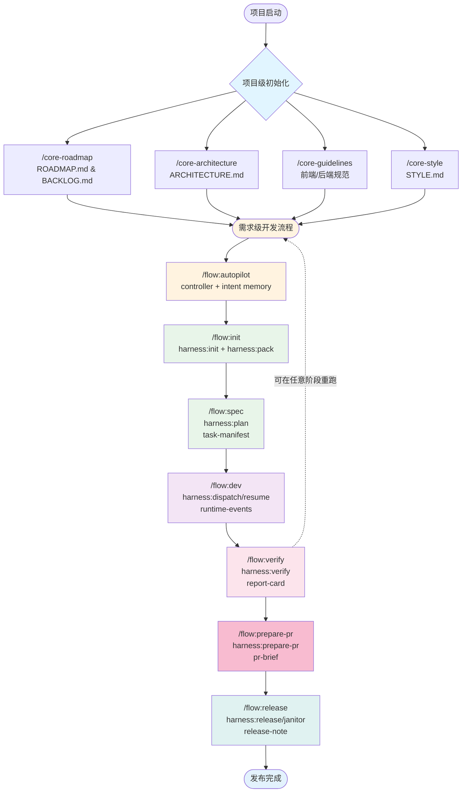

# 🚀 cc-devflow

> Claude Code Autopilot-First 需求开发流系统

基于 Claude Code 官方子代理、钩子和设置机制构建的完整开发工作流系统。通过可恢复的命令链将需求从规划推进到代码交付。

[中文文档](./README.zh-CN.md) | [English](./README.md)

---

## 🎯 一句话介绍

Autopilot-first 的需求交付主线：`/flow:autopilot` 先把意图收敛成可执行计划并驱动薄 harness 链路，产出 PR-ready brief，再交给 `/flow:release` 收尾。

---

## ✨ 核心特性

- 🎯 **Autopilot 主链** - 推荐路径是 `/flow:autopilot` → `/flow:prepare-pr` → `/flow:release`
- 🔄 **薄 Harness 骨架** - 流程命令统一映射到 `harness:*` 运行时操作，支持 checkpoint、恢复与可审计工件
- 📝 **Markdown-First 记忆** - `devflow/intent/*` 持久化 summary、facts、decision-log、plan、delegation-map、resume-index 与 PR brief
- 📋 **Manifest 驱动执行** - 需求先收敛为 `task-manifest.json`，再通过 dispatch、delegated workers 与 verify 质量闸推进
- 🔄 **智能恢复** - `harness:resume` 与 intent checkpoint 基于状态恢复，而不是依赖聊天历史
- 🛡️ **质量闸** - 自动化 TypeScript 检查、测试、代码检查和安全扫描
- 🤖 **本地 Subagent / Worker** - autopilot 可以把边界清晰的任务委派给本地 worker，同时保持单一真相源
- 🎨 **UI原型生成** - 条件触发的 HTML 原型，融合艺术设计灵感
- 🔗 **GitHub 集成** - 支持 PR-ready brief、发布说明和规范化提交衔接
- 📊 **进度跟踪** - 实时状态监控、阶段推导和智能重启点
- 🔍 **一致性验证** - 企业级一致性检查，智能冲突检测
- 🧪 **TDD 强制执行** - 严格的测试驱动开发，harness planner 自动 TDD 顺序验证
- 📜 **Constitution** - 10 条宪法条款管控质量、安全和架构
- 🔄 **OpenSpec 互操作** - OpenSpec 与 CC-DevFlow 格式双向转换，自动生成 TDD 任务
- 🔄 **自主开发** - Ralph × Manus 集成实现有记忆的持续迭代
- 🔌 **多平台支持** - 通过 `npm run adapt` 编译工作流到 Codex、Cursor、Qwen、Antigravity
- 🔄 **多模块编译器** - 完整模块编译：skills、commands、agents、rules、hooks

---

## 💡 核心概念

### Hooks 系统

实时质量守护，PreToolUse 阻止不合规操作，PostToolUse 自动记录变更。

<details>
<summary>📖 Hooks 详解（点击展开）</summary>

**Hook 类型**:

| Hook | 触发时机 | 功能 |
|------|---------|------|
| **UserPromptSubmit** | 用户输入提交时 | 智能推荐相关 Skills |
| **PreToolUse** | 工具使用前 | 阻止不合规操作（TDD 违规等） |
| **PostToolUse** | 工具使用后 | 自动记录文件变更 |
| **Stop** | 会话停止时 | 提供错误处理提示 |

**Guardrail 工作流程**:
```
用户编辑文件 → PreToolUse Hook 触发
  ↓ 路径归一化
  ↓ 规则匹配
  ↓ 内容检查
  ↓ 违规？阻止操作 : 允许操作
```

**跳过 Guardrail**:
```bash
# 方式 1: 文件标记
echo "@skip-tdd-check" >> devflow/requirements/REQ-123/TASKS.md

# 方式 2: 环境变量
export SKIP_TDD_ENFORCER=1
```

📚 [完整 Hooks 文档](docs/guides/hooks-system.zh-CN.md)
</details>

### Skills 系统 (v4.0 Skills-First 架构)

智能知识库激活，分组 Skills 与自动上下文注入。

<details>
<summary>📖 Skills 详解（点击展开）</summary>

**Skills-First 架构** (v4.0):

```
.claude/skills/
├── workflow.yaml           # Skill 依赖图 (借鉴 OpenSpec)
├── workflow/               # 9 个工作流 Skills (flow-init, flow-spec, flow-dev 等)
├── domain/                 # 7 个领域 Skills (tdd, debugging, brainstorming)
├── guardrail/              # 3 个守护 Skills (constitution-guardian, tdd-enforcer)
└── utility/                # 8 个工具 Skills (npm-release, skill-creator)
```

**按分类的关键 Skills**:

| 分类 | Skills | 用途 |
|------|--------|------|
| **Workflow** | flow-init, flow-spec, flow-dev, flow-verify, flow-release | 核心开发工作流 |
| **Domain** | tdd, debugging, brainstorming, verification | 领域专业知识 |
| **Guardrail** | constitution-guardian, tdd-enforcer | 实时合规检查 |
| **Utility** | npm-release, skill-creator, writing-skills | 开发工具 |

**上下文注入** (借鉴 Trellis):
- 每个 Skill 有 `context.jsonl` 定义所需上下文文件
- `inject-skill-context.ts` 钩子在 Skill 执行前自动加载上下文
- 变量替换: `{REQ}` → 实际需求 ID

📚 [完整 Skills 文档](docs/guides/skills-system.zh-CN.md)
</details>

### Agent Orchestration

当前执行模型：autopilot controller + 本地 subagent/worker + 薄 harness runtime。

<details>
<summary>📖 代理编排详解（点击展开）</summary>

**执行模型**:
- **Autopilot controller**: 收敛意图、推进阶段、维护 markdown 真相面
- **本地 subagent / worker**: 在任务边界清晰时执行委派任务
- **薄 harness runtime**: 持久化 checkpoint、report-card、PR brief 和 release 工件

**工具分配**:
- Controller/runtime: 状态推导、工件同步、阶段切换
- Workers/subagents: 作用域内执行、验证和结果落盘

📚 [执行模型详解](docs/architecture/execution-model.zh-CN.md)
</details>

---

## 🚀 快速开始

### 安装

#### 方式 1: 从 npm 安装（推荐）

```bash
# 全局安装
npm install -g cc-devflow
# 或
pnpm add -g cc-devflow

# 在项目中初始化
cc-devflow init

# 编译到特定平台（可选）
cc-devflow adapt --platform cursor
cc-devflow adapt --platform codex
cc-devflow adapt --platform antigravity
cc-devflow adapt --platform qwen
```

#### 方式 2: 手动安装

```bash
pnpm dlx tiged Dimon94/cc-devflow/.claude .claude
```

#### 更新指南 (Update)

更新到最新版本并同步本地项目：

```bash
# 全局更新
npm install -g cc-devflow@latest

# 更新本地项目文件（将覆盖冲突文件）
cc-devflow init
```

### CLI 使用

```bash
# 在当前目录初始化
cc-devflow init

# 在指定目录初始化
cc-devflow init --dir /path/to/project

# 编译到特定平台
cc-devflow adapt --platform codex
cc-devflow adapt --cwd /path/to/project --platform cursor

# 直接运行 harness runtime（供 npm scripts 委派）
cc-devflow harness release --change-id REQ-123
```

`cc-devflow init` 与 `cc-devflow adapt` 现在会自动补齐 `package.json` 中缺失的 `harness:*` scripts，且统一写入可移植的 `cc-devflow harness <subcommand>`（不使用机器绝对路径），避免 `/flow:*` 因脚本缺失退化到手工 fallback。

### 验证安装

```bash
.claude/scripts/verify-setup.sh
```

### 第一个需求

```bash
/flow:autopilot "REQ-001|用户认证|https://docs.example.com/auth"
/flow:prepare-pr "REQ-001"
/flow:release "REQ-001"
```

<details>
<summary>🔍 完整入门教程（点击展开）</summary>

**交互式演示**:
```bash
python3 .claude/scripts/demo.py
```

**核心脚本**:
```bash
# 环境检查
bash .claude/scripts/check-prerequisites.sh

# 查看任务状态
bash .claude/scripts/check-task-status.sh --verbose

# 标记任务完成
bash .claude/scripts/mark-task-complete.sh T001

# 生成状态报告
bash .claude/scripts/generate-status-report.sh --format markdown
```

**运行测试**:
```bash
# 运行所有测试
bash .claude/tests/run-all-tests.sh --scripts

# Constitution 测试
bash .claude/tests/constitution/run_all_constitution_tests.sh
```

📚 [完整入门指南](docs/guides/getting-started.zh-CN.md)
</details>

---

## 📋 命令速查表

### 🏢 项目级命令（Project-Level）

**用途**: 项目整体规划和架构设计，通常在项目初期执行一次

| 命令 | 用途 | 快速示例 | 详细文档 |
|------|------|----------|----------|
| `/core-roadmap` | 🗺️ 生成产品路线图 | `/core-roadmap` | [→](docs/commands/core-roadmap.zh-CN.md) |
| `/core-architecture` | 🏗️ 生成系统架构 | `/core-architecture` | [→](docs/commands/core-architecture.zh-CN.md) |
| `/core-guidelines` | 📘 生成项目规范 | `/core-guidelines` | [→](docs/commands/core-guidelines.zh-CN.md) |
| `/core-style` | 🎨 生成设计风格指南 | `/core-style` | [→](docs/commands/core-style.zh-CN.md) |

### 📦 需求级命令（Requirement-Level）

**用途**: 具体需求开发，每个需求（REQ-XXX）执行一次

| 命令 | 用途 | 快速示例 | 详细文档 |
|------|------|----------|----------|
| `/flow:autopilot` | 🤖 收敛意图并驱动推荐主链 | `/flow:autopilot "REQ-123\|功能"` | [→](.claude/commands/flow/autopilot.md) |
| `/flow:init` | 📦 初始化需求上下文 | `/flow:init "REQ-123\|功能"` | [→](.claude/commands/flow/init.md) |
| `/flow:spec` | 📋 生成任务清单 | `/flow:spec "REQ-123"` | [→](.claude/commands/flow/spec.md) |
| `/flow:dev` | 🛠️ 分发并执行任务 | `/flow:dev "REQ-123"` | [→](.claude/commands/flow/dev.md) |
| `/flow:verify` | ✅ 执行报告卡质量闸 | `/flow:verify "REQ-123" --strict` | [→](.claude/commands/flow/verify.md) |
| `/flow:prepare-pr` | 🧾 从已验证工件生成 PR-ready brief | `/flow:prepare-pr "REQ-123"` | [→](.claude/commands/flow/prepare-pr.md) |
| `/flow:release` | 🚢 发布与收尾清理 | `/flow:release "REQ-123"` | [→](.claude/commands/flow/release.md) |
| `/flow:fix` | 🐛 系统化缺陷修复 | `/flow:fix "BUG-123\|描述"` | [→](.claude/commands/flow/fix.md) |
| `/flow:new` | ⚠️ 已废弃别名 | 改用 `/flow:autopilot`（推荐）或 `/flow:init`（手动控制） | [→](.claude/commands/flow/new.md) |
| `/flow:clarify` | ⚠️ 已废弃 | 合并入 `/flow:spec` | [→](.claude/commands/flow/clarify.md) |
| `/flow:checklist` | ⚠️ 已废弃 | 改用 `/flow:verify --strict` | [→](.claude/commands/flow/checklist.md) |
| `/flow:quality` | ⚠️ 已废弃 | 改用 `/flow:verify` | [→](.claude/commands/flow/quality.md) |

📚 [完整命令参考](docs/commands/README.zh-CN.md)

<details>
<summary>🎯 我应该用哪个命令？（点击展开）</summary>

```
你的场景：
├─ 规划产品方向？ → /core-roadmap
├─ 设计系统架构？ → /core-architecture
├─ 建立编码规范？ → /core-guidelines
├─ 建立设计风格指南？ → /core-style
├─ 按推荐路径启动需求交付？ → /flow:autopilot "REQ-123|功能|URLs"
├─ 需要手动控制阶段？ → /flow:init "REQ-123|功能|URLs"
├─ 手动生成任务清单？ → /flow:spec "REQ-123"
├─ 手动执行任务？ → /flow:dev "REQ-123"
├─ 严格质量闸？ → /flow:verify "REQ-123" --strict
├─ 验证后生成 PR 材料？ → /flow:prepare-pr "REQ-123"
├─ 开发中断需要继续？ → /flow:restart "REQ-123"
├─ 检查开发进度？ → /flow:status REQ-123
├─ 任意阶段复检一致性？ → /flow:verify "REQ-123"
├─ 修复生产 Bug？ → /flow:fix "BUG-001|描述"
└─ 准备发布？ → /flow:release "REQ-123"
```
</details>

---

## 🔄 工作流程图

以下 Mermaid 流程图展示了完整的 cc-devflow 工作流，包括项目级和需求级两个层面的流程：



**流程说明**:
- **项目级命令**（浅蓝色）：项目初始化时执行一次，建立全局标准（SSOT）
- **需求级命令**（浅橙色）：每个需求（REQ-XXX）执行一次
- **默认主链**：`/flow:autopilot` → `/flow:init` → `/flow:spec` → `/flow:dev` → `/flow:verify` → `/flow:prepare-pr` → `/flow:release`
- **Harness 运行时链路**：各阶段统一委托 `npm run harness:*`，并持久化 checkpoint
- **统一 /flow:spec**：将规格阶段收敛为单一任务清单产出
- **报告卡质量闸**：`/flow:verify --strict` 不通过时阻断发布
- **TDD 强制执行**：`/flow:dev` 保留 fail-first 检查
- **废弃命令**：`/flow:new`、`/flow:clarify`、`/flow:checklist`、`/flow:quality` 仅保留迁移提示

---

## 🏗️ 系统架构

**执行模型**: Autopilot 控制器 + 本地 subagent/worker + 薄 harness runtime
**文档结构**: `intent/` + `requirements/` 双面结构，以 Markdown memory 为先
**质量保证**: Constitution v2.0.0 + TDD 强制执行 + 实时 Guardrail

<details>
<summary>📖 架构详解（点击展开）</summary>

### 子代理工作流

```text
clarify-analyst     → 澄清约束与未决问题
tech-architect      → 总结实现边界与接口形状
ui-designer         → 按需补充界面与交互约束
planner             → 把批准后的计划编译成可执行任务
dev-implementer     → 执行 manifest 任务并写结果工件
security-reviewer   → 在高风险场景下补充安全验证
```

### 当前工件面

```text
devflow/
├── intent/REQ-123/
│   ├── summary.md
│   ├── facts.md
│   ├── decision-log.md
│   ├── plan.md
│   ├── resume-index.md
│   └── artifacts/
│       ├── results/
│       └── pr-brief.md
└── requirements/REQ-123/
    ├── context-package.md
    ├── harness-state.json
    ├── TASKS.md
    ├── task-manifest.json
    ├── report-card.json
    └── RELEASE_NOTE.md
```

### 质量闸

- Pre-push Guard（TypeScript、测试、代码检查、安全、构建）
- Report Card Gate（`/flow:verify --strict`，在 `/flow:prepare-pr` 和 `/flow:release` 前执行）
- Constitution Compliance（每个阶段强制执行）
- TDD Checkpoint（TEST VERIFICATION CHECKPOINT）
- Guardrail Hooks（PreToolUse 实时阻止不合规操作）

📚 [完整架构文档](docs/architecture/README.zh-CN.md)
</details>

---

## ⚙️ 配置

**最小配置** (`.claude/settings.json`):

```json
{
  "permissions": {
    "allowGitOperations": true,
    "allowNetworkRequests": true,
    "allowSubprocesses": true
  }
}
```

<details>
<summary>🔧 完整配置选项（点击展开）</summary>

### Hooks 配置

```json
{
  "hooks": {
    "PreToolUse": [{
      "matcher": "Edit|Write",
      "hooks": [{"type": "command", "command": "..."}]
    }]
  }
}
```

### 环境变量

```bash
# 流程行为
export FLOW_AUTO_APPROVE=false
export MIN_TEST_COVERAGE=80
export STRICT_TYPE_CHECKING=true

# Guardrail 跳过
export SKIP_TDD_ENFORCER=1
export SKIP_CONSTITUTION_CHECK=1
```

📚 [完整配置指南](docs/guides/configuration.zh-CN.md)
</details>

---

## 🧪 测试覆盖

**脚本测试**: 8/8 通过 ✅ (100%)
**Constitution 测试**: 38/38 通过 ✅ (100%)

```bash
# 运行所有测试
bash .claude/tests/run-all-tests.sh --scripts
```

<details>
<summary>📊 测试框架详解（点击展开）</summary>

### 测试套件

| 测试套件 | 测试用例数 | 状态 |
|----------|-----------|------|
| `test_check_prerequisites` | 18 | ✅ 100% |
| `test_check_task_status` | 18 | ✅ 100% |
| `test_common` | 15 | ✅ 100% |
| `test_mark_task_complete` | 15 | ✅ 100% |
| `test_setup_epic` | 13 | ✅ 100% |
| `test_validate_constitution` | 4 | ✅ 100% |

📚 [测试框架详解](docs/guides/testing-guide.zh-CN.md)
</details>

---

## 📝 版本历史

说明：v6.0.0 之前的条目保留当时的命令写法，用于历史追踪。

### v6.0.0 (2026-02-18) - 最新版本

**🧩 Harness-First 主链：通向今天 autopilot-first 骨架的历史桥梁**

历史说明：这个版本把 harness runtime 收敛成一个 5 阶段主链。当前推荐入口已经演进为 `/flow:autopilot` + `/flow:prepare-pr`，但 v6.0.0 仍然是薄 runtime 成形的关键节点。

- **v6.0.0 当时的默认命令链**
  - `/flow:init` → `/flow:spec` → `/flow:dev` → `/flow:verify` → `/flow:release`
  - 这条链路后来演进成今天推荐的 `/flow:autopilot` → `/flow:prepare-pr` → `/flow:release`

- **核心运行时产物**
  - `context-package.md` + `harness-state.json`：初始化状态
  - `task-manifest.json` + `runtime-events.jsonl`：执行轨迹
  - `report-card.json` + `release-note.md`：质量与发布证据

- **废弃命令迁移**
  - `/flow:new` → 在当时改为显式执行 5 阶段主链
  - `/flow:clarify` → 合并进 `/flow:spec` 规划闭环
  - `/flow:checklist`、`/flow:quality` → 统一迁移到 `/flow:verify`

**📊 v6.0 改进指标**:
| 指标 | 之前 | 之后 | 改善 |
|------|------|------|------|
| 默认需求命令路径 | 8+ 条混合路径 | 当时固定为 5 阶段主链 | 显著简化 |
| 中断恢复能力 | 命令分散实现 | 统一 `harness:resume` | 更稳定 |
| 质量证据 | 分散产物 | 单一 report-card 闸门 | 可审计 |

### v4.7.0 (2026-02-07)

**🤝 Claude Team 集成：历史上的并行开发分支**

历史说明：这是一次 team-mode 探索。当前规范仍然是 `direct -> delegate -> team`，但 team 已不再是默认入口，下面内容应视为版本档案，而不是当前推荐配置。

- **flow-dev Team 模式** - 多 Agent 并行任务执行
  - `--team` 标志启用 Team 模式（默认 3 个 Agent）
  - `--agents N` 指定 Agent 数量（2-5）
  - 自动任务依赖分析和冲突检测
  - 文件冲突任务分配给同一 Agent 串行执行

- **新增 Hooks** - Team 生命周期管理
  - `TeammateIdle Hook` - 任务分配和调度
  - `TaskCompleted Hook` - 完成时质量验证
  - 超时检测和告警

- **任务依赖解析器** - 智能任务分析
  - `parse-task-dependencies.js` - 解析 TASKS.md 格式
  - 识别 `[P]` 并行标记、`[US*]` 用户故事分组
  - 基于 Phase 的依赖解析

- **状态恢复** - 断点续传
  - `team-state-recovery.sh` - 快照和恢复 Team 状态
  - 支持中断会话恢复

- **新增文件**
  - `.claude/scripts/parse-task-dependencies.js` - 任务解析器
  - `.claude/scripts/detect-file-conflicts.sh` - 冲突检测
  - `.claude/scripts/team-dev-init.sh` - Dev Team 初始化
  - `.claude/scripts/team-state-recovery.sh` - 状态恢复
  - `.claude/docs/guides/TEAM_MODE_GUIDE.md` - 完整使用指南

**📊 v4.7 改进指标**:
| 指标 | 之前 | 之后 | 改善 |
|------|------|------|------|
| 并行 Agent 数 | 1 | 3-5 | +400% |
| 需求完成时间 | 90 分钟 | 50 分钟 | -45% |
| 任务调度 | 手动 | 自动 | 100% |
| 质量验证 | 单点 | 分布式 | 100% |

### v4.3.0 (2026-02-07)

**🌿 Git Worktree 集成：历史实验，后续已移除**

历史说明：内建 worktree 管理后来已从 canonical workflow 中移除。这里保留此条，只是为了说明 v4.3.0 当时的项目形态。

- **Git Worktree 模式（默认）** - 隔离的开发环境
  - 创建 `../repo-name-REQ-xxx/` worktree 目录
  - 每个 worktree 有独立的 Claude Code 会话
  - 用 `cd` 切换需求，而非 `git checkout`
  - `--branch-only` 标志支持传统分支模式

- **新增 Skill: using-git-worktrees** - 完整的 worktree 管理
  - `worktree-create.sh` - 创建新 worktree
  - `worktree-list.sh` - 列出所有 worktree
  - `worktree-switch.sh` - 切换 worktree
  - `worktree-cleanup.sh` - 清理已合并的 worktree
  - Shell 别名模板 (za/zl/zm/zw)

- **修改的命令**
  - `/flow:init` - 默认 worktree 模式，`--branch-only` 用于直接分支模式
  - `/flow:release` - 自动清理 worktree

**📊 v4.3 改进指标**:
| 指标 | 之前 | 之后 | 改善 |
|------|------|------|------|
| 并行需求数 | 1 | 3-5 | +400% |
| 上下文切换时间 | 30s | 1s | -97% |
| 会话隔离 | 无 | 完全 | 100% |

### v4.1.0 (2026-02-07)

**🎯 统一规格阶段：/flow:spec 命令**

v4.1.0 确立 `/flow:spec` 为统一 planning 入口，并逐步演进为今天的 manifest-first 规划链：

- **统一 /flow:spec 命令** - 一个命令完成整个规格阶段
  - 将澄清后的需求上下文编译成可执行规划产物
  - 为小需求提供更轻的 planning 路径
  - 让可选设计分析服从任务图，而不是反过来主导流程

- **并行 Agent 执行** - Tech + UI 代理并发运行
  - 设计阶段时间减少约 35%
  - 共享模板组件位于 `_shared/` 目录

- **简化工作流** (v4.1)
  ```
  精简: /flow:init → /flow:spec → /flow:dev
  标准: /flow:init → /flow:spec → /flow:dev → /flow:verify
  完整: /flow:autopilot → /flow:init → /flow:spec → /flow:dev → /flow:verify → /flow:prepare-pr → /flow:release
  ```

**📊 v4.1 改进指标**:
| 指标 | 之前 (v4.0) | 之后 (v4.1) | 改善 |
|------|-------------|-------------|------|
| 命令调用次数 | 4 | 1 | -75% |
| 设计阶段时间 | 8-12 分钟 | 5-8 分钟 | -35% |
| Entry/Exit Gate 代码 | ~280 行 | ~100 行 | -64% |

### v4.0.0 (2026-02-07)

**🏗️ Skills-First 架构：统一 Skills 与上下文注入**

v4.0.0 引入重大架构重构，将 135 个文件重组为统一的 Skills-First 架构，借鉴 Trellis 和 OpenSpec：

- **Skills-First 架构** - 所有 Skills 组织为 4 个分组
  - `workflow/`: 9 个核心工作流 Skills (flow-init, flow-spec, flow-dev 等)
  - `domain/`: 7 个领域专业 Skills (tdd, debugging, brainstorming, verification)
  - `guardrail/`: 3 个实时合规 Skills (constitution-guardian, tdd-enforcer)
  - `utility/`: 8 个开发工具 Skills (npm-release, skill-creator, writing-skills)

- **JSONL 上下文注入** (借鉴 Trellis)
  - 每个 Skill 有 `context.jsonl` 定义所需上下文文件
  - `inject-skill-context.ts` 钩子在 Skill 执行前自动加载上下文
  - 变量替换: `{REQ}` 替换为实际需求 ID
  - 支持可选文件 `"optional": true`

- **workflow.yaml 依赖图** (借鉴 OpenSpec)
  - 通过 `requires` 和 `generates` 定义 Skill 依赖
  - 文件存在性状态检测
  - 清晰可视化 Skill 执行顺序

- **自包含 Skills**
  - 每个 Skill 目录包含: SKILL.md + context.jsonl + scripts/ + references/ + assets/
  - SKILL.md 限制 <500 行，聚焦核心指令
  - Agent 指令移至 `references/` 子目录
  - 模板移至 `assets/` 子目录

- **多模块跨平台编译器** (v3.0)
  - 完整模块编译：skills、commands、agents、rules、hooks
  - 平台专用输出格式：
    - **Codex**: `.codex/skills/`, `.codex/prompts/`, `AGENTS.md`
    - **Cursor**: `.cursor/rules/*.mdc`, `.cursor/subagents/`, `hooks.json`
    - **Qwen**: `.qwen/commands/*.toml`, `.qwen/agents/`, `CONTEXT.md`
    - **Antigravity**: `.agent/skills/`, `.agent/workflows/`, `.agent/rules/`
  - `context.jsonl` 编译时展开，支持平台专用格式
  - 197 个测试通过（24 个新增多模块测试）

**📊 v4.0 改进指标**:
| 指标 | 之前 | 之后 | 改善 |
|------|------|------|------|
| 维护点 | 4 个目录 | 1 个目录 | -75% |
| 上下文加载 | 手动全量 | 按需自动 | -70% token |
| 依赖可见性 | 隐式 | 显式 (workflow.yaml) | +100% |
| 平台模块支持 | 仅命令 | 全部模块 | +400% |

**📁 新增文件**:
- `.claude/skills/workflow.yaml` - Skill 依赖图
- `.claude/hooks/inject-skill-context.ts` - 上下文注入钩子
- `.claude/skills/*/context.jsonl` - 每个 Skill 的上下文定义
- `devflow/spec/{frontend,backend,shared}/index.md` - 规范索引
- `lib/compiler/context-expander.js` - Context.jsonl 展开模块
- `lib/compiler/__tests__/multi-module-emitters.test.js` - 多模块测试

### v2.3.0 (2026-01-08)

**🛡️ 纪律系统：铁律 + 合理化防御 + 压力测试**

v2.3.0 将 Constitution 从"文档"升级为"可执行纪律系统"，借鉴 superpowers 项目最佳实践：

- **铁律 + 合理化表格** - 预先阻止 AI Agent 合理化尝试
  - 10 条 Constitution 条款现在都有铁律（绝对禁止）
  - 合理化表格采用 `| 借口 | 现实 |` 格式
  - 红旗标志用于 AI 自检触发
  - 集中式 `rationalization-library.md` 存储所有合理化

- **两阶段代码审查** - `/flow-review` 命令（新增）
  - 阶段 1：规格合规性（不信任实现者报告，直接读代码）
  - 阶段 2：代码质量（仅在阶段 1 通过后运行）
  - `spec-reviewer.md` 和 `code-quality-reviewer.md` 代理

- **完成前验证** - 断言前先有证据
  - `verification-before-completion` 技能
  - `verify-gate.sh` 脚本用于所有流程出口闸门
  - 没有新鲜验证证据不得声称完成

- **系统化调试** - `/flow-fix` 增强 4 阶段调试
  - 阶段 1：根因调查（尚未修复）
  - 阶段 2：模式分析
  - 阶段 3：假设和测试
  - 阶段 4：TDD 实现
  - `flow-debugging` 和 `flow-tdd` 技能

- **头脑风暴集成** - `/flow:init` 现在包含头脑风暴
  - `BRAINSTORM.md` 作为需求"北极星"
  - `/flow:spec` 需要 BRAINSTORM 对齐检查
  - `flow-brainstorming` 技能

- **压力测试框架** - 技能的 TDD
  - `tests/pressure-scenarios/` 包含 4 个场景
  - 测试 AI 在时间/沉没成本/权威/疲劳压力下的行为
  - `run-pressure-tests.sh` 运行器

- **技能融合** - Superpowers 技能迁移到本地
  - `flow-tdd`、`flow-debugging`、`flow-receiving-review`、`flow-finishing-branch`
  - 所有 `superpowers:xxx` 引用替换为本地技能

- **Ralph × Manus 集成** - 有记忆的自主开发（新增）
  - 合并入 `/flow:dev` (默认自主模式)
  - `flow-attention-refresh` 技能提供 4 个刷新协议
  - `ERROR_LOG.md` 结构化错误追踪
  - `research/attempts/` 失败痕迹记录
  - Stop Hook 实现自引用循环
  - `/flow:init` Stage 2.5 融入 Manus 研究方法
  - 目标：无人工干预任务完成率 ≥85%

**📋 Constitution v2.1.0**:
- 所有 10 条条款现在都有铁律 + 合理化防御 + 红旗标志
- 交叉引用到 `rationalization-library.md`

**📁 新增文件**:
- `.claude/commands/util/cancel-ralph.md` - 取消 Ralph 循环命令
- `.claude/skills/flow-attention-refresh/SKILL.md` - 4 个注意力刷新协议
- `.claude/hooks/ralph-stop-hook.sh` - 自引用循环 Stop Hook
- `.claude/hooks/hooks.json` - Hook 注册配置
- `.claude/scripts/setup-ralph-loop.sh` - Ralph 状态初始化脚本
- `.claude/docs/templates/ERROR_LOG_TEMPLATE.md` - 执行错误日志格式
- `.claude/docs/templates/ATTEMPT_TEMPLATE.md` - 研究尝试日志格式
- `.claude/agents/spec-reviewer.md` - 阶段 1 规格合规性审查员
- `.claude/agents/code-quality-reviewer.md` - 阶段 2 代码质量审查员
- `.claude/commands/flow-review.md` - 历史两阶段审查命令，已被当前 review/verify 链路取代
- `.claude/rules/rationalization-library.md` - 集中式合理化防御
- `.claude/scripts/verify-gate.sh` - 出口闸门验证脚本
- `.claude/skills/flow-brainstorming/` - 头脑风暴技能
- `.claude/skills/flow-debugging/` - 系统化调试技能
- `.claude/skills/flow-tdd/` - TDD 强制执行技能
- `.claude/skills/flow-receiving-review/` - 审查反馈处理技能
- `.claude/skills/flow-finishing-branch/` - 分支完成决策技能
- `.claude/skills/verification-before-completion/` - 完成验证技能
- `tests/` - 压力测试框架

### v2.2.0 (2025-12-19)

**🔌 多平台适配：Agent 适配器架构 + 命令编译器**

v2.2.0 引入全面的多平台支持，让 cc-devflow 工作流能在多个 AI 编码助手上运行：

- **Agent 适配器架构 (REQ-004)** - 平台差异的可插拔适配层
  - 统一的 Agent Adapter 抽象（环境探测、命令执行、能力声明）
  - Adapter Registry 支持自动检测和显式覆盖
  - 内置适配器：Claude Code（默认）、Codex CLI、Cursor、Qwen、Antigravity
  - 安全优先设计：能力白名单，高风险操作默认禁用
  - 结构化日志便于调试和审计

- **命令编译器 (REQ-005)** - 单一真相源编译
  - `.claude/` 作为 SSOT，编译为平台原生格式
  - `npm run adapt` CLI 多平台编译
  - 支持平台：Codex (`.codex/`)、Cursor (`.cursor/`)、Qwen (`.qwen/`)、Antigravity (`.agent/`)
  - 占位符展开：`{SCRIPT:*}`、`{TEMPLATE:*}`、`{GUIDE:*}`、`{AGENT_SCRIPT}`、`$ARGUMENTS`
  - 模板/指南内联，自动嵌入引用内容
  - 资源复制与路径重写（脚本、模板、指南 → 平台目录）
  - 基于 Manifest 的增量编译和漂移检测

- **适配器编译器 (REQ-006)** - 多平台规则入口文件生成
  - 4 个平台专用规则 Emitters（Cursor MDC、Codex SKILL.md、Qwen TOML、Antigravity 12K 智能分块）
  - 技能注册表编译（合并 `skill-rules.json` + `skill.md` 元数据）
  - Manifest v2.0 扩展，支持 `skills` 和 `rulesEntry` 追踪
  - `--rules` 和 `--skills` CLI 选项实现选择性编译
  - **Bug 修复**：默认关闭模板内联（保持路径引用而非内联展开）
  - 173 个测试，新模块覆盖率 87%

**📦 新 CLI 工具**:
```bash
npm run adapt                        # 编译到所有平台
npm run adapt -- --platform codex    # 编译到指定平台
npm run adapt -- --check             # 检查漂移（不编译）
npm run adapt -- --verbose           # 显示详细输出
```

### v2.1.0 (2025-11-07)

**🏢 核心突破：引入项目级命令（Project-Level Commands）**

v2.1.0 的核心突破是引入了**项目级命令**，与之前的**需求级命令**形成两层体系：

- **项目级命令** - 项目整体规划和架构设计（项目初期执行一次）
  - `/core-roadmap` - 交互式产品路线图生成（6阶段对话）
  - `/core-architecture` - 4种架构图生成（Mermaid格式）
  - `/core-guidelines` - 项目规范生成（前端/后端分离）
  - `/core-style` - 项目设计风格指南生成（视觉一致性SSOT）

- **需求级命令增强** - Stage 1.5 路线图与架构上下文加载（flow-init）
  - 初始化需求时自动加载项目级上下文
  - 需求与路线图自动映射（RM-ID, Milestone, Quarter）
  - 架构上下文自动关联（Feature Layer, Tech Stack, Module）

**📚 文档改进**:
- README 完全重构（完整目录 + 折叠 + 外部文档链接）
- 新增 25+ 个详细文档

📋 [完整变更日志](CHANGELOG.md)

---

## 🤝 贡献 & 支持

**贡献**: [贡献指南](CONTRIBUTING.md)
**问题**: [GitHub Issues](https://github.com/Dimon94/cc-devflow/issues)
**文档**: [完整文档](docs/)

---

## 📄 许可证

MIT License - 查看 [LICENSE](LICENSE) 文件

---

**🌟 如果 cc-devflow 帮助简化了您的开发工作流，请为此仓库点星！**
