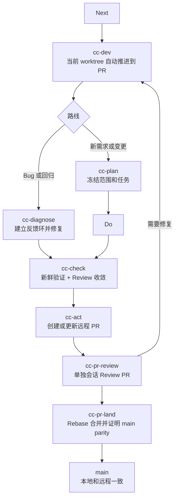

# cc-devflow

> 面向 Agent 编程的计划、诊断、执行、验证、交付工作流。

[](https://github.com/Dimon94/cc-devflow/stargazers)
[](https://www.npmjs.com/package/cc-devflow)
[](./package.json)
[](./LICENSE)

[中文文档](./README.zh-CN.md) | [English](./README.md) | [快速开始](./docs/guides/getting-started.zh-CN.md) | [贡献指南](./CONTRIBUTING.zh-CN.md) | [安全策略](./SECURITY.zh-CN.md)

CC-DevFlow 是一个给 Agent 编程时代准备的小而明确的工作流系统。它保留一条 PDCA 新需求闭环、一条 PR Harness 链路，再用轻量 `cc-diagnose` 处理 hotfix 和 debug。

## 为什么用 cc-devflow

- **公开入口很小**：核心 workflow skill、PR Harness 链路、1 个可选深度 review skill，加一个负责安装和平台适配的 CLI。
- **先证据后完成**：实现之后必须经过验证证据，才能进入 ship 或 handoff。
- **Skill-first 分发**：公开契约写在 `.claude/skills/<skill>/SKILL.md` 和 `PLAYBOOK.md`，不依赖隐藏运行时语义。
- **多平台产物**：一次安装，再生成 Codex、Cursor、Qwen、Antigravity 等 Agent 环境需要的输出。
- **持久项目记忆**：spec、planning、review、handoff 留在 `devflow/`；临时 worker scratch 不混入 durable truth。

## 快速开始

前置条件：

- Node.js 18+
- npm 或兼容的包运行器
- 一个 Git 仓库
- Claude Code 或其他受支持的 Agent 环境

安装整包 Skill：

```bash
npx cc-devflow@latest init --dir /path/to/your/project
```

生成平台产物：

```bash
npx cc-devflow@latest adapt --cwd /path/to/your/project --platform codex
npx cc-devflow@latest adapt --cwd /path/to/your/project --platform cursor
npx cc-devflow@latest adapt --cwd /path/to/your/project --platform qwen
npx cc-devflow@latest adapt --cwd /path/to/your/project --platform antigravity
```

刷新所有受支持的平台产物：

```bash
npx cc-devflow@latest adapt --cwd /path/to/your/project --all
```

安装完成后，直接让 Agent 使用这些 workflow skill。计划类工作从 `cc-plan` 开始，Bug 和 regression 直接走 `cc-diagnose`。需要自动选择下一步时走 `cc-next`；选中目标后用 `cc-dev` 推进工作，直到 `cc-act` 选择交付方式；PR 用单独会话跑 `cc-pr-review`；review 后用单独会话跑 `cc-pr-land` 合并并证明 main parity。

## 流程图

```text
PR Harness: cc-next -> cc-dev -> cc-pr-review -> cc-pr-land

PDCA: cc-plan -> cc-do -> cc-check(review convergence) -> cc-act
Parallel PDCA: cc-plan -> cc-dev dispatch loop -> child cc-* environments -> integrate -> cc-check -> cc-act
Hotfix: cc-diagnose -> focused fix -> regression proof
```



## Workflow Skill

| Skill | 什么时候用 | 主要产物 |
| --- | --- | --- |
| `cc-next` | 需要从本地 change 和 issue truth 里选下一个 ready 目标 | 交给 `cc-dev` 的 Goal Packet |
| `cc-dev` | 已选目标要在当前 worktree 内自动推进到远程 PR | `task.md`、Git commit、PR 或 handoff |
| `cc-plan` | 新功能或变更需要澄清范围、设计方案、冻结任务 | `task.md#Contract Summary` |
| `cc-diagnose` | Bug、回归、崩溃、flaky 或性能回退需要快速反馈环和 hotfix 纪律 | 回复证据、聚焦代码 / 测试改动、回归证明 |
| `cc-do` | 已冻结的计划任务需要实现 | 代码、测试、`task.md` 状态、Git commit |
| `cc-review` | 复杂方案、diff、复杂度报告、优化热点、生产加固风险或极严结构质量 Review 需要在实现前或验证前做可选深度 Review | 计划 finding 写入 `task.md`；执行 finding 和修复选项回到对话 |
| `cc-pr-review` | 远程 PR 需要单独会话做合并前 Review，相关时包含 PR 范围内复杂度热点审查 | PR review packet、findings 和 landing verdict |
| `cc-pr-land` | 已 Review PR 需要 rebase-first 合并到 main 并证明 parity | 已集成 main 和本地 / 远程一致性证据 |
| `cc-check` | 工作需要新鲜验证证据 | pass/fail/blocked 回复和 Git commit |
| `cc-act` | 已验证工作需要 PR、本地 handoff 或 closeout | 可选 `handoff/pr-brief.md`、Git/PR 真相或 incident postmortem |
| `postmortem` | 失败教训需要召回、追问、单独记录或 closeout 压缩 | `devflow/postmortems/INDEX.md` 和 incident postmortem |

整包还包含维护类 Skill：

- `cc-archive`：归档、恢复或列出 `devflow/changes/<change-key>/`
- `cc-simplify`：审查已改代码的复用、质量、效率和需求漂移

## 计划质量门禁

`cc-plan` 会在 `cc-do` 开始前冻结实现决策。非 trivial 计划需要比较 minimal viable 和 ideal architecture，full-design 需要包含 implementation decision horizon 和 error/rescue map；测试计划要记录测试框架证据、public test seam、behavior assertion、mock boundary、覆盖质量、强制 regression test、refactor candidates、vertical tracer-bullet slices 和 confidence-per-minute 测试策略。它只记录最终 `cc-check` Review 收敛门，不再默认拆出 `cc-review` 子线程。`cc-diagnose` 刻意更轻：先用最锋利的反馈环复现，列出可证伪假设，窄口打点，修复后证明原始复现消失，并清掉 debug probe。

大需求需要并行时，`cc-plan` 先在 `task.md#Execution Environments` 冻结 execution environment 依赖图、触点、路由 skill、验证命令和 merge gate；`cc-dev` 再按这张图创建同级 worktree / 子线程，派发 `cc-do`、显式 standalone `cc-review`、`cc-check`、`cc-diagnose` 或有边界的 `cc-act`，并在主控线程串行验收、cherry-pick、跑 phase gate 和最终 `cc-check`。子线程只拥有自己的 environment，不拥有阶段解锁、主分支合并或最终交付裁决。Codex 子线程派发必须使用固定 dispatch packet、真实 thread tool preflight，并在 cherry-pick 前留下只读 integration audit 证据。

Canonical language 和 durable decisions 只收敛到 cc-devflow 原生真相源：`task.md`、Git history、PR truth 和 handoff artifacts。历史 planning artifacts 只作为可读 fallback 输入。


planning 之后的每个阶段都从 `task.md`、当前 Git history/status，以及存在时的 PR 或 handoff truth 开始。系统不再提供 runtime context query 层；有争议的事实必须回到源 artifact 重新读取。用 `npm run benchmark:skills` 保持 public skill 入口足够薄；深层规划规则应该放在条件 reference 后面，而不是默认上下文里。


## 验证与交付门禁

`cc-check` 现在把 QA 当成反馈环问题，而不是只看测试是否绿。Bugfix 和行为变更需要记录证明现实的 loop、expected / actual、复现步骤、confidence-per-minute proof value、测试边界质量；如果没有干净的 public test seam，要留下架构 follow-up。它还会开启 review subAgent，按照 `task.md`、当前 diff 和新鲜验证证据多轮执行 `cc-review`，直到没有 P0/P1/P2 finding；任何未解决的 P0/P1/P2 都会退回 `cc-plan`、`cc-do` 或 `cc-diagnose`，不能 pass。绿灯但没有证明价值的测试、宽泛 snapshot、重复 happy path、no-op smoke、脆弱内部断言、过度 mock 自家模块，会退回 `cc-do` 或 `cc-plan`，不能支撑 pass。它还会把 `task.md#Failure Ledger` 里的失败记录分类成 confirmed lesson、noise 或 unresolved risk。

`cc-act` 会把这些证据带进 PR brief、handoff 和 release note。PR / handoff 输出还会携带 release-readiness gate ledger，覆盖 local checks、config/env、migrations/data、deploy/health、smoke/cleanup、rollback 和 watch items；也会记录 remote issue closeout state：终态且直接完成的 issue 需要关闭并验证，未合并 PR 走 auto-close-on-merge，父级或部分完成的工作只保留 related-only 引用。skipped、blocked、not-applicable 都必须说明原因。


## 安装方式

### 整包安装

需要完整 `.claude` skill pack 时使用：

```bash
npx cc-devflow@latest init --dir /path/to/your/project
npx cc-devflow@latest init --dir /path/to/your/project --force
```

`--force` 只升级 cc-devflow 管理的分发 Skill，不会删除项目里其他已有的 `.claude` 文件。

### 源码仓库调试

如果你在本仓库里开发：

```bash
node bin/cc-devflow-cli.js --help
node bin/cc-devflow-cli.js init --dir /tmp/example-project
node bin/cc-devflow-cli.js adapt --cwd /tmp/example-project --platform codex
```

### 通过 skills.sh 安装单个 Skill

[skills.sh](https://skills.sh/) 只作为单 Skill 分发渠道：

```bash
npx skills add https://github.com/Dimon94/cc-devflow --skill cc-next
npx skills add https://github.com/Dimon94/cc-devflow --skill cc-dev
npx skills add https://github.com/Dimon94/cc-devflow --skill cc-plan
npx skills add https://github.com/Dimon94/cc-devflow --skill cc-diagnose
npx skills add https://github.com/Dimon94/cc-devflow --skill cc-do
npx skills add https://github.com/Dimon94/cc-devflow --skill cc-review
npx skills add https://github.com/Dimon94/cc-devflow --skill cc-pr-review
npx skills add https://github.com/Dimon94/cc-devflow --skill cc-pr-land
npx skills add https://github.com/Dimon94/cc-devflow --skill cc-check
npx skills add https://github.com/Dimon94/cc-devflow --skill cc-act
npx skills add https://github.com/Dimon94/cc-devflow --skill postmortem
```

需要整包用 `cc-devflow init`，需要平台产物用 `cc-devflow adapt`，只想拿单个 Skill 才用 `skills add`。

## 配置

CC-DevFlow 会在写入 durable workflow 文档前读取分层 YAML 配置：

```text
~/.cc-devflow/config.yml
<repo>/.cc-devflow/config.yml
<repo>/.cc-devflow/config.local.yml
```

优先级固定为：默认值 < 用户 < 项目 < 本地 < 环境变量 < CLI 参数。`output.document_language` 是机器约束，目前支持 `en` 和 `zh-CN`。它约束 durable planning、review、handoff Markdown 的标题、正文、占位符、证据说明和 PR/body 草稿；代码、命令、路径、schema key、API 名、commit type/scope 等机器字面量保持原文。非标偏好放在 `agent_preferences` 下，只影响表达风格，不覆盖 workflow 契约。

```yaml
version: 1
output:
  document_language: zh-CN
agent_preferences:
  general:
    - 先给结论。
  documentation:
    - 标题短一些，避免营销腔。
```

常用命令：

```bash
npx cc-devflow config init --cwd /path/to/your/project --project
npx cc-devflow config set output.document_language zh-CN --cwd /path/to/your/project --project
npx cc-devflow config resolve --cwd /path/to/your/project --format policy
npx cc-devflow config doctor --cwd /path/to/your/project
```

完整样例见 [`config/user-config.template.yml`](./config/user-config.template.yml)。

## 仓库格式

对外分发的 Skill 位于 `.claude/skills/`：

```text
.claude/skills/<skill>/
├── SKILL.md
├── PLAYBOOK.md
├── assets/
├── references/
└── scripts/
```

每个已发布 Skill 都把运行契约放在自己目录里：

- `SKILL.md` 包含 YAML frontmatter 和 `Harness Contract`
- `PLAYBOOK.md` 包含 `Visible State Machine`
- 本地资源跟随拥有它的 Skill 一起放置

当前分发目录：

- `.claude/skills/cc-next/`
- `.claude/skills/cc-dev/`
- `.claude/skills/cc-plan/`
- `.claude/skills/cc-diagnose/`
- `.claude/skills/cc-do/`
- `.claude/skills/cc-review/`
- `.claude/skills/cc-pr-review/`
- `.claude/skills/cc-pr-land/`
- `.claude/skills/cc-check/`
- `.claude/skills/cc-act/`
- `.claude/skills/postmortem/`
- `.claude/skills/cc-archive/`
- `.claude/skills/cc-simplify/`
- `.claude/skills/do-not-repeat-yourself/`

## Durable 与 Ephemeral

- 新 change 目录使用 `REQ-<number>-<description>` 表示需求，使用 `FIX-<number>-<description>` 表示 Bug 修复。`REQ` 和 `FIX` 各自递增自己的编号，跨前缀同号允许共存。并行工作树也可能产生重复编号，必须用完整 change key 的描述区分业务内容。
- `devflow/changes/<change>/` 的 durable change truth 只保留 `task.md`、可选 `handoff/pr-brief.md` 和 Git commits。真实失败先进入 `task.md#Failure Ledger`；被验证为长期教训的复发故障再压缩进 `devflow/postmortems/` 的 incident postmortem。
- 新 planned change 默认只有一个人工编写的 Markdown artifact：`task.md`，功能计划把冻结设计写进 `## Contract Summary`。Hotfix 诊断不要求 `task.md` handoff，除非明确把它升级进 PDCA 尾巴。历史 planning / review artifacts 只作为可读 fallback 输入。
- 流程状态归 Git：保持 `task.md` 当前，每个完成阶段 / 执行环境提交 commit，不创建额外过程文件。
- 用 `npm run verify:examples` 和 `npm run benchmark:skills` 保持 workflow truth 与 skill 入口小而可测。
- `devflow/workspaces/<change>/` 保存 ephemeral runtime scratch，例如 worker assignment、journal、prompt 和 session log。
- 能从 durable truth 再生成的文件，不应该持久化到 `devflow/changes/`。

Artifact contract 快速检查：

```bash
npm run verify:examples
npm run benchmark:skills
```

想先看完整产物链，可以从 [`docs/examples/START-HERE.md`](./docs/examples/START-HERE.md) 开始。样例和 Skill 的版本绑定真相源在 [`docs/examples/example-bindings.json`](./docs/examples/example-bindings.json)。最小 artifact 合同的迁移与编写指南在 [`docs/guides/minimize-artifacts.md`](./docs/guides/minimize-artifacts.md)。

## 开发

```bash
git clone https://github.com/Dimon94/cc-devflow.git
cd cc-devflow
npm install
npm test
npm run verify
```

发布校验：

```bash
npm run verify:publish
```

主要贡献说明见 [`CONTRIBUTING.zh-CN.md`](./CONTRIBUTING.zh-CN.md)，里面包含公开入口规则、本地 CLI 冒烟验证、文档规则和 PR 期望。

## 讨论交流

欢迎扫码加入 cc-devflow 交流 1 群，反馈问题、交流使用体验或提出新功能建议。


如果二维码过期，请在 issue 中提醒维护者更新。

## 社区与贡献

- 如果这个工作流对你有用，可以给项目一个 Star：[GitHub stars](https://github.com/Dimon94/cc-devflow/stargazers)
- 可复现 Bug、陈旧文档、缺失平台适配，都可以开 issue。
- PR 保持聚焦：一个 Skill、一个 CLI 行为、一个编译 / 适配修复，或一次文档清理。
- 如果修改已发布 Skill，同一个 PR 里同步它的 `version`、本地 `CHANGELOG.md`、样例和受影响的公开文档。
- 参与讨论前请阅读 [行为准则](./CODE_OF_CONDUCT.zh-CN.md)。
- 漏洞报告请走 [安全策略](./SECURITY.zh-CN.md)，不要发到公开 issue。

## Star History

<a href="https://www.star-history.com/#Dimon94/cc-devflow&Date">
  <picture>
    <source media="(prefers-color-scheme: dark)" srcset="https://api.star-history.com/svg?repos=Dimon94/cc-devflow&type=Date&theme=dark" />
    <source media="(prefers-color-scheme: light)" srcset="https://api.star-history.com/svg?repos=Dimon94/cc-devflow&type=Date" />
    
  </picture>
</a>

## License

[MIT](./LICENSE)
