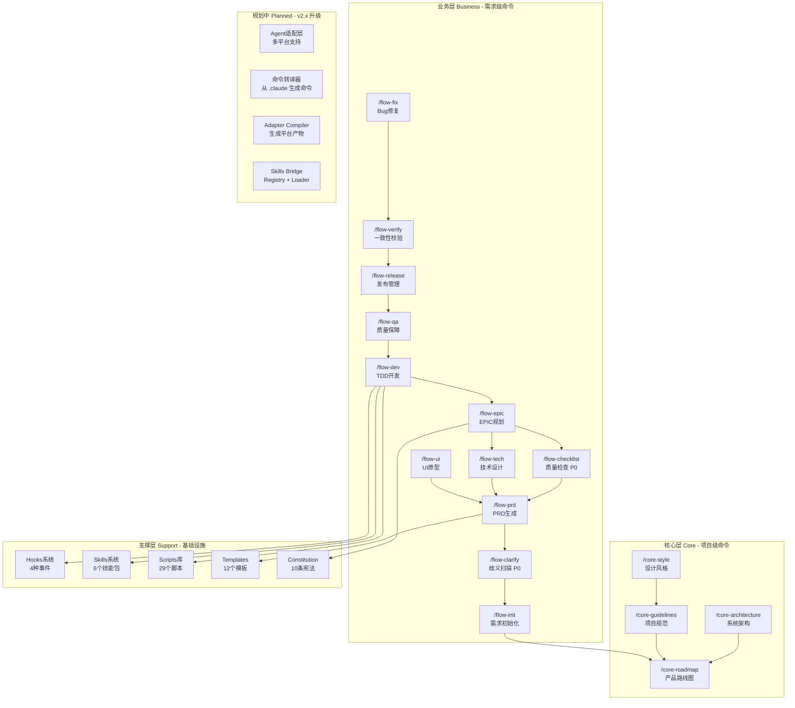
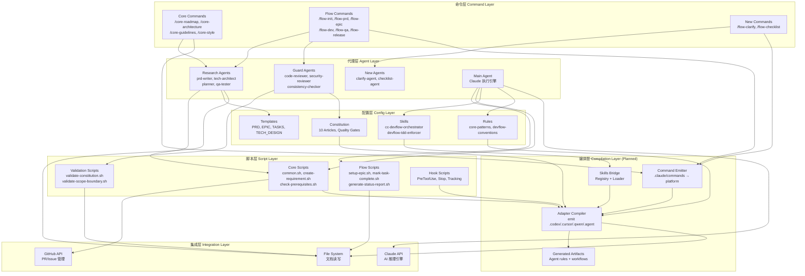
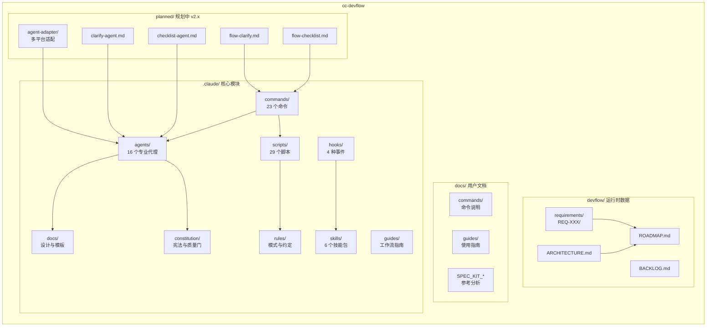
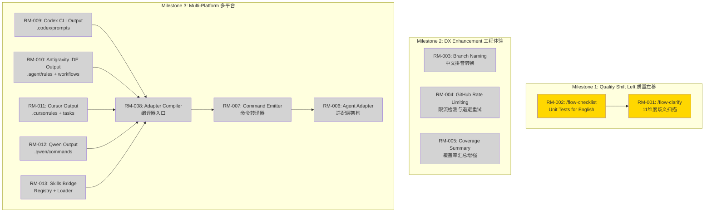

# Project Architecture: cc-devflow

**Version**: 2.1.0
**Created**: 2025-12-15T16:30:00+08:00 北京时间
**Updated**: 2025-12-18T00:00:00+08:00 北京时间
**Architecture Type**: Plugin-based CLI Framework (插件式命令行框架)
**Deployment Model**: CLI Tool + Generated Agent Artifacts

---

## 架构类型

- **应用类型**: Plugin-based CLI Framework (插件式命令行框架)
  - 基于 Claude Code 的扩展系统
  - 命令驱动 + Agent 协作模式
  - 文档驱动开发流程

- **部署方式**: CLI Tool (命令行工具)
  - 作为 Claude Code 的 `.claude/` 目录配置
  - 无需独立服务器部署
  - 通过 `npx tiged` 一键安装

- **多平台输出**: Generated Agent Artifacts（生成物）
  - 以 `.claude/` 为单一事实源（SSOT）
  - 通过编译器生成 `.codex/`、`.cursor/`、`.qwen/`、`.agent/` 等目录
  - 生成物可删可重建（build artifacts）

---

## 技术栈

### Command Layer (命令层)
- **Command System**: Claude Code Slash Commands
- **Format**: Markdown-based command definitions
- **Count**: 23 commands (/core-*, /flow-*)

### Agent Layer (代理层)
- **Agent System**: Claude Code Sub-Agents
- **Orchestration**: Research Agent Pattern (read-only analysis)
- **Main Agent**: Claude (execution authority)
- **Count**: 16 specialized agents

### Script Layer (脚本层)
- **Runtime**: Bash (macOS/Linux), PowerShell (Windows)
- **Framework**: Custom shell functions (common.sh)
- **Count**: 29 utility scripts

### Skills Layer (技能层)
- **Activation**: Keyword/Intent/File triggers
- **Pattern**: Domain knowledge + Guardrails
- **Count**: 6 skill packages

### Multi-Platform Compilation Layer (编译层)
- **Compiler**: Adapter Compiler（从 `.claude/` 编译生成平台产物）
- **Outputs**: `.codex/`, `.cursor/`, `.qwen/`, `.agent/` (Antigravity IDE)
- **Skills Strategy**: Registry + Loader（渐进披露），MCP 可选增强

**Command Compilation Rule (关键规则)**
- `.claude/commands/*.md` 的 frontmatter 作为可执行映射源
  - `scripts` + `{SCRIPT:<alias>}` → 编译为可执行命令
  - `agent_scripts` + `{AGENT_SCRIPT}` → 编译为平台上下文更新步骤（并替换 `__AGENT__`）
  - `$ARGUMENTS` / `{{args}}` → 按目标平台替换

### Integration Layer (集成层)
- **AI**: Claude API (via Claude Code)
- **VCS**: GitHub API (gh CLI)
- **External**: npm Registry, pinyin library (planned)

### DevOps & Tools
- **Package Manager**: npm (for dependencies)
- **Testing**: Bash unit tests + Constitution tests
- **Linting**: Markdown validation
- **Hooks**: Pre/Post Tool Use, User Prompt Submit, Stop

---

## 1. 功能架构图 (Feature Architecture)

### 核心模块划分

cc-devflow 采用三层功能架构:

- **核心层 (Core)**: 项目级规划、架构设计、规范制定
- **业务层 (Business)**: 需求级开发流程、质量保障
- **支撑层 (Support)**: 脚本工具、Hook 系统、技能系统

### 架构图

---

## 2. 技术架构图 (Technical Architecture)

### 分层设计

cc-devflow 采用四层技术架构:

- **命令层 (Command Layer)**: 用户交互入口，Slash 命令定义
- **代理层 (Agent Layer)**: 智能分析，文档生成
- **脚本层 (Script Layer)**: 自动化执行，工具函数
- **配置层 (Config Layer)**: 规则定义，模板管理

### 架构图

---

## 3. 模块划分图 (Module Structure)

### 代码组织

cc-devflow 按职责划分为以下主要模块:

- **.claude/**: 核心功能模块 (命令、代理、脚本、规则)
- **devflow/**: 运行时数据 (需求、路线图、架构文档)
- **docs/**: 用户文档 (命令说明、指南)
- **spec-kit/**: 参考实现 (用于借鉴的 spec-kit 项目)

### 架构图

---

## 4. 需求依赖图 (Requirement Dependency)

### 依赖关系

基于 v2.x 升级任务的需求依赖:

- **RM-001 ~ RM-002**: P0 质量左移特性 (/flow-clarify, /flow-checklist)
- **RM-003 ~ RM-005**: P1 工程体验优化 (分支命名, GitHub API 限流, Coverage)
- **RM-006 ~ RM-013**: P2 多平台支持 (Adapter + 编译产物)

### 架构图

### RM-008 Adapter Compiler Runtime

`AdapterCompiler` (RM-008) is implemented by `.claude/scripts/update-agent-context.sh`. Rather than depending on spec-kit's `.specify` directory, the script now:

- Derives its context from `.claude/` assets plus an optional plan specified via `DEVFLOW_CONTEXT_SOURCE` or `DEVFLOW_PLAN_PATH`, falling back to `devflow/ROADMAP.md` when no plan is provided.
- Detects the current branch through `DEVFLOW_BRANCH` or live Git metadata but never aborts when the branch cannot be resolved, logging warnings instead.
- Emits agent-specific templates via an embedded placeholder layout, with `DEVFLOW_AGENT_CONTEXT_TEMPLATE` available for overrides, so new platforms can be added without referencing external templates.
- Continues to update existing agent files or fabricate new ones per agent argument, exposing a platform-neutral CLI surface for the adapter compiler.

This runtime node feeds the artifacts leaf in the graph and keeps the compiled outputs rebuildable.

**图例**:
- 🟢 #90EE90 (浅绿): 基础设施 (Foundation)
- 🟡 #FFD700 (金色): P0 优先级 - 质量左移
- ⚪ #D3D3D3 (浅灰): P1/P2 优先级 - 计划中

---

## 架构决策记录 (Architecture Decision Records)

### ADR-001: 选择 Research Agent Pattern 作为代理执行模型

- **日期**: 2024-12-01 北京时间
- **状态**: Accepted
- **决策者**: CC-DevFlow Team

**背景 (Context)**:
需要在 Claude Code 环境下实现多代理协作，但面临上下文隔离和权限控制挑战。

**决策 (Decision)**:
采用 Research Agent Pattern:
- Research Agents (16个): 只读分析，输出 Markdown 计划
- Main Agent (Claude): 执行所有代码操作，拥有完整上下文

**理由 (Rationale)**:
- Claude Code 的 Sub-Agent 机制天然支持此模式
- 职责分离清晰，Research 不会意外修改代码
- 上下文由 Main Agent 统一管理，避免状态不一致

**影响 (Consequences)**:
- **正面影响**:
  - 安全性高，Research Agent 无法执行危险操作
  - 可追溯性强，所有执行都经过 Main Agent
  - 易于调试，计划和执行分离

- **负面影响**:
  - 执行延迟，需要两阶段处理
  - 上下文传递开销

- **中性影响**:
  - 需要设计良好的 Agent 协调机制

**替代方案 (Alternatives Considered)**:
1. **Direct Execution Model**
   - 优势: 更快的执行速度
   - 劣势: 安全风险高，难以审计
   - 为何未选择: 与 Claude Code 设计理念冲突

2. **Event-Driven Agent Mesh**
   - 优势: 更灵活的协作模式
   - 劣势: 复杂度高，调试困难
   - 为何未选择: 过度工程 (Article VIII 违规)

---

### ADR-002: 选择 Markdown 作为命令和文档格式

- **日期**: 2024-12-01 北京时间
- **状态**: Accepted
- **决策者**: CC-DevFlow Team

**背景 (Context)**:
需要定义命令、代理指令、模板等配置格式。

**决策 (Decision)**:
全面采用 Markdown 格式:
- 命令定义: `.claude/commands/*.md`
- 代理指令: `.claude/agents/*.md`
- 模板: `.claude/docs/templates/*.md`

**理由 (Rationale)**:
- Claude Code 原生支持 Markdown 命令解析
- 人类可读，无需专门工具
- Git 友好，易于版本控制和 diff
- 支持内嵌代码块、表格等丰富格式

**影响 (Consequences)**:
- **正面影响**:
  - 零学习曲线，所有开发者熟悉 Markdown
  - 文档即代码，配置即文档
  - IDE 原生支持预览和编辑

- **负面影响**:
  - 缺乏强类型校验
  - 解析复杂结构需要约定

- **中性影响**:
  - 需要制定明确的模板规范

---

### ADR-003: 采用 Constitution (宪法) 模式进行质量治理

- **日期**: 2025-01-10 北京时间
- **状态**: Accepted
- **决策者**: CC-DevFlow Team

**背景 (Context)**:
需要在多代理协作环境中统一质量标准和开发规范。

**决策 (Decision)**:
建立 10 Articles Constitution:
- Article I-V: 核心质量原则 (Quality, Architecture, Security, Performance, Maintainability)
- Article VI: TDD 强制要求
- Article VII-IX: 简单性门禁 (Simplicity, Anti-Abstraction, Integration-First)
- Article X: 需求边界控制

**理由 (Rationale)**:
- 宪法高于一切，防止局部优化破坏全局
- 四层防御体系 (Template, Command, Agent, Script)
- 明确的违规等级和处理流程

**影响 (Consequences)**:
- **正面影响**:
  - 质量标准统一，无歧义
  - 自动化执行，减少人为疏漏
  - 可审计，所有违规可追溯

- **负面影响**:
  - 灵活性降低，特殊情况处理复杂
  - 维护成本，宪法修订需要广泛同步

- **中性影响**:
  - 需要持续教育团队理解宪法精神

---

## 架构演进路径

### 当前状态 (As-Is)

**已实现功能**:
- 23 个命令 (/core-*, /flow-*)
- 16 个专业化 Sub-Agents
- 29 个自动化脚本
- 6 个 Skills 技能包
- 4 种 Hooks 事件
- 12 个文档模板
- Constitution v2.0.0

**技术债务**:
- 分支命名不支持中文
- GitHub API 无统一限流处理
- /flow-verify 输出缺乏结构化统计

### 目标状态 (To-Be)

**v2.2.0 目标** (2025 Q1):
- 质量左移: /flow-clarify + /flow-checklist
- 工程体验: 中文分支名, gh_api_safe(), Coverage Table
- 多平台预研: Agent Adapter 架构设计

**v3.0.0 愿景** (2025 Q2):
- 多平台支持: Codex CLI, Antigravity, Cursor, Qwen Code
- 编译式适配: Adapter Compiler + 命令转译器
- 统一适配层

### 演进计划

| Phase | Timeline | Focus | Key Changes |
|-------|----------|-------|-------------|
| Phase 1 | 2025-Q1 | Quality Shift Left | +/flow-clarify, +/flow-checklist, +clarify-agent, +checklist-agent |
| Phase 2 | 2025-Q1 | DX Enhancement | 中文分支名, gh_api_safe(), Coverage Summary Table |
| Phase 3 | 2025-Q2 | Multi-Platform | Agent Adapter, Command Template Engine, Codex/Cursor/Qwen 支持 |

---

## 非功能性需求 (NFRs)

### 性能要求

| Metric | Current | Target | Timeline |
|--------|---------|--------|----------|
| 命令响应时间 | 2-5s | <3s | 2025-Q1 |
| Agent 分析时间 | 10-30s | <20s | 2025-Q1 |
| 脚本执行时间 | <1s | <1s | 已达成 |

### 可扩展性要求

- **命令扩展**: 新增命令只需添加 `.claude/commands/*.md` 文件
- **Agent 扩展**: 新增代理只需添加 `.claude/agents/*.md` 文件
- **平台扩展**: v3.0 通过 Agent Adapter 支持多平台
- **模板扩展**: 支持自定义项目模板

### 安全要求

- **无秘密存储**: 所有敏感信息通过环境变量或 Secret Manager
- **输入校验**: 所有用户输入经过 validate-* 脚本检查
- **权限最小化**: Research Agents 只读，Main Agent 受限执行
- **审计日志**: EXECUTION_LOG.md 记录所有关键操作

### 可维护性要求

- **代码规范**: Constitution v2.0.0 强制执行
- **测试覆盖**: 脚本测试 100%, Constitution 测试 100%
- **文档完整**: 每个命令、代理、脚本都有说明文档
- **版本控制**: 所有变更通过 Git，遵循 Conventional Commits

---

## Validation Checklist

验证此架构文档是否完整:

- [x] 所有 4 种架构图已生成
- [x] 所有 Mermaid 代码语法正确
- [x] 架构图反映当前项目结构和 v2.x 规划
- [x] 技术栈与项目实际一致
- [x] 至少有 3 条 ADR 记录
- [x] 架构演进路径清晰
- [x] NFRs 已定义

**Ready for Team Review**: YES

---

**生成说明**:
1. 本文档基于 cc-devflow 项目实际结构生成
2. 所有 Mermaid 图表语法已验证
3. 需求依赖图基于 docs/SPEC_KIT_UPGRADE_TASKS.md
4. ADR 记录基于项目宪法和实际架构决策
5. 所有日期使用北京时间 + ISO 8601 格式

---

*Generated by architecture-designer agent*
*Template: ARCHITECTURE_TEMPLATE.md*
*Constitution: v2.0.0*
