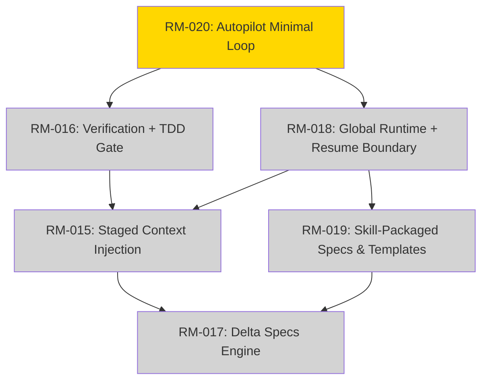

# CC-DevFlow vNext Roadmap

**Version:** vNext Draft
**Status:** Draft
**Last Updated:** 2026-04-09
**Planning Horizon:** 2026 Q2 short-term loop, 2026 Q3 stabilization

## Vision Statement

CC-DevFlow 的下一阶段不再追求“更厚的平台”，而是收敛成一个
`skill-first + protocol-first + markdown-first` 的自动驾驶系统。

用户的核心体验应该是：

1. 给出一个模糊目标
2. 系统先收敛计划
3. 人批准计划
4. 系统按配置自动选择 `direct` / `delegate` / `team`
5. 执行过程中持续留下 checkpoint 与验证证据
6. 中断后可从 `resume-index + artifacts` 恢复，而不是靠聊天历史猜状态

这条主线要求我们把自动化的“厚度”放到 `~/.cc-devflow/` runtime 和
skills/plugin 体系里，把仓库内保留为真正的长期真相源：
`devflow/intent/`、`ROADMAP`、`BACKLOG`、checkpoint 与验证证据。

## North Star Experience

**一句话**: `plan approved -> config-driven execute -> checkpoint -> resume -> verify`

约束：

- `team` 不是默认路径，只是配置可选项
- executable dev task 默认强制 TDD
- 只有显式声明 `non_tdd_reason` 的任务才能跳过 TDD
- repo 只保留值得审阅和恢复的 Markdown 工件
- 平台目录只保留最薄入口，不继续堆平台专属资产

## What Changed From v2.x

旧路线图的问题：

- 以命令和平台适配为中心，而不是以用户闭环体验为中心
- 把 `RM-015~020` 看成独立功能包，而不是一条执行链
- 对 `workspace`、`context`、`quality` 的描述偏实现导向，缺少统一产品叙事
- 没有正面回答“自动化住在哪里，repo 里应该留下什么”

新路线图的重排原则：

- 先打通 `Autopilot Minimal Loop`
- 再压薄上下文和 repo 侵入
- 最后补增量规格这类高价值但非首环路能力

## Design Invariants

1. **Skill-first**: 自动化能力优先住在 skill/plugin，而不是散落在用户平台目录。
2. **Runtime outside repo**: 运行态、缓存、学习记录放 `~/.cc-devflow/`。
3. **Truth inside repo**: repo 只保留 plan、intent、resume、checkpoint、验证证据。
4. **TDD by default**: executable dev task 默认 tests-first，例外必须写原因。
5. **Direct first**: 默认路径始终是 `direct -> delegate -> team`。
6. **Evidence over chat**: 恢复和完成定义以 artifact 为准，不以聊天为准。

## Milestone Overview

| Milestone | Quarter | Theme | Success Criteria | Status |
|-----------|---------|-------|------------------|--------|
| M1 | 2026 Q2 | Front Door | `RM-020` 定义并落成 autopilot 最小闭环，计划批准后可进入自动执行 | Planned |
| M2 | 2026 Q2 | Brake System | `RM-016` + `RM-018` 打通 verify/resume，形成可恢复执行链 | Planned |
| M3 | 2026 Q2-Q3 | Thin Surface | `RM-015` + `RM-019` 压薄上下文与平台侵入，能力收敛到 skill/runtime | Planned |
| M4 | 2026 Q3 | Change Discipline | `RM-017` 在主环路稳定后接入增量规格追踪 | Planned |

## Reordered RM Sequence

| New Order | RM-ID | Theme | Priority | Why Now |
|-----------|-------|-------|----------|---------|
| 1 | RM-020 | Autopilot Minimal Loop | P0 | 没有统一前门，就没有真正的自动驾驶主线 |
| 2 | RM-016 | Verification + TDD Gate | P0 | 没有刹车系统，自动执行会退化成“先写后补” |
| 3 | RM-018 | Global Runtime + Resume Boundary | P0 | 没有清晰状态边界，就会继续污染 repo 与平台目录 |
| 4 | RM-015 | Staged Context Injection | P1 | 主环路成立后，才值得系统性压缩上下文 |
| 5 | RM-019 | Skill-Packaged Specs & Templates | P1 | 把脚本/模板向 skill 收束，解决侵入感和维护散落 |
| 6 | RM-017 | Delta Specs Engine | P2 | 高价值，但不是第一波闭环所必需 |

## 2026 Q2 Milestones

### M1: Front Door

**Timeline:** 2026-04-09 to 2026-04-30
**Theme:** 从“很多 flow 命令”收敛为“一个能真正开工的前门”

**Success Criteria:**

- [ ] 用户可通过一个前门启动模糊目标收敛与自动执行
- [ ] `plan.md` 获批前不会进入 execute
- [ ] 获批后按配置进入 `direct` / `delegate` / `team`
- [ ] `team` 默认关闭，只有显式配置才升级

**Feature Cluster: Autopilot Minimal Loop**

- **RM-020**: Flow Simplification -> Autopilot Minimal Loop
  - 描述: 将旧的“workflow simplification”重写为真正的最小闭环：
    `discover/converge -> approve -> execute -> resume -> verify`
  - 关键变化:
    - `/flow:autopilot` 成为默认前门
    - `flow-init / flow-spec / flow-dev / flow-verify / flow-release`
      退到编排原语
    - `team` 从主叙事降级为可选策略
  - 预计工作量: 2 weeks

**Dependencies:**

- **Blocks**: RM-016, RM-018, RM-015
- **Depends on**: existing autopilot skill and intent artifacts baseline

**Risks:**

- **Risk 1**: 只是换名字，没有真正统一执行链
  - **Mitigation**: 用明确状态机和 exit criteria 约束 `autopilot`
- **Risk 2**: 继续把 `team` 设计成默认路径
  - **Mitigation**: 在 config 和文档里显式标记 `team` 为 optional

### M2: Brake System

**Timeline:** 2026-05-01 to 2026-05-31
**Theme:** 让自动驾驶可恢复、可中断、可验证

**Success Criteria:**

- [ ] verify 结果由程序化证据驱动，而不是 AI completion marker
- [ ] executable dev task 默认执行 TDD
- [ ] 非 TDD 任务必须带 `non_tdd_reason`
- [ ] 恢复优先看 `resume-index + checkpoints + runtime state`

**Feature Cluster: Verification & Runtime Boundary**

- **RM-016**: Quality Gate Enhancement -> Verification + TDD Gate
  - 描述: 从“质量闸”升级为 autopilot 的刹车系统
  - 关键变化:
    - lint/typecheck/test/review 成为 verify pipeline
    - TDD 变成硬规则，不再只是建议
    - 缺失 artifact 或失败验证直接阻断完成态
  - 预计工作量: 1.5 weeks

- **RM-018**: Workspace & Session -> Global Runtime + Resume Boundary
  - 描述: 重写状态边界，runtime 放 `~/.cc-devflow/`，repo 只保留
    `devflow/intent/`、checkpoint 和 evidence
  - 关键变化:
    - 会话恢复从“journal 中心”转为“runtime + repo artifact 共治”
    - `workspace` 不再等于“真相源”，只是人可读记录的一种表现
    - 平台目录不新增厚资产
  - 预计工作量: 2 weeks

**Dependencies:**

- **Blocks**: RM-015, RM-019
- **Depends on**: RM-020

**Risks:**

- **Risk 1**: repo/runtime 边界模糊，状态仍然分裂
  - **Mitigation**: 明确 artifact truth table 和 restore precedence
- **Risk 2**: TDD 规则只写在文档里，没有真正进入 gate
  - **Mitigation**: 将 `non_tdd_reason` 作为显式例外机制接入计划与验证

### M3: Thin Surface

**Timeline:** 2026-06-01 to 2026-06-30
**Theme:** 把厚度移出 repo，把通用能力移入 skill

**Success Criteria:**

- [ ] subagent/skill 只加载与当前阶段相关的上下文
- [ ] 模板、脚本、规范尽可能由 skill 打包承载
- [ ] 用户平台目录只保留最薄入口和路由说明
- [ ] repo 内不再新增与平台规范无关的大量专属目录

**Feature Cluster: Context & Packaging**

- **RM-015**: Staged Context Injection
  - 描述: 上下文只按阶段注入，不再默认共享整包记忆
  - 关键变化:
    - 注入内容以 intent、plan、facts、spec indexes 为主
    - 自动排除和当前阶段无关的大块上下文
  - 预计工作量: 1.5 weeks

- **RM-019**: Spec Guidelines System -> Skill-Packaged Specs & Templates
  - 描述: 统一规范目录继续保留，但模板、提示、自动化尽量进 skill
  - 关键变化:
    - 通用模板和执行提示优先住在 skill assets
    - repo 中只保留真正属于项目的规范和产出
  - 预计工作量: 1 week

**Dependencies:**

- **Blocks**: RM-017
- **Depends on**: RM-016, RM-018

### M4: Change Discipline

**Timeline:** 2026 Q3
**Theme:** 在闭环稳定后补上变更追踪

**Success Criteria:**

- [ ] 已稳定模块可以使用 delta spec 记录增量变更
- [ ] delta 与 SSOT spec 之间可同步、可审计
- [ ] 变更追踪不反客为主，不挤压主环路可用性

**Feature Cluster: Incremental Specs**

- **RM-017**: Delta Specs Engine
  - 描述: 为稳定后的主环路增加增量规格管理能力
  - 关键变化:
    - 先服务长期演化模块
    - 不作为第一波 autopilot 上线阻塞项
  - 预计工作量: 2 weeks

## Dependency Graph

## Success Metrics

| Metric | Target | Why It Matters |
|--------|--------|----------------|
| Plan approval to first executable step | < 5 minutes | 证明 autopilot 真正能开工 |
| Resume time to actionable next step | < 60 seconds | 证明恢复不依赖聊天历史 |
| Default path usage | `direct` > `delegate`, `team` opt-in | 保持系统不过度复杂 |
| Executable task TDD compliance | 100%, except explicit `non_tdd_reason` | 防止“先写后补”回潮 |
| Repo pollution | 0 new thick platform-specific folders | 满足低侵入目标 |
| Artifact completeness | 100% completed tasks have evidence | 完成定义可审计 |

## Non-Goals

- 不为 autopilot 新造厚 orchestration platform
- 不把 `team` 做成默认路径或第二套真相源
- 不把 repo 变成 runtime cache
- 不在第一波闭环里优先做大而全的 delta spec 系统
- 不在用户 `.claude` 等平台目录里继续堆大量非规范资产

## Recommended Next Move

短期最该做的不是再扩展命令面，而是验证这一条链是否真实成立：

`approved plan -> direct/delegate by config -> TDD gate -> checkpoint -> resume -> verify`

只要这条链成立，后面的 context slimming、skill packaging、delta specs
才不会重新长成一个厚平台。
