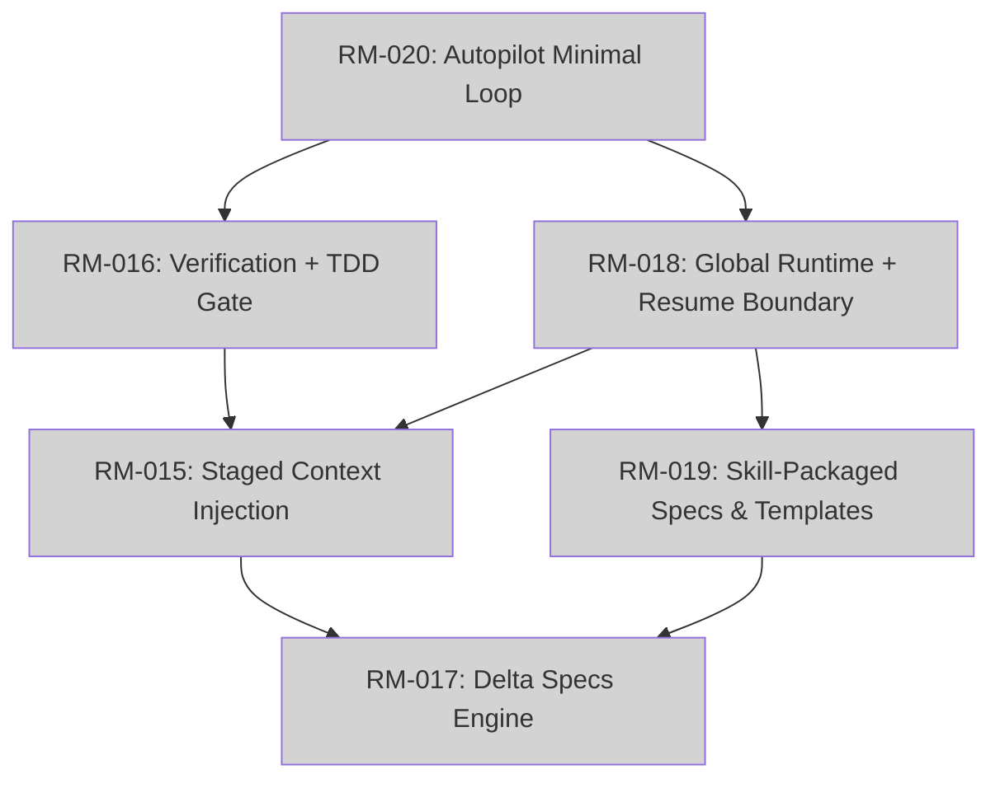

# Product Roadmap: CC-DevFlow

**Version**: vNext Draft
**Created**: 2026-04-09 北京时间
**Updated**: 2026-04-09 北京时间
**Planning Horizon**: Q2 2026 (remaining) + Q3,Q4,Q1
**Status**: Active Draft

**Input**:
- `/core:roadmap` 重新运行后的上下文口径，采用 `human_effort / llm_effort / completeness_score / scope_shape`
- `devflow/requirements/` 现有交付记录
- Office-hours 已确认的北极星体验：`plan approved -> config-driven execute -> checkpoint -> resume -> verify`

## Reading Guide

- **Success Criteria / Acceptance Criteria**: 说明这个项做完以后如何验收。
- **Completeness**: 不是进度百分比，而是这个 roadmap item 当前是否已经被
  定义成一个完整可交付单元，而不是被切成了一个廉价 shortcut shard。
- **Scope Shape**:
  - `lake`: 已经适合完整交付的闭环
  - `ocean`: 还需要拆分，否则会伪装成一个过大的 roadmap item

## Vision Statement

CC-DevFlow 的下一阶段不再追求“更厚的平台”，而是收敛成一个
`skill-first + protocol-first + markdown-first` 的自动驾驶系统。

未来 3 个月的核心任务不是继续扩充命令面，而是把用户第一次真正能感知
到价值的最小闭环做出来：

- 用户给出模糊目标
- 系统先收敛计划
- 人批准计划
- 系统按配置进入 `direct / delegate / team`
- 执行中留下 checkpoint 与验证证据
- 中断后从 `resume-index + artifacts` 恢复，而不是靠聊天历史猜

这要求 CC-DevFlow 把运行态和缓存放到 `~/.cc-devflow/`，把仓库内保留为
真正的人机共读真相源：`devflow/intent/`、`ROADMAP`、`BACKLOG`、
checkpoints 与验证工件。

## Milestone Overview

| Milestone | Quarter | Theme | Success Criteria | Status |
|-----------|---------|-------|------------------|--------|
| M1-Q2-2026 | Q2-2026 | Front Door | `RM-020` 形成可批准、可执行、可恢复的 autopilot 最小闭环 | Completed |
| M2-Q2-2026 | Q2-2026 | Brake System | `RM-016` + `RM-018` 打通 verify/resume，TDD 与 artifact 证据成为硬约束 | Planned |
| M3-Q2-2026 | Q2-2026 | Thin Surface | `RM-015` + `RM-019` 压薄上下文与平台目录侵入 | Planned |
| M4-Q3-2026 | Q3-2026 | Change Discipline | `RM-017` 被拆解成可执行 lakes，而不是模糊 ocean | Planned |

## Q2 2026 Milestones

### M1-Q2-2026: Front Door

**Timeline**: 2026-04-09 ~ 2026-04-30
**Theme**: 一个能真正开工的前门

**Success Criteria**:
- [x] `/flow:autopilot` 成为模糊目标默认入口
- [x] `plan.md` 未获批准前不进入 execute
- [x] 批准后按配置进入 `direct / delegate / team`
- [x] `team` 默认关闭，只有显式配置才启用

**Feature Cluster: Autopilot Minimal Loop**
- **RM-020**: Autopilot Minimal Loop (`autopilot` skill, intent artifacts)
  - 描述: 把旧的 Flow Simplification 重写为 `discover/converge -> approve -> execute -> resume -> verify`
  - 优先级: P1
  - 预计工时: LLM 3-4 days | Human 2 weeks
  - Completeness: 9/10
  - Scope Shape: lake

**Acceptance Criteria**:
- [x] `/flow:autopilot` 能生成可批准的 `plan.md`
- [x] 计划批准前不会进入 execute
- [x] 计划批准后能按配置进入 `direct / delegate / team`
- [x] `resume-index.md` 能指向唯一下一步动作

**Progress Update (2026-04-09):**
- 已落地显式 approval gate：`/flow:autopilot` 先停在批准闸，再通过 `harness:approve` 放行执行
- 已落地单一 approval truth source：`harness-state.json.approval`，并镜像到 `plan.md` / `resume-index.md`
- 已落地执行梯约束：默认 `direct -> delegate -> team`，`team` 只在显式配置时升级
- 已落地稳定恢复动作：`harness:resume --from-checkpoint stable` 会把失败/阻塞任务重排到最近稳定 checkpoint 之后继续执行

**Dependencies**:
- **Blocks**: RM-016, RM-018, RM-015
- **Depends on**: existing autopilot skill baseline, current `devflow/intent/` artifacts

**Risks**:
- **Risk 1**: 只是重命名，不是真正统一执行链
  - **Mitigation**: 明确状态机、批准门、resume 门与 exit criteria
- **Risk 2**: `team` 再次回到默认主路径
  - **Mitigation**: 把 `direct` 写死为默认，`team` 只通过配置显式打开

**Estimated Effort**: LLM 3-4 days | Human 2 weeks

### M2-Q2-2026: Brake System

**Timeline**: 2026-05-01 ~ 2026-05-31
**Theme**: 可恢复、可验证、不可糊弄

**Success Criteria**:
- [ ] verify 结果由程序化证据驱动，而不是 completion marker
- [ ] executable dev task 默认 tests-first
- [ ] 非 TDD 任务必须记录 `non_tdd_reason`
- [ ] 恢复优先读取 `resume-index + checkpoints + runtime support state`

**Feature Cluster: Verification & Runtime Boundary**
- **RM-016**: Verification + TDD Gate (`quality-gates`, constitution, verify pipeline)
  - 描述: 把 quality gate 升级为 autopilot 的刹车系统
  - 优先级: P1
  - 预计工时: LLM 2-3 days | Human 1.5 weeks
  - Completeness: 9/10
  - Scope Shape: lake

- **RM-018**: Global Runtime + Resume Boundary (`~/.cc-devflow/`, repo artifact contract)
  - 描述: 把 runtime/cache 移到全局目录，repo 只保留长期真相源
  - 优先级: P1
  - 预计工时: LLM 3 days | Human 2 weeks
  - Completeness: 8/10
  - Scope Shape: lake

**Acceptance Criteria**:
- [ ] executable dev task 默认强制 TDD
- [ ] 非 TDD 任务必须记录 `non_tdd_reason`
- [ ] verify 至少覆盖 tests、lint/typecheck 和 artifact completeness
- [ ] `~/.cc-devflow/` 与 repo artifacts 的职责边界有明确约定
- [ ] resume 先读 repo artifacts，再读 runtime support state

**Dependencies**:
- **Blocks**: RM-015, RM-019
- **Depends on**: RM-020

**Risks**:
- **Risk 1**: repo/runtime 边界继续分裂
  - **Mitigation**: 明确 restore precedence 和 artifact truth table
- **Risk 2**: TDD 仍停留在文化约定
  - **Mitigation**: 让 `non_tdd_reason` 进入 plan、manifest 或 verify 结构

**Estimated Effort**: LLM 5-6 days | Human 3.5 weeks

### M3-Q2-2026: Thin Surface

**Timeline**: 2026-06-01 ~ 2026-06-30
**Theme**: 把厚度移出 repo，把通用能力移入 skill

**Success Criteria**:
- [ ] subagent/skill 只加载当前阶段真正需要的上下文
- [ ] 模板、脚本、自动化提示词优先进入 skill assets
- [ ] 用户平台目录只保留最薄入口和路由说明
- [ ] repo 内不再新增大批平台专属资产

**Feature Cluster: Context & Packaging**
- **RM-015**: Staged Context Injection (`context profiles`, `intent-first loading`)
  - 描述: 按阶段注入最小上下文，不再默认共享整包项目记忆
  - 优先级: P2
  - 预计工时: LLM 2 days | Human 1.5 weeks
  - Completeness: 8/10
  - Scope Shape: lake

- **RM-019**: Skill-Packaged Specs & Templates (`skill assets`, `thin platform entry`)
  - 描述: 通用模板和自动化尽量进 skill/plugin，repo 只留项目专属规范
  - 优先级: P2
  - 预计工时: LLM 1-2 days | Human 1 week
  - Completeness: 8/10
  - Scope Shape: lake

**Acceptance Criteria**:
- [ ] 每个阶段只注入当前任务真正需要的最小上下文
- [ ] 通用模板和提示优先进入 skill assets
- [ ] repo 中不再新增大批平台专属目录
- [ ] 项目专属规范继续保留在 `devflow/spec/` 或同等级真相源中

**Dependencies**:
- **Blocks**: RM-017
- **Depends on**: RM-016, RM-018

**Risks**:
- **Risk 1**: 模板与规范拆分后失去 discoverability
  - **Mitigation**: skill assets + repo index 双向链接
- **Risk 2**: 只迁移文件位置，没有真正减少侵入感
  - **Mitigation**: 用“repo 是否新增平台专属目录”做约束指标

**Estimated Effort**: LLM 3-4 days | Human 2.5 weeks

## Q3 2026 Milestones

### M4-Q3-2026: Change Discipline

**Timeline**: 2026-07-01 ~ 2026-09-30
**Theme**: 先拆 ocean，再落增量规格

**Success Criteria**:
- [ ] `RM-017` 被拆成可执行 lakes
- [ ] delta 与 SSOT spec 的同步边界可审计
- [ ] 增量规格不反客为主，不挤压主闭环可用性

**Feature Cluster: Incremental Specs**
- **RM-017**: Delta Specs Engine
  - 描述: 为稳定模块增加增量规格跟踪，但必须先从 ocean 拆成 lakes
  - 优先级: P3
  - 预计工时: LLM 4-5 days (Phase A) | Human 2 weeks+
  - Completeness: 6/10
  - Scope Shape: ocean

**Acceptance Criteria**:
- [ ] 先拆出至少一个单模块 delta-spec lake
- [ ] 单模块 delta 可以同步到 SSOT spec
- [ ] archive/diff 行为可审计
- [ ] 在拆成 lakes 之前，不作为 Q2 主闭环阻塞项

**Dependencies**:
- **Blocks**: -
- **Depends on**: RM-015, RM-019

**Risks**:
- **Risk 1**: 过早把规格系统做厚
  - **Mitigation**: 先限制到一个稳定模块和一条 delta sync path
- **Risk 2**: 抢占 Q2 主闭环资源
  - **Mitigation**: 只在 Q2 闭环成立后进入拆解

**Estimated Effort**: LLM 4-5 days (Phase A) | Human 2 weeks+

## Dependency Graph

## Velocity Tracking

| Metric | Value | Source | Role |
|--------|-------|--------|------|
| Completed REQs | 3 completed + 1 active seed | `devflow/requirements/` scan | 历史样本数 |
| Avg Time per REQ | ~2-3 days per delivered REQ | `EXECUTION_LOG.md` sample | human baseline |
| Human Baseline Capacity | 4-6 medium roadmap items / quarter | historical throughput calibration | 风险参考 |
| LLM-Native Capacity | 8-12 lakes / quarter | compression-calibrated estimate | 主排期单位 |
| Planning Mode | llm-native | `/core:roadmap` override | 真相源 |
| Risk Notes | docs-heavy work compresses more than runtime-bound work; sample size is small; resume/runtime changes have higher integration risk | velocity calibration | 风险解释 |

## Completeness / Lake-Ocean Review

### Lakes To Boil

| RM-ID | Title | LLM Effort | Completeness | Decision |
|-------|-------|------------|--------------|----------|
| RM-020 | Autopilot Minimal Loop | 3-4 days | 9/10 | 完整做成前门闭环，不拆 shortcut |
| RM-016 | Verification + TDD Gate | 2-3 days | 9/10 | 把 TDD 与 evidence gate 做成硬约束 |
| RM-018 | Global Runtime + Resume Boundary | 3 days | 8/10 | 明确 runtime/repo 边界，一次做对 |
| RM-015 | Staged Context Injection | 2 days | 8/10 | 只做阶段化最小注入，不做大规格系统 |
| RM-019 | Skill-Packaged Specs & Templates | 1-2 days | 8/10 | 先迁通用模板与自动化，不求全局化 |

### Oceans To Split

| RM-ID | Title | Current Shape | Why It Is An Ocean | Required Split |
|-------|-------|---------------|--------------------|----------------|
| RM-017 | Delta Specs Engine | ocean | 涉及 SSOT、delta sync、archive、模块级 rollout | 先拆成单模块 delta sync lake，再决定是否扩展 |

### Review Notes

- `RM-020/016/018` 都是可在单季度内闭环的 lakes，应完整交付，不推荐再拆出廉价 shortcut。
- `RM-017` 目前还是 ocean，只能进入 Q3 拆解，不应伪装成 Q2 的单个 roadmap item。
- 主排期以 `llm_effort` 为准，`human_effort` 只用于风险说明和沟通基线。

## Implementation Tracking

| RM-ID | Feature | Derived From | Human Effort | LLM Effort | Completeness | Scope Shape | Status | Mapped REQ | Progress |
|-------|---------|--------------|--------------|------------|--------------|-------------|--------|------------|----------|
| RM-020 | Autopilot Minimal Loop | `autopilot` skill + office-hours decisions | 2 weeks | 3-4 days | 9/10 | lake | Planned | - | 0% |
| RM-016 | Verification + TDD Gate | RM-016 research + Constitution Article VI | 1.5 weeks | 2-3 days | 9/10 | lake | Planned | - | 0% |
| RM-018 | Global Runtime + Resume Boundary | RM-018 research + runtime boundary decisions | 2 weeks | 3 days | 8/10 | lake | Planned | - | 0% |
| RM-015 | Staged Context Injection | OpenSpec × Trellis proposal | 1.5 weeks | 2 days | 8/10 | lake | Planned | - | 0% |
| RM-019 | Skill-Packaged Specs & Templates | spec system + gstack/superpowers packaging philosophy | 1 week | 1-2 days | 8/10 | lake | Planned | - | 0% |
| RM-017 | Delta Specs Engine | OpenSpec delta-spec design | 2 weeks+ | 4-5 days (Phase A) | 6/10 | ocean | Planned | - | 0% |

## Constitution Check (Phase -1 Gates)

### Simplicity Gate (Article VII)
- [x] 每个里程碑 <= 3 个主要项目
  - **检查结果**: PASS，Q2 主线压缩为 3 个 lakes + 2 个配套 lakes

### Anti-Abstraction Gate (Article VIII)
- [x] 无过早基础设施建设
  - **检查结果**: PASS，`~/.cc-devflow/` 与 staged context 都服务于已确认闭环，不是抽象平台工程

### Integration-First Gate (Article IX)
- [x] 先定义前门闭环，再定义配套能力
  - **检查结果**: PASS，`RM-020 -> RM-016/RM-018 -> RM-015/RM-019 -> RM-017`

## Non-Goals

- 不为 autopilot 新造厚 orchestrator
- 不把 `team` 做成默认路径或第二套真相源
- 不把 repo 变成 runtime cache
- 不在 Q2 把 `RM-017` 当成完整 lake 强行塞进主闭环
- 不继续往用户 `.claude` 等平台目录堆大量非规范资产
