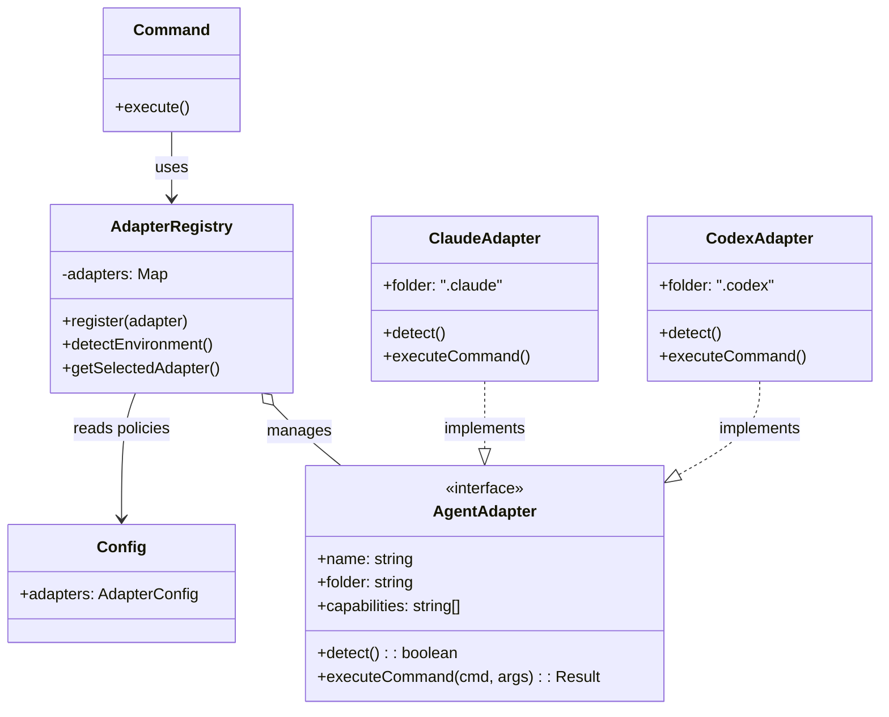

# Technical Design: REQ-004 - Agent Adapter Architecture

**Status**: Approved
**Created**: 2025-12-17T08:25:00Z
**Updated**: 2025-12-17T08:45:00Z
**Type**: Technical Design

---

## 1. System Architecture

### 1.1 Architecture Overview

### 1.2 Module Breakdown

- **AdapterRegistry**: Singleton responsible for lifecycle and selection. Inspired by `spec-kit`'s `AGENT_CONFIG`.
- **AgentAdapter Interface**: Abstract contract. Adds `folder` property to standard API to support directory isolation pattern from `spec-kit`.
- **Implementations**: `ClaudeAdapter` (default, `.claude/`) and `CodexAdapter` (new, `.codex/`).
- **Configuration**: `config/adapters.yml` defining policies.

### 1.3 Data Flow

1. **Command Invocation**: User runs `/flow-xxx`.
2. **Detection**: `AdapterRegistry` detects environment (e.g., checks for `.claude/` vs `.codex/` presence or env vars).
3. **Selection**: Registry selects adapter.
4. **Context Loading**: Adapter loads context from its specific `folder`.
5. **Execution**: Adapter executes command.

### 1.4 Existing Codebase Integration

- **Reuses**: `lib/` structure.
- **Aligns with**: `spec-kit` directory isolation pattern (`.claude/`, `.codex/`, etc.).
- **Extends**: Adds `lib/adapters` to bridge the gap between `cc-devflow` commands and `spec-kit` scaffolding.

---

## 2. Technology Stack

### 2.1 Runtime
- **Environment**: Node.js (Existing Baseline)

### 2.2 Libraries
- **Validation**: `zod`
- **YAML Parser**: `js-yaml`

### 2.3 Deviation from Baseline
None.

---

## 3. Data Model Design

### 3.1 Configuration Schema (`config/adapters.yml`)

#### Object: AdapterConfig

| Field | Type | Description |
|-------|------|-------------|
| preferred | string | Optional name of adapter to force select |
| policies | PolicyConfig | Security policies |

#### Object: PolicyConfig

| Field | Type | Description |
|-------|------|-------------|
| allow_shell | boolean | Default false. Allow shell execution. |
| allow_network | boolean | Default false. Allow network access. |
| audit_log_path | string | Path to audit log file. |

### 3.2 Runtime Objects

#### Interface: AdapterMetadata

| Field | Type | Description |
|-------|------|-------------|
| name | string | Unique identifier (e.g., 'claude') |
| folder | string | Config directory (e.g., '.claude') |
| version | string | Semver string |
| capabilities | string[] | List of capabilities |

---

## 4. API Design (Internal Contracts)

### 4.1 Interface: AgentAdapter

#### `detect(): Promise<boolean>`
- **Purpose**: Check if current environment/directory structure matches adapter.
- **Performance**: < 50ms.

#### `executeCommand(cmd: string, args: string[]): Promise<CommandResult>`
- **Purpose**: Execute a step in the workflow.

#### `getFolder(): string`
- **Purpose**: Return the specific configuration folder name (aligned with `spec-kit` conventions).

### 4.2 Error Handling
- **AdapterNotFoundError**
- **CapabilityDeniedError**

---

## 5. Security Design

### 5.1 Authorization (Capability Model)
- **Model**: Capability-based Access Control (Shell, Network).
- **Enforcement**: Registry checks capabilities before execution.

### 5.2 Secret Management
- **Strategy**: Environment variables only.

### 5.3 Audit
- **Log Path**: Configurable.

---

## 6. Performance Design

### 6.1 Caching Strategy
- **Detection Result**: Cached in singleton.

### 6.2 Performance Targets
- **Overhead**: < 50ms.

---

## 7. Constitution Check (Phase -1 Gates)

### 7.0 Baseline Deviation Check (ANTI-TECH-CREEP)
- [x] All baseline technologies reused.

### 7.1 Simplicity Gate (Article VII)
- [x] **≤3 modules**: Registry, Interface, Adapters.
- [x] **No future-proofing**: Only Claude + Codex.

### 7.2 Anti-Abstraction Gate (Article VIII)
- [x] **Direct usage**: Adapter interface is minimal.

### 7.3 Integration-First Gate (Article IX)
- [x] **Contracts defined first**: `adapter-interface.ts` updated to include `folder`.

### 7.4 Complexity Tracking
N/A

---

## 8. Validation Checklist

- [x] Section 1: System Architecture - Complete
- [x] Section 2: Technology Stack - Complete
- [x] Section 3: Data Model Design - Complete
- [x] Section 4: API Design - Complete
- [x] Section 5: Security Design - Complete
- [x] Section 6: Performance Design - Complete
- [x] Section 7: Constitution Check - Complete
- [x] No placeholders remaining

**Ready for Epic Planning**: YES
