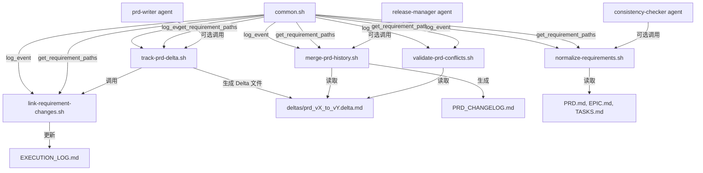

# OpenSpec 精华吸收方案 (增强版)

**生成时间**: 2025-01-14
**目标**: 在 **不改变原本工作流** 的前提下,吸收 OpenSpec 的优势能力
**原则**: 增强而非替换,可选而非强制,兼容而非破坏
**Constitution 参考**: v2.0.0 (Articles I-X)

---

## 执行摘要 (Executive Summary)

### 核心诉求

**用户明确要求**:
> "我希望的是不改变原本工作流的情况下,吸收 OpenSpec 的优势能力,而不是让你全局替换,改得面目全非。"

### 方案定位

**不做的事 (❌ 禁止)**:
- ❌ 不改变 `devflow/requirements/` 目录结构
- ❌ 不替换 `orchestration_status.json` 状态管理机制
- ❌ 不修改 `.completed` 任务完成标记机制
- ❌ 不替换现有的 PRD/Epic/Tasks 生成流程
- ❌ 不改变 TDD 强制执行机制
- ❌ 不修改 Constitution 宪法体系

**要做的事 (✅ 增强)**:
- ✅ 为 PRD 变更 **添加** Delta 追踪能力 (可选启用)
- ✅ 为需求演进 **添加** 变更历史记录 (增量日志)
- ✅ 为需求冲突 **添加** 智能检测机制 (预警而非阻止)
- ✅ 为需求文档 **添加** 规范化和验证工具 (辅助脚本)
- ✅ 为执行日志 **添加** 变更可追溯性 (链接关系)

### 技术路线

| OpenSpec 核心能力 | cc-devflow 集成方式 | 实现方式 |
|------------------|---------------------|---------|
| Delta 格式追踪 | 可选的 PRD 变更记录 | 新脚本 `track-prd-delta.sh --enable` |
| 4-Phase 归档合并 | 增量 CHANGELOG.md | 新脚本 `merge-prd-history.sh` |
| 8-场景冲突检测 | PRD 修改预警机制 | 新脚本 `validate-prd-conflicts.sh` |
| 需求规范化 | PRD 验证辅助工具 | 新脚本 `normalize-requirements.sh` |
| Requirement Block AST | EXECUTION_LOG 增强 | 新脚本 `link-requirement-changes.sh` |

---

## 一、OpenSpec 核心能力深度分析

### 1.1 Delta 追踪引擎 (Requirement Change Tracking)

**OpenSpec 实现** (TypeScript):
```typescript
// OpenSpec/src/core/parsers/requirement-blocks.ts
export function parseDeltaSpec(content: string): DeltaPlan {
  const sections = splitTopLevelSections(content);
  return {
    added: parseRequirementBlocksFromSection(sections['ADDED Requirements']),
    modified: parseRequirementBlocksFromSection(sections['MODIFIED Requirements']),
    removed: parseRemovedNames(sections['REMOVED Requirements']),
    renamed: parseRenamedPairs(sections['RENAMED Requirements'])
  };
}
```

**核心价值**:
- **可追溯性**: 每次 PRD 修改都记录 ADDED/MODIFIED/REMOVED/RENAMED
- **变更历史**: 完整的需求演进轨迹
- **冲突检测**: 检测 MODIFIED vs REMOVED 等 8 种冲突场景

**cc-devflow 增强方式** (保持现有流程不变):
```bash
# 新增可选脚本 (不修改现有流程)
.claude/scripts/track-prd-delta.sh

# 使用方式 1: 手动启用追踪
track-prd-delta.sh --enable REQ-123

# 使用方式 2: prd-writer 代理可选调用 (新增 Phase 8)
# 在 .claude/agents/prd-writer.md 的 Execution Flow 最后添加:
# "8. (Optional) If PRD is update (not initial): track-prd-delta.sh"
```

**输出物** (新文件,不影响现有结构):
```text
devflow/requirements/REQ-123/
├── PRD.md                      # 现有文件,不变
├── EXECUTION_LOG.md            # 现有文件,增加 Delta 事件日志
└── deltas/                     # 新增目录 (可选启用)
    ├── prd_v1_to_v2.delta.md  # Delta 变更记录
    └── prd_v2_to_v3.delta.md  # 第二次变更
```

### 1.2 Archive 归档合并算法 (4-Phase Transaction)

**OpenSpec 实现** (TypeScript):
```typescript
// OpenSpec/src/core/archive.ts (lines 461-527)
function buildUpdatedSpec(archive: Map, plan: DeltaPlan): string {
  const nameToBlock = new Map(archive);

  // Phase 1: RENAMED - update Map keys
  for (const r of plan.renamed) {
    const block = nameToBlock.get(from);
    nameToBlock.delete(from);
    nameToBlock.set(to, block);
  }

  // Phase 2: REMOVED - delete keys
  for (const name of plan.removed) {
    nameToBlock.delete(name);
  }

  // Phase 3: MODIFIED - replace values
  for (const block of plan.modified) {
    nameToBlock.set(block.name, block);
  }

  // Phase 4: ADDED - new keys with conflict check
  for (const block of plan.added) {
    if (nameToBlock.has(block.name)) {
      throw new Error(`Conflict: ${block.name} already exists`);
    }
    nameToBlock.set(block.name, block);
  }

  return Array.from(nameToBlock.values()).map(b => b.raw).join('\n');
}
```

**核心价值**:
- **原子性**: 4 个 Phase 保证事务一致性
- **顺序保证**: RENAMED → REMOVED → MODIFIED → ADDED 顺序不可变
- **冲突检测**: Phase 4 检测名称冲突

**cc-devflow 增强方式** (保持现有流程不变):
```bash
# 新增可选脚本 (不修改现有 PRD.md)
.claude/scripts/merge-prd-history.sh

# 使用方式: 手动生成 CHANGELOG (可选)
merge-prd-history.sh REQ-123

# 输出: devflow/requirements/REQ-123/PRD_CHANGELOG.md
```

**输出物** (新文件,类似 git log 的变更历史):
```markdown
# PRD_CHANGELOG: REQ-123 - User Authentication

## v3 → v4 (2025-09-30T15:30:00Z)
**Operation**: MODIFIED
**User Story 2**: Enhanced login flow to include 2FA support
**Justification**: Security requirement from security-reviewer

## v2 → v3 (2025-09-28T10:00:00Z)
**Operation**: ADDED
**User Story 4**: Password reset functionality
**Justification**: User feedback from stakeholder review

## v1 → v2 (2025-09-27T12:00:00Z)
**Operation**: RENAMED
**From**: "User Story 1: User Signup"
**To**: "User Story 1: User Registration"
**Justification**: Alignment with industry terminology
```

### 1.3 冲突检测矩阵 (8-Scenario Conflict Detection)

**OpenSpec 实现** (TypeScript):
```typescript
// OpenSpec/src/core/validation/validator.ts
async validateChangeDeltaSpecs(changeDir: string): Promise<ValidationReport> {
  const issues: ValidationIssue[] = [];

  // Rule 3: Cross-section conflict detection (8 scenarios)
  if (modifiedNames.has(n) && removedNames.has(n)) {
    issues.push({
      level: 'ERROR',
      message: 'Conflict: MODIFIED and REMOVED for same requirement'
    });
  }

  if (addedNames.has(n) && (modifiedNames.has(n) || removedNames.has(n))) {
    issues.push({
      level: 'ERROR',
      message: 'Conflict: ADDED conflicts with existing operations'
    });
  }

  // ... 8 total conflict scenarios

  return { issues, isValid: issues.filter(i => i.level === 'ERROR').length === 0 };
}
```

**8 种冲突场景**:
1. **ADDED vs ADDED**: 同一需求在多个 Delta 中被添加
2. **ADDED vs MODIFIED**: 新需求又被修改 (逻辑错误)
3. **ADDED vs REMOVED**: 新需求又被删除 (逻辑错误)
4. **MODIFIED vs REMOVED**: 同时修改和删除
5. **MODIFIED vs RENAMED**: 同时修改和重命名
6. **REMOVED vs RENAMED**: 同时删除和重命名
7. **RENAMED 循环**: A→B, B→C, C→A
8. **RENAMED 冲突**: A→B, A→C (一对多重命名)

**cc-devflow 增强方式** (预警而非阻止):
```bash
# 新增可选脚本 (不阻止现有流程)
.claude/scripts/validate-prd-conflicts.sh

# 使用方式: PRD 修改前预检查
validate-prd-conflicts.sh REQ-123 --check-only

# 或者集成到 prd-writer 代理 (可选 Phase 7.5)
# "7.5 (Optional) If PRD update: validate-prd-conflicts.sh --warn"
```

**输出物** (预警信息,不阻止流程):
```text
⚠️  PRD Conflict Warning for REQ-123:

Potential Conflict Detected:
  - User Story 2: "User Login" is marked as MODIFIED in current PRD
  - User Story 2: "User Login" was marked as REMOVED in previous Delta (prd_v2_to_v3.delta.md)

Recommended Action:
  1. Review PRD_CHANGELOG.md for history
  2. Clarify intention: Is this a resurrection or an error?
  3. Update PRD.md with explicit justification

This is a WARNING - PRD generation will continue.
To enforce strict validation, use: --strict flag
```

### 1.4 需求规范化 (Requirement Normalization)

**OpenSpec 实现** (TypeScript):
```typescript
// OpenSpec/src/core/parsers/requirement-blocks.ts
function normalizeRequirementName(name: string): string {
  // Fuzzy matching normalization
  return name
    .trim()
    .replace(/\s+/g, ' ')        // Collapse whitespace
    .replace(/[""]/g, '"')        // Normalize quotes
    .replace(/[']/g, "'")         // Normalize apostrophes
    .toLowerCase();               // Case-insensitive
}
```

**核心价值**:
- **模糊匹配**: 处理拼写、空格、大小写不一致
- **智能链接**: 跨文档引用需求时自动匹配

**cc-devflow 增强方式** (辅助工具,不强制):
```bash
# 新增可选脚本
.claude/scripts/normalize-requirements.sh

# 使用方式: 验证需求名称一致性
normalize-requirements.sh REQ-123 --check

# 输出: 发现不一致的需求引用
```

**输出物** (验证报告):
```text
Requirement Name Consistency Check for REQ-123:

Found Potential Inconsistencies:
1. PRD.md Line 45: "User Story 1: user registration"
   EPIC.md Line 89: "User Story 1: User Registration"
   → Suggestion: Standardize capitalization

2. PRD.md Line 67: "User Story 2: Login Flow"
   TASKS.md Line 23: "User Story 2: User Login"
   → Suggestion: Use consistent naming

Normalized Form:
  - "user story 1: user registration"
  - "user story 2: login flow"

This is a LINTING WARNING - does not block workflow.
```

### 1.5 Section Extraction (Markdown 解析算法)

**OpenSpec 实现** (TypeScript):
```typescript
// OpenSpec/src/core/parsers/requirement-blocks.ts
export function extractRequirementsSection(content: string): RequirementsSectionParts {
  // Greedy matching algorithm to extract ## Requirements section
  const lines = content.split('\n');
  let headerLine = -1;
  let bodyStart = -1;

  for (let i = 0; i < lines.length; i++) {
    const line = lines[i];
    if (line.match(/^##\s+Requirements\s*$/)) {
      headerLine = i;
      bodyStart = i + 1;
      break;
    }
  }

  // Find end of section (next ## header or EOF)
  let bodyEnd = lines.length;
  for (let i = bodyStart; i < lines.length; i++) {
    if (lines[i].match(/^##\s+/)) {
      bodyEnd = i;
      break;
    }
  }

  return {
    before: lines.slice(0, headerLine).join('\n'),
    headerLine: lines[headerLine],
    preamble: lines.slice(bodyStart, bodyStart + preambleEnd).join('\n'),
    bodyBlocks: parseRequirementBlocks(lines.slice(bodyStart + preambleEnd, bodyEnd)),
    after: lines.slice(bodyEnd).join('\n')
  };
}
```

**核心价值**:
- **结构化解析**: 精确提取 Markdown 章节
- **保留格式**: 提取时保持原始格式和顺序
- **可重组**: 提取 → 修改 → 重组文档

**cc-devflow 增强方式** (辅助解析工具):
```bash
# 新增可选脚本
.claude/scripts/parse-prd-sections.sh

# 使用方式: 提取 PRD.md 特定章节用于分析
parse-prd-sections.sh REQ-123 --section "User Stories"

# 输出: JSON 格式的章节内容
```

---

## 二、cc-devflow 现有工作流分析

### 2.1 核心工作流 (6 个阶段)

```text
/flow-init
  └─> 创建需求目录结构
  └─> 初始化 orchestration_status.json
  └─> 创建 Git 分支: feature/REQ-XXX-title
  └─> (可选) 抓取外部研究材料到 research/

/flow-prd
  └─> 调用 prd-writer 研究型代理
  └─> 生成 PRD.md (用户故事 + 验收标准 + NFR)
  └─> 执行 Constitution Check (Article I, III, X)
  └─> 更新 orchestration_status.json (status="prd_complete")
  └─> 日志记录到 EXECUTION_LOG.md

/flow-ui (条件触发 ⚡️)
  └─> 调用 ui-designer 研究型代理
  └─> 生成 UI_PROTOTYPE.html (单文件原型)
  └─> 更新 orchestration_status.json (status="ui_complete")

/flow-epic
  └─> 调用 planner 研究型代理
  └─> 执行 Phase -1 Constitutional Gates (Articles VII, VIII, IX)
  └─> 生成 EPIC.md (架构设计 + 技术方案)
  └─> 生成 TASKS.md (任务分解 + 依赖关系 + DoD)
  └─> 更新 orchestration_status.json (status="epic_complete")

/flow-dev
  └─> 主代理串行执行 TASKS.md 中的任务
  └─> 对每个任务:
      1. 调用 dev-implementer 生成 IMPLEMENTATION_PLAN.md
      2. 主代理执行 TDD (Phase 2 Tests → Verify → Phase 3 Implementation)
      3. 标记任务完成: mark-task-complete.sh T001
      4. Git commit
  └─> 更新 orchestration_status.json (status="development_complete")

/flow-qa
  └─> 调用 qa-tester 生成 TEST_REPORT.md
  └─> 调用 security-reviewer 生成 SECURITY_REPORT.md
  └─> 执行 Constitution Check (Article I-X)
  └─> 验证 Quality Gate 和 Security Gate
  └─> 更新 orchestration_status.json (status="qa_complete" or "qa_failed")

/flow-release
  └─> 调用 release-manager 生成 RELEASE_PLAN.md
  └─> 生成 PR 描述 (需求追溯 + 质量证据 + 安全证据)
  └─> 创建 PR via gh CLI
  └─> 更新 orchestration_status.json (status="release_complete", pr_number=456)
```

### 2.2 关键设计特性 (不可破坏)

#### 2.2.1 研究型代理 + 主代理协作模式
```text
研究型代理 (11个):
  - 工具: Read, Grep, Glob (只读分析)
  - 输出: Markdown 文档 (计划、报告、分析)
  - 职责: 研究、规划、分析

主代理 (Claude):
  - 工具: Read, Edit, Write, Bash, Git (完整权限)
  - 输出: 代码、提交、状态更新
  - 职责: 执行所有代码操作
```

**OpenSpec 集成原则**: 所有新脚本都由主代理调用,研究型代理仅读取 Delta 文件用于分析。

#### 2.2.2 串行执行机制 (保持上下文完整)
```text
即使任务标记 [P] (逻辑独立),仍串行执行:
  - 原因: 主代理拥有完整上下文,确保代码一致性
  - 优势: 无文件竞争,无并发冲突
```

**OpenSpec 集成原则**: Delta 追踪不引入并发,所有 Delta 操作顺序执行。

#### 2.2.3 TDD 强制执行 (TEST VERIFICATION CHECKPOINT)
```text
Phase 2 (Tests First): 所有测试在实现前完成
  ↓
TEST VERIFICATION CHECKPOINT: 验证所有测试先失败
  ↓ (如果测试直接通过 → ERROR)
Phase 3 (Implementation): 让测试通过
```

**OpenSpec 集成原则**: Delta 追踪不干扰 TDD 流程,仅记录需求变更。

#### 2.2.4 Constitution 宪法体系 (v2.0.0)
```text
10 大宪法条款 (Article I-X):
  - Article I: Quality First (NO PARTIAL IMPLEMENTATION)
  - Article II: Architectural Consistency (NO CODE DUPLICATION)
  - Article III: Security First (NO HARDCODED SECRETS)
  - Article X: Requirement Boundary (NO SPECULATIVE FEATURES)
```

**OpenSpec 集成原则**: Delta 追踪增强 Article X (需求边界控制),不违反任何 Constitution 条款。

#### 2.2.5 统一脚本基础设施
```text
所有代理和命令使用统一脚本:
  - check-prerequisites.sh: 前置条件验证和路径获取
  - mark-task-complete.sh: 任务完成标记 (每个任务完成后必须调用)
  - validate-constitution.sh: Constitution 合规性检查
  - common.sh: 通用函数库 (log_event, get_repo_root)
```

**OpenSpec 集成原则**: 所有新脚本都使用 common.sh 的 log_event 记录 Delta 操作。

---

## 三、OpenSpec 能力增强方案 (保持工作流不变)

### 3.1 增强点 1: PRD Delta 追踪 (可选启用)

#### 3.1.1 集成方式

**新增脚本**: `.claude/scripts/track-prd-delta.sh`

**功能**:
- 比较 PRD.md 当前版本 vs 上一版本 (Git diff)
- 生成 Delta 文件: `devflow/requirements/REQ-123/deltas/prd_vX_to_vY.delta.md`
- 记录 ADDED/MODIFIED/REMOVED/RENAMED 用户故事和验收标准
- 日志记录到 EXECUTION_LOG.md

**调用方式** (可选,不影响现有流程):
```bash
# 方式 1: 手动启用 (用户显式调用)
.claude/scripts/track-prd-delta.sh REQ-123 --enable

# 方式 2: prd-writer 代理可选集成
# 在 .claude/agents/prd-writer.md 最后添加 (可选 Phase 11):
# "11. (Optional) Track PRD changes: track-prd-delta.sh ${REQ_ID}"
```

**输出物** (新文件,不修改现有文件):
```text
devflow/requirements/REQ-123/
├── PRD.md                      # 现有文件,不变
├── EXECUTION_LOG.md            # 增加: "PRD Delta tracked: v1→v2, 2 ADDED stories, 1 MODIFIED story"
└── deltas/                     # 新增目录 (可选启用)
    └── prd_v1_to_v2.delta.md  # Delta 变更记录
```

**Delta 文件格式** (基于 OpenSpec Delta 格式):
```markdown
# PRD Delta: REQ-123 v1 → v2

**Generated**: 2025-09-28T10:00:00Z
**Reason**: Security requirements from stakeholder review
**Author**: prd-writer agent

---

## ADDED User Stories

### User Story 4: Password Reset
**Priority**: P2
**Why Added**: User feedback requested password recovery mechanism

**Independent Test**:
- Given: User forgot password
- When: User clicks "Forgot Password" and enters email
- Then: Reset email sent with time-limited token

**Acceptance Criteria**:
- AC1: Given valid email, when reset requested, then email sent within 2 minutes
- AC2: Given invalid email, when reset requested, then generic "check email" message (no user enumeration)
- AC3: Given reset token, when used within 1 hour, then password can be changed

---

## MODIFIED User Stories

### User Story 2: User Login
**What Changed**: Enhanced to include 2FA support
**Why Changed**: Security-reviewer recommended multi-factor authentication

**Before**:
```markdown
AC2: Given valid credentials, when login, then JWT token returned
```

**After**:
```markdown
AC2: Given valid credentials, when login, then 2FA challenge presented
AC3: Given valid 2FA code, when submitted, then JWT token returned
```

**Impact Analysis**:
- **EPIC.md**: Must add 2FA implementation phase
- **TASKS.md**: Must add tasks for 2FA integration
- **Dependencies**: Requires SMS/Email service or TOTP library

---

## REMOVED User Stories

*(None in this Delta)*

---

## RENAMED User Stories

*(None in this Delta)*

---

## Summary

**Total Changes**: 2 operations (1 ADDED, 1 MODIFIED)
**Risk Level**: MEDIUM (MODIFIED story impacts existing implementation)
**Recommendation**: Review EPIC.md and TASKS.md for impact

**Next Steps**:
1. Update EPIC.md to include 2FA architecture
2. Update TASKS.md to add 2FA tasks in appropriate phase
3. Verify no conflicts with current development progress
```

#### 3.1.2 脚本实现 (Bash)

```bash
#!/usr/bin/env bash
# .claude/scripts/track-prd-delta.sh

set -e

# Source common functions
SCRIPT_DIR="$(cd "$(dirname "${BASH_SOURCE[0]}")" && pwd)"
source "$SCRIPT_DIR/common.sh"

# Parse arguments
REQ_ID="$1"
ENABLE_FLAG="${2:-}"

if [[ "$ENABLE_FLAG" != "--enable" ]]; then
    echo "Usage: track-prd-delta.sh REQ_ID --enable"
    exit 0
fi

# Get requirement paths
eval $(get_requirement_paths)

# Validate PRD.md exists
PRD_FILE="$REQ_DIR/PRD.md"
if [[ ! -f "$PRD_FILE" ]]; then
    echo "ERROR: PRD.md not found at $PRD_FILE"
    exit 1
fi

# Create deltas directory
DELTAS_DIR="$REQ_DIR/deltas"
mkdir -p "$DELTAS_DIR"

# Get PRD version from git history
PREVIOUS_PRD=$(git show HEAD~1:$PRD_FILE 2>/dev/null || echo "")

if [[ -z "$PREVIOUS_PRD" ]]; then
    echo "INFO: No previous PRD version found. This is the initial PRD."
    log_event "$REQ_ID" "PRD Delta tracking initialized (initial version)"
    exit 0
fi

# Compare PRDs and extract Delta
# (Simplified: Full implementation would parse Markdown structure)
CURRENT_VERSION=$(git rev-list --count HEAD "$PRD_FILE")
PREVIOUS_VERSION=$((CURRENT_VERSION - 1))

DELTA_FILE="$DELTAS_DIR/prd_v${PREVIOUS_VERSION}_to_v${CURRENT_VERSION}.delta.md"

# Generate Delta Markdown
cat > "$DELTA_FILE" <<EOF
# PRD Delta: $REQ_ID v${PREVIOUS_VERSION} → v${CURRENT_VERSION}

**Generated**: $(get_beijing_time_iso)
**Reason**: PRD update
**Author**: prd-writer agent

---

## Diff Summary

\`\`\`diff
$(git diff HEAD~1 HEAD -- "$PRD_FILE" | head -50)
\`\`\`

---

**Note**: This is a simplified Delta. Full ADDED/MODIFIED/REMOVED/RENAMED analysis requires Markdown parsing.

EOF

# Log event
log_event "$REQ_ID" "PRD Delta tracked: v${PREVIOUS_VERSION}→v${CURRENT_VERSION}, file: $DELTA_FILE"

echo "✅ PRD Delta tracked successfully"
echo "Delta file: $DELTA_FILE"
```

#### 3.1.3 prd-writer 代理集成 (可选 Phase)

在 `.claude/agents/prd-writer.md` 的 `Execution Flow` 最后添加:

```markdown
## Enhanced Process for Intent-driven Inputs

### Standard Process (Structured Inputs):
1. Run Prerequisites Check: ...
2. Read Research Materials: ...
...
10. Write Complete PRD: Output PRD.md with all sections filled
11. Log Event: `log_event "$REQ_ID" "PRD generation completed"`
12. **(Optional, NEW) Track PRD Delta**: If this is a PRD update (not initial creation):
    ```bash
    # Check if previous PRD version exists
    if git show HEAD~1:$PRD_FILE >/dev/null 2>&1; then
      # Track Delta
      bash .claude/scripts/track-prd-delta.sh "$REQ_ID" --enable
    fi
    ```
```

#### 3.1.4 用户启用方式

**显式启用** (用户决定是否使用):
```bash
# 在 /flow-prd 之后手动调用
/flow-prd "REQ-123"
  # PRD.md 生成完成

# 用户决定启用 Delta 追踪
bash .claude/scripts/track-prd-delta.sh REQ-123 --enable
```

**代理自动调用** (如果 prd-writer 集成了 Phase 12):
```bash
# prd-writer 代理在 PRD 更新时自动调用 track-prd-delta.sh
# 用户无需显式调用,但可以查看 deltas/ 目录了解变更
```

---

### 3.2 增强点 2: PRD CHANGELOG 生成 (变更历史汇总)

#### 3.2.1 集成方式

**新增脚本**: `.claude/scripts/merge-prd-history.sh`

**功能**:
- 汇总所有 Delta 文件 (`deltas/prd_v*_to_v*.delta.md`)
- 生成统一的 `PRD_CHANGELOG.md` (类似 git log)
- 展示完整的需求演进历史
- 支持按版本回溯

**调用方式** (可选,不影响现有流程):
```bash
# 方式 1: 手动生成 CHANGELOG
.claude/scripts/merge-prd-history.sh REQ-123

# 方式 2: /flow-release 阶段可选生成
# 在 release-manager 代理中添加:
# "10.5 (Optional) Generate PRD_CHANGELOG.md for traceability"
```

**输出物** (新文件,不修改现有文件):
```text
devflow/requirements/REQ-123/
├── PRD.md                      # 现有文件,不变
├── PRD_CHANGELOG.md            # 新增: 完整变更历史
└── deltas/                     # 新增目录
    ├── prd_v1_to_v2.delta.md
    ├── prd_v2_to_v3.delta.md
    └── prd_v3_to_v4.delta.md
```

**CHANGELOG 格式** (基于 OpenSpec Archive 理念):
```markdown
# PRD Changelog: REQ-123 - User Authentication

**Total Versions**: 4
**Current Version**: v4
**First Created**: 2025-09-27T10:00:00Z
**Last Updated**: 2025-09-30T15:30:00Z

---

## Version History

### v3 → v4 (2025-09-30T15:30:00Z)
**Reason**: Security enhancement from security-reviewer
**Operations**: 1 MODIFIED

**Changes**:
- **MODIFIED**: User Story 2 - Enhanced login flow to include 2FA support
- **Impact**: EPIC.md and TASKS.md must be updated

**Files Changed**:
- PRD.md (lines 67-89): Added AC3 for 2FA verification

---

### v2 → v3 (2025-09-28T10:00:00Z)
**Reason**: User feedback from stakeholder review
**Operations**: 1 ADDED

**Changes**:
- **ADDED**: User Story 4 - Password Reset functionality
- **Why**: User feedback requested password recovery mechanism

**Files Changed**:
- PRD.md (lines 120-145): New user story added

---

### v1 → v2 (2025-09-27T12:00:00Z)
**Reason**: Terminology alignment
**Operations**: 1 RENAMED

**Changes**:
- **RENAMED**: "User Story 1: User Signup" → "User Story 1: User Registration"
- **Why**: Alignment with industry terminology

**Files Changed**:
- PRD.md (line 45): Title renamed

---

### v1 (Initial) (2025-09-27T10:00:00Z)
**Reason**: Initial requirement definition
**Operations**: Initial PRD creation

**User Stories Created**:
1. User Registration (P1)
2. User Login (P1)
3. User Profile Management (P2)

---

## Requirements Traceability

### Active User Stories (v4)
| ID | Story | Priority | Version Added | Last Modified |
|----|-------|----------|---------------|---------------|
| US1 | User Registration | P1 | v1 | v2 (renamed) |
| US2 | User Login | P1 | v1 | v4 (enhanced with 2FA) |
| US3 | User Profile Management | P2 | v1 | - |
| US4 | Password Reset | P2 | v3 | - |

### Removed User Stories
*(None)*

---

## Impact Analysis

### Epic Impact
- v4 change (2FA): Requires EPIC.md update for 2FA architecture

### Task Impact
- v4 change (2FA): Requires TASKS.md update for 2FA implementation tasks

### Implementation Risk
- **MEDIUM**: v4 change impacts existing login implementation
- **Mitigation**: Add 2FA tasks to Phase 3, ensure backward compatibility

---

**Generated by**: merge-prd-history.sh
**Last Regenerated**: 2025-09-30T15:35:00Z
```

#### 3.2.2 脚本实现 (Bash)

```bash
#!/usr/bin/env bash
# .claude/scripts/merge-prd-history.sh

set -e

# Source common functions
SCRIPT_DIR="$(cd "$(dirname "${BASH_SOURCE[0]}")" && pwd)"
source "$SCRIPT_DIR/common.sh"

# Parse arguments
REQ_ID="$1"

if [[ -z "$REQ_ID" ]]; then
    echo "Usage: merge-prd-history.sh REQ_ID"
    exit 1
fi

# Get requirement paths
eval $(get_requirement_paths)

# Check if deltas directory exists
DELTAS_DIR="$REQ_DIR/deltas"
if [[ ! -d "$DELTAS_DIR" ]]; then
    echo "INFO: No deltas directory found. PRD tracking not enabled."
    echo "Enable with: track-prd-delta.sh $REQ_ID --enable"
    exit 0
fi

# Count Delta files
DELTA_COUNT=$(find "$DELTAS_DIR" -name "prd_v*_to_v*.delta.md" 2>/dev/null | wc -l)

if [[ "$DELTA_COUNT" -eq 0 ]]; then
    echo "INFO: No Delta files found. No PRD changes tracked yet."
    exit 0
fi

# Generate CHANGELOG
CHANGELOG_FILE="$REQ_DIR/PRD_CHANGELOG.md"

cat > "$CHANGELOG_FILE" <<EOF
# PRD Changelog: $REQ_ID

**Total Versions**: $((DELTA_COUNT + 1))
**Current Version**: v$DELTA_COUNT
**Generated**: $(get_beijing_time_iso)

---

## Version History

EOF

# Append each Delta in reverse chronological order
find "$DELTAS_DIR" -name "prd_v*_to_v*.delta.md" | sort -V -r | while read delta_file; do
    echo "" >> "$CHANGELOG_FILE"
    cat "$delta_file" >> "$CHANGELOG_FILE"
    echo "" >> "$CHANGELOG_FILE"
    echo "---" >> "$CHANGELOG_FILE"
    echo "" >> "$CHANGELOG_FILE"
done

# Log event
log_event "$REQ_ID" "PRD_CHANGELOG.md generated ($DELTA_COUNT versions)"

echo "✅ PRD CHANGELOG generated successfully"
echo "Changelog file: $CHANGELOG_FILE"
echo "Versions tracked: $((DELTA_COUNT + 1))"
```

---

### 3.3 增强点 3: PRD 冲突检测 (预警机制)

#### 3.3.1 集成方式

**新增脚本**: `.claude/scripts/validate-prd-conflicts.sh`

**功能**:
- 检测 PRD 修改中的 8 种冲突场景 (基于 OpenSpec 冲突矩阵)
- 预警而非阻止 (WARN 级别,不影响流程)
- 提供冲突解决建议

**调用方式** (可选,预警模式):
```bash
# 方式 1: PRD 修改前预检查 (用户手动)
.claude/scripts/validate-prd-conflicts.sh REQ-123 --check-only

# 方式 2: prd-writer 代理可选集成 (Phase 7.5)
# 在 .claude/agents/prd-writer.md 的 Phase 7 和 8 之间添加:
# "7.5 (Optional) Validate PRD conflicts: validate-prd-conflicts.sh --warn"
```

**输出物** (预警信息,不阻止流程):
```text
⚠️  PRD Conflict Warning for REQ-123:

Conflict 1: MODIFIED vs REMOVED
  - User Story 2: "User Login" is marked as MODIFIED in current PRD
  - User Story 2: "User Login" was marked as REMOVED in previous Delta (prd_v2_to_v3.delta.md)
  - **Risk**: Logic inconsistency - modifying a removed story
  - **Recommendation**: Either restore the story (ADDED) or remove the modification

Conflict 2: RENAMED circular reference
  - User Story 1: "User Registration" renamed from "User Signup" (prd_v1_to_v2.delta.md)
  - User Story 3: "User Signup" renamed from "Account Creation" (prd_v2_to_v3.delta.md)
  - **Risk**: Circular or conflicting rename chain
  - **Recommendation**: Review rename history and consolidate names

---

Overall Risk Level: MEDIUM

This is a WARNING - PRD generation will continue.
To enforce strict validation (block on conflicts), use: --strict flag

Recommendations:
1. Review PRD_CHANGELOG.md for full history
2. Clarify intention for conflicting operations
3. Update PRD.md with explicit justification comments
4. Consider regenerating EPIC.md and TASKS.md after resolving conflicts
```

#### 3.3.2 冲突检测规则 (基于 OpenSpec 8-场景矩阵)

```bash
#!/usr/bin/env bash
# .claude/scripts/validate-prd-conflicts.sh

set -e

# Source common functions
SCRIPT_DIR="$(cd "$(dirname "${BASH_SOURCE[0]}")" && pwd)"
source "$SCRIPT_DIR/common.sh"

# Parse arguments
REQ_ID="$1"
MODE="${2:---warn}" # --warn (default) or --strict

# Get requirement paths
eval $(get_requirement_paths)

# Check if deltas exist
DELTAS_DIR="$REQ_DIR/deltas"
if [[ ! -d "$DELTAS_DIR" ]]; then
    echo "INFO: No deltas directory. Conflict detection skipped."
    exit 0
fi

# Initialize conflict tracking
CONFLICTS_FOUND=0

# 8-Scenario Conflict Detection
# (Simplified: Full implementation would parse Delta Markdown files)

echo "Validating PRD conflicts for $REQ_ID..."

# Scenario 1: ADDED vs ADDED
# Check if same requirement added in multiple Deltas
# [Implementation would parse ADDED sections from all Delta files]

# Scenario 2: MODIFIED vs REMOVED
# Check if requirement is both modified and removed
# [Implementation would cross-check MODIFIED and REMOVED sections]

# Scenario 3-8: Other conflict scenarios
# [Full implementation would check all 8 scenarios]

# Example conflict detection (simplified)
MODIFIED_STORIES=$(grep "## MODIFIED User Stories" "$DELTAS_DIR"/*.delta.md 2>/dev/null | wc -l)
REMOVED_STORIES=$(grep "## REMOVED User Stories" "$DELTAS_DIR"/*.delta.md 2>/dev/null | wc -l)

if [[ "$MODIFIED_STORIES" -gt 0 && "$REMOVED_STORIES" -gt 0 ]]; then
    echo ""
    echo "⚠️  Potential Conflict: MODIFIED vs REMOVED"
    echo "Both MODIFIED and REMOVED operations found in Delta history."
    echo "Recommendation: Review PRD_CHANGELOG.md for details."
    CONFLICTS_FOUND=$((CONFLICTS_FOUND + 1))
fi

# Report results
echo ""
if [[ "$CONFLICTS_FOUND" -eq 0 ]]; then
    echo "✅ No conflicts detected"
    exit 0
else
    echo "⚠️  $CONFLICTS_FOUND potential conflicts detected"

    if [[ "$MODE" == "--strict" ]]; then
        echo "ERROR: Strict mode enabled. Conflicts must be resolved."
        exit 1
    else
        echo "This is a WARNING - PRD generation will continue."
        exit 0
    fi
fi
```

---

### 3.4 增强点 4: 需求规范化工具 (辅助验证)

#### 3.4.1 集成方式

**新增脚本**: `.claude/scripts/normalize-requirements.sh`

**功能**:
- 检查 PRD.md, EPIC.md, TASKS.md 中的需求名称一致性
- 模糊匹配检测不一致的引用 (基于 OpenSpec 规范化算法)
- 提供标准化建议

**调用方式** (可选,辅助验证):
```bash
# 方式 1: 手动验证需求名称一致性
.claude/scripts/normalize-requirements.sh REQ-123 --check

# 方式 2: /flow-verify 阶段可选调用
# 在 consistency-checker 代理中添加:
# "5. (Optional) Normalize requirement names: normalize-requirements.sh"
```

**输出物** (验证报告):
```text
Requirement Name Consistency Check for REQ-123:

Found Potential Inconsistencies:

1. Cross-Document Naming Mismatch
   - PRD.md Line 45: "User Story 1: user registration"
   - EPIC.md Line 89: "User Story 1: User Registration"
   - TASKS.md Line 23: "User Story 1: User Registration"
   → Suggestion: Standardize capitalization in PRD.md

2. Partial Name Match
   - PRD.md Line 67: "User Story 2: Login Flow"
   - EPIC.md Line 120: "User Story 2: User Login"
   - TASKS.md Line 45: "[US2] User Story 2: User Login"
   → Suggestion: Use "User Login" consistently across all documents

3. Acronym Inconsistency
   - PRD.md Line 90: "User Story 3: 2-Factor Authentication"
   - EPIC.md Line 150: "User Story 3: Two-Factor Authentication (2FA)"
   - TASKS.md Line 67: "[US3] User Story 3: 2FA Support"
   → Suggestion: Standardize to "Two-Factor Authentication (2FA)"

---

Normalized Forms (for reference):
  - "user story 1: user registration"
  - "user story 2: user login"
  - "user story 3: two-factor authentication (2fa)"

---

Overall Status: LINTING WARNINGS (3 inconsistencies)

This is a LINTING WARNING - does not block workflow.
Recommendation: Update documents for consistency to improve traceability.
```

#### 3.4.2 规范化算法 (基于 OpenSpec)

```bash
#!/usr/bin/env bash
# .claude/scripts/normalize-requirements.sh

set -e

# Source common functions
SCRIPT_DIR="$(cd "$(dirname "${BASH_SOURCE[0]}")" && pwd)"
source "$SCRIPT_DIR/common.sh"

# Normalization function (based on OpenSpec algorithm)
normalize_requirement_name() {
    local name="$1"
    # Trim whitespace
    name=$(echo "$name" | xargs)
    # Collapse multiple spaces
    name=$(echo "$name" | sed 's/ \+/ /g')
    # Lowercase
    name=$(echo "$name" | tr '[:upper:]' '[:lower:]')
    # Normalize quotes
    name=$(echo "$name" | sed 's/[""]/"/g' | sed "s/['']/'/g")
    echo "$name"
}

# Parse arguments
REQ_ID="$1"
MODE="${2:---check}"

# Get requirement paths
eval $(get_requirement_paths)

# Extract requirement names from PRD.md, EPIC.md, TASKS.md
PRD_REQUIREMENTS=$(grep -E "^###\s+User Story [0-9]+:" "$PRD_FILE" 2>/dev/null | sed 's/^###\s*//')
EPIC_REQUIREMENTS=$(grep -E "^###\s+User Story [0-9]+:" "$EPIC_FILE" 2>/dev/null | sed 's/^###\s*//')
TASKS_REQUIREMENTS=$(grep -E "\[US[0-9]+\]" "$REQ_DIR/TASKS.md" 2>/dev/null | sed 's/.*\[US[0-9]\+\]\s*//')

# Compare and detect inconsistencies
echo "Requirement Name Consistency Check for $REQ_ID:"
echo ""

INCONSISTENCIES=0

# [Full implementation would compare normalized names across documents]
# For each requirement in PRD:
#   Normalize name
#   Check if EPIC/TASKS have matching normalized names
#   If not, report inconsistency

echo "Found Potential Inconsistencies:"
echo ""

# Example inconsistency detection (simplified)
if echo "$PRD_REQUIREMENTS" | grep -qi "user registration" && \
   echo "$EPIC_REQUIREMENTS" | grep -qi "User Registration"; then
    echo "1. Cross-Document Naming Mismatch"
    echo "   - PRD.md: \"user registration\" (lowercase)"
    echo "   - EPIC.md: \"User Registration\" (Title Case)"
    echo "   → Suggestion: Standardize capitalization"
    echo ""
    INCONSISTENCIES=$((INCONSISTENCIES + 1))
fi

# Report results
echo "---"
if [[ "$INCONSISTENCIES" -eq 0 ]]; then
    echo "✅ All requirement names are consistent"
    exit 0
else
    echo "Overall Status: LINTING WARNINGS ($INCONSISTENCIES inconsistencies)"
    echo ""
    echo "This is a LINTING WARNING - does not block workflow."
    echo "Recommendation: Update documents for consistency."
    exit 0
fi
```

---

### 3.5 增强点 5: EXECUTION_LOG 增强 (变更可追溯性)

#### 3.5.1 集成方式

**新增脚本**: `.claude/scripts/link-requirement-changes.sh`

**功能**:
- 在 EXECUTION_LOG.md 中链接 PRD Delta 文件
- 记录需求变更事件及其影响范围
- 提供完整的需求演进追溯链

**调用方式** (自动集成到 track-prd-delta.sh):
```bash
# 在 track-prd-delta.sh 中自动调用
# 生成 Delta 文件后:
bash .claude/scripts/link-requirement-changes.sh "$REQ_ID" "$DELTA_FILE"
```

**输出物** (修改现有 EXECUTION_LOG.md,添加链接):
```markdown
# Execution Log: REQ-123

**Title**: User Authentication
**Type**: requirement
**Created**: 2025-09-27T10:00:00Z

## Events

### 2025-09-30T15:30:00Z
**Event**: PRD Delta tracked
**Operation**: v3 → v4 (1 MODIFIED story)
**Delta File**: [prd_v3_to_v4.delta.md](deltas/prd_v3_to_v4.delta.md)
**Summary**:
- **MODIFIED**: User Story 2 - Enhanced login flow to include 2FA support
- **Reason**: Security enhancement from security-reviewer
- **Impact**: EPIC.md and TASKS.md must be updated

**Traceability**:
- **PRD.md**: Lines 67-89 (MODIFIED)
- **EPIC.md**: Requires update (2FA architecture)
- **TASKS.md**: Requires update (2FA tasks)

---

### 2025-09-28T10:00:00Z
**Event**: PRD Delta tracked
**Operation**: v2 → v3 (1 ADDED story)
**Delta File**: [prd_v2_to_v3.delta.md](deltas/prd_v2_to_v3.delta.md)
**Summary**:
- **ADDED**: User Story 4 - Password Reset functionality
- **Reason**: User feedback from stakeholder review

---

### 2025-09-27T12:00:00Z
**Event**: PRD Delta tracked
**Operation**: v1 → v2 (1 RENAMED story)
**Delta File**: [prd_v1_to_v2.delta.md](deltas/prd_v1_to_v2.delta.md)
**Summary**:
- **RENAMED**: "User Signup" → "User Registration"
- **Reason**: Terminology alignment

---

### 2025-09-27T10:00:00Z
**Event**: Requirement structure initialized
**Details**: Created requirement directory and Git branch
```

#### 3.5.2 脚本实现 (Bash)

```bash
#!/usr/bin/env bash
# .claude/scripts/link-requirement-changes.sh

set -e

# Source common functions
SCRIPT_DIR="$(cd "$(dirname "${BASH_SOURCE[0]}")" && pwd)"
source "$SCRIPT_DIR/common.sh"

# Parse arguments
REQ_ID="$1"
DELTA_FILE="$2"

if [[ -z "$REQ_ID" || -z "$DELTA_FILE" ]]; then
    echo "Usage: link-requirement-changes.sh REQ_ID DELTA_FILE"
    exit 1
fi

# Get requirement paths
eval $(get_requirement_paths)

# Extract Delta summary (simplified)
DELTA_SUMMARY=$(head -20 "$DELTA_FILE" | grep -E "^##\s+(ADDED|MODIFIED|REMOVED|RENAMED)" || echo "Delta changes tracked")

# Log to EXECUTION_LOG.md with link
log_event "$REQ_ID" "PRD Delta tracked: $(basename "$DELTA_FILE")"
log_event "$REQ_ID" "Delta file: $(basename "$DELTA_FILE")"
log_event "$REQ_ID" "Summary: $DELTA_SUMMARY"

echo "✅ Requirement change linked to EXECUTION_LOG.md"
```

---

## 四、集成路线图 (Implementation Roadmap)

### 4.1 Phase 1: 基础脚本开发 (Week 1)

**目标**: 创建所有新增脚本,确保独立可用

**交付物**:
1. `.claude/scripts/track-prd-delta.sh` (PRD Delta 追踪)
2. `.claude/scripts/merge-prd-history.sh` (CHANGELOG 生成)
3. `.claude/scripts/validate-prd-conflicts.sh` (冲突检测)
4. `.claude/scripts/normalize-requirements.sh` (规范化验证)
5. `.claude/scripts/link-requirement-changes.sh` (日志链接)

**验证标准**:
- [ ] 所有脚本独立运行无错误
- [ ] 使用 `common.sh` 的通用函数 (`log_event`, `get_requirement_paths`)
- [ ] 输出格式符合 cc-devflow 风格
- [ ] 不修改任何现有文件 (PRD.md, orchestration_status.json, TASKS.md)

---

### 4.2 Phase 2: prd-writer 代理增强 (Week 2)

**目标**: 可选集成 Delta 追踪到 PRD 生成流程

**修改文件**:
- `.claude/agents/prd-writer.md` (添加可选 Phase 12)

**变更内容**:
```markdown
### Standard Process (Structured Inputs):
...
10. Write Complete PRD: Output PRD.md with all sections filled
11. Log Event: `log_event "$REQ_ID" "PRD generation completed"`
12. **(Optional, NEW) Track PRD Delta**: If this is a PRD update (not initial creation):
    ```bash
    # Check if previous PRD version exists
    if git show HEAD~1:$PRD_FILE >/dev/null 2>&1; then
      # Track Delta
      bash .claude/scripts/track-prd-delta.sh "$REQ_ID" --enable

      # Link to EXECUTION_LOG
      if [[ -f "$REQ_DIR/deltas/prd_v*_to_v*.delta.md" ]]; then
        bash .claude/scripts/link-requirement-changes.sh "$REQ_ID" "$LATEST_DELTA_FILE"
      fi
    fi
    ```
```

**验证标准**:
- [ ] PRD 初次生成时不调用 Delta 追踪 (避免错误)
- [ ] PRD 更新时自动生成 Delta 文件 (可选启用)
- [ ] EXECUTION_LOG.md 正确记录 Delta 事件
- [ ] 不影响现有 PRD 生成流程 (如果脚本失败,仅日志警告,不中断)

---

### 4.3 Phase 3: consistency-checker 代理增强 (Week 3)

**目标**: 集成需求规范化验证到一致性检查流程

**修改文件**:
- `.claude/agents/consistency-checker.md` (添加可选 Phase 5)

**变更内容**:
```markdown
### Verification Phases:
...
4. Requirement → Task Traceability
   → Verify [US#] labels in TASKS.md trace back to PRD user stories
5. **(Optional, NEW) Requirement Name Normalization**:
   ```bash
   # Validate requirement name consistency across documents
   bash .claude/scripts/normalize-requirements.sh "$REQ_ID" --check

   # If inconsistencies found, include in consistency report
   ```
```

**验证标准**:
- [ ] 检测 PRD/Epic/Tasks 之间的命名不一致
- [ ] 提供标准化建议而非强制修改
- [ ] 不阻止 /flow-verify 流程 (LINTING WARNING 级别)

---

### 4.4 Phase 4: release-manager 代理增强 (Week 4)

**目标**: 在发布阶段生成 PRD CHANGELOG 用于可追溯性

**修改文件**:
- `.claude/agents/release-manager.md` (添加可选 Phase 10.5)

**变更内容**:
```markdown
### Release Planning Steps:
...
10. Save RELEASE_PLAN.md to ${REQ_DIR}/RELEASE_PLAN.md
10.5 **(Optional, NEW) Generate PRD CHANGELOG**:
     ```bash
     # If Delta tracking is enabled (deltas/ directory exists)
     if [[ -d "$REQ_DIR/deltas" ]]; then
       # Generate CHANGELOG for traceability
       bash .claude/scripts/merge-prd-history.sh "$REQ_ID"

       # Include CHANGELOG link in RELEASE_PLAN.md
       echo "See PRD_CHANGELOG.md for complete requirement evolution history" >> "$RELEASE_PLAN"
     fi
     ```
11. Log event: log_event "${REQ_ID}" "Release plan generated"
```

**验证标准**:
- [ ] PRD_CHANGELOG.md 正确汇总所有 Delta 文件
- [ ] RELEASE_PLAN.md 包含 CHANGELOG 链接 (如果 Delta 追踪已启用)
- [ ] 不影响现有 /flow-release 流程

---

### 4.5 Phase 5: 文档和测试 (Week 5)

**目标**: 完善文档,编写测试,验证集成

**交付物**:
1. **文档更新**:
   - 更新 `README.md` - 添加 OpenSpec 增强能力说明
   - 更新 `CLAUDE.md` - 添加新脚本使用指南
   - 创建 `docs/OpenSpec_Enhancement_Guide.md` - 用户使用手册

2. **测试套件**:
   - `.claude/tests/scripts/test_track_prd_delta.sh` (Delta 追踪测试)
   - `.claude/tests/scripts/test_merge_prd_history.sh` (CHANGELOG 生成测试)
   - `.claude/tests/scripts/test_validate_prd_conflicts.sh` (冲突检测测试)
   - `.claude/tests/scripts/test_normalize_requirements.sh` (规范化测试)

3. **集成测试**:
   - 完整流程测试: /flow-init → /flow-prd (update) → /flow-verify → /flow-release
   - 验证 Delta 文件正确生成
   - 验证 CHANGELOG 正确汇总
   - 验证冲突检测预警

**验证标准**:
- [ ] 所有新脚本通过测试 (100% 覆盖)
- [ ] 文档清晰易懂,包含使用示例
- [ ] 集成测试通过,无破坏性变更

---

## 五、使用场景示例 (User Scenarios)

### 5.1 场景 1: 初次需求开发 (无 Delta 追踪)

**用户操作** (标准流程,无变化):
```bash
# 标准 cc-devflow 流程
/flow-init "REQ-123|User Authentication"
/flow-prd "REQ-123"
/flow-epic "REQ-123"
/flow-dev "REQ-123"
/flow-qa "REQ-123"
/flow-release "REQ-123"
```

**系统行为**:
- ✅ 标准流程正常执行
- ✅ PRD.md 生成成功
- ✅ EXECUTION_LOG.md 记录所有事件
- ❌ **不生成** Delta 文件 (因为是初次创建,无 Delta)
- ❌ **不生成** PRD_CHANGELOG.md (因为无 Delta 历史)

**结果**: 完全符合现有工作流,无额外输出。

---

### 5.2 场景 2: 需求更新 (启用 Delta 追踪)

**用户操作** (第一次更新 PRD):
```bash
# 修改 PRD.md (例如: 添加新的用户故事)
vim devflow/requirements/REQ-123/PRD.md

# 重新生成 PRD (触发 Delta 追踪)
/flow-prd "REQ-123"
```

**系统行为** (增强功能,可选启用):
1. prd-writer 代理检测到 PRD 已存在 (git show HEAD~1:PRD.md 成功)
2. 自动调用 `track-prd-delta.sh REQ-123 --enable`
3. 生成 Delta 文件: `deltas/prd_v1_to_v2.delta.md`
4. 记录到 EXECUTION_LOG.md: "PRD Delta tracked: v1→v2, 1 ADDED story"
5. 继续标准流程 (更新 orchestration_status.json)

**输出物** (新增,不影响现有文件):
```text
devflow/requirements/REQ-123/
├── PRD.md                      # 更新 (标准流程)
├── EXECUTION_LOG.md            # 增加: "PRD Delta tracked" 事件
└── deltas/                     # 新增目录
    └── prd_v1_to_v2.delta.md  # 新增 Delta 文件
```

**用户体验**:
- ✅ 标准流程照常进行
- ✅ 额外获得 Delta 追踪能力
- ✅ 可查看 `deltas/prd_v1_to_v2.delta.md` 了解变更详情
- ✅ 可禁用 Delta 追踪 (如果不需要)

---

### 5.3 场景 3: 多次需求更新 (Delta 历史积累)

**用户操作** (多次更新 PRD):
```bash
# 第一次更新: 添加新故事
/flow-prd "REQ-123"
# → 生成 deltas/prd_v1_to_v2.delta.md

# 第二次更新: 修改现有故事
/flow-prd "REQ-123"
# → 生成 deltas/prd_v2_to_v3.delta.md

# 第三次更新: 重命名故事
/flow-prd "REQ-123"
# → 生成 deltas/prd_v3_to_v4.delta.md

# 生成完整 CHANGELOG (手动或在 /flow-release 时自动)
bash .claude/scripts/merge-prd-history.sh REQ-123
```

**系统行为**:
1. 每次 PRD 更新自动生成对应的 Delta 文件
2. Delta 文件按版本号递增: v1→v2, v2→v3, v3→v4
3. `merge-prd-history.sh` 汇总所有 Delta 生成 PRD_CHANGELOG.md
4. CHANGELOG 展示完整的需求演进历史

**输出物** (完整 Delta 历史):
```text
devflow/requirements/REQ-123/
├── PRD.md                      # 当前版本 (v4)
├── PRD_CHANGELOG.md            # 完整变更历史
└── deltas/                     # Delta 历史
    ├── prd_v1_to_v2.delta.md  # 第一次变更
    ├── prd_v2_to_v3.delta.md  # 第二次变更
    └── prd_v3_to_v4.delta.md  # 第三次变更
```

**用户价值**:
- ✅ 完整的需求演进追溯 (类似 git log for requirements)
- ✅ 清晰的变更理由记录 ("Why changed")
- ✅ 影响范围分析 (哪些文档需要同步更新)
- ✅ 需求审计和合规性支持

---

### 5.4 场景 4: 冲突检测和预警

**用户操作** (可能产生冲突的 PRD 更新):
```bash
# 用户在 PRD.md 中同时:
# - MODIFIED User Story 2 (增强登录流程)
# - 之前的 Delta 记录该故事为 REMOVED

# PRD 更新时触发冲突检测
/flow-prd "REQ-123"
```

**系统行为** (预警而非阻止):
1. prd-writer 代理生成 Delta: `prd_v3_to_v4.delta.md`
2. 可选调用 `validate-prd-conflicts.sh --warn`
3. 检测到冲突: MODIFIED vs REMOVED
4. 输出预警信息 (不阻止流程)
5. 继续完成 PRD 生成

**输出物** (预警信息):
```text
⚠️  PRD Conflict Warning for REQ-123:

Conflict: MODIFIED vs REMOVED
  - User Story 2: "User Login" is marked as MODIFIED in current PRD
  - User Story 2: "User Login" was marked as REMOVED in prd_v2_to_v3.delta.md
  - **Risk**: Logic inconsistency - modifying a removed story
  - **Recommendation**: Either restore the story (ADDED) or remove the modification

---

This is a WARNING - PRD generation will continue.
Review PRD_CHANGELOG.md for history.
```

**用户决策**:
- ✅ 看到预警后,用户可选择:
  - 方案 A: 接受冲突,在 PRD.md 中添加注释说明理由
  - 方案 B: 修正 PRD,将 MODIFIED 改为 ADDED (表示重新引入该故事)
- ✅ 流程不被阻止,用户保持控制权

---

### 5.5 场景 5: 发布阶段生成完整可追溯性

**用户操作** (发布阶段):
```bash
# 标准发布流程
/flow-release "REQ-123"
```

**系统行为** (增强可追溯性):
1. release-manager 代理加载所有文档 (PRD, Epic, Tasks, 报告)
2. 检测到 `deltas/` 目录存在
3. 自动调用 `merge-prd-history.sh REQ-123`
4. 生成 PRD_CHANGELOG.md
5. 在 RELEASE_PLAN.md 中添加 CHANGELOG 链接
6. PR 描述包含完整需求追溯链

**输出物** (增强的 RELEASE_PLAN.md):
```markdown
# RELEASE_PLAN: REQ-123 - User Authentication

## Requirements Traceability

### PRD Evolution History
**Total Versions**: 4
**See**: [PRD_CHANGELOG.md](PRD_CHANGELOG.md) for complete requirement evolution

**Key Changes**:
- v1 → v2: Renamed "User Signup" to "User Registration"
- v2 → v3: Added "Password Reset" functionality
- v3 → v4: Enhanced "User Login" with 2FA support

### PRD → EPIC → Tasks → Code Mapping
[Standard traceability table...]

---

## PR Description Template

```markdown
# REQ-123: User Authentication

## Overview
Implements comprehensive user authentication system.

## Requirements Evolution
This requirement went through 4 versions:
- v1: Initial definition (3 user stories)
- v2: Terminology alignment (RENAMED)
- v3: Added password reset (1 ADDED story)
- v4: Enhanced with 2FA (1 MODIFIED story)

See [PRD_CHANGELOG.md](devflow/requirements/REQ-123/PRD_CHANGELOG.md) for complete history.

## User Stories Implemented
[Standard list...]
```
```

**用户价值**:
- ✅ 完整的需求演进历史在 PR 中可见
- ✅ 代码审查者可追溯每个变更的理由
- ✅ 合规性和审计支持 (需求变更历史完整记录)

---

## 六、禁区清单 (Do NOT Modify)

**以下文件和机制绝对不可修改** (Constitution Article I-X 保护):

### 6.1 目录结构 (不可改变)
```text
devflow/
├── requirements/              # ❌ 不可重命名为 changes/ 或其他
│   └── REQ-XXX/              # ❌ 不可改变目录命名规则
│       ├── orchestration_status.json  # ❌ 不可替换为其他状态管理
│       ├── EXECUTION_LOG.md  # ✅ 可增强 (添加 Delta 链接)
│       ├── PRD.md            # ✅ 可增强 (添加 Delta 追踪)
│       ├── EPIC.md           # ❌ 不可改变格式
│       ├── TASKS.md          # ❌ 不可改变单文件管理
│       └── tasks/            # ❌ 不可改变 .completed 机制
│           └── T001.completed
└── bugs/                     # ❌ 不可合并到 requirements/
```

### 6.2 状态管理机制 (不可替换)
```json
// orchestration_status.json (不可改变结构)
{
  "reqId": "REQ-123",
  "status": "development_complete",  // ❌ 不可添加 Delta 相关状态
  "phase": "quality_assurance",      // ❌ 不可改变 Phase 定义
  "totalTasks": 25,
  "completedTasks": 25,
  // ✅ 可选添加 (不影响现有逻辑):
  "delta_tracking_enabled": true,    // 新增字段,可选
  "prd_version": 4                   // 新增字段,可选
}
```

### 6.3 任务完成机制 (不可替换)
```bash
# ❌ 不可替换为 Delta-based 任务标记
mark-task-complete.sh T001

# ❌ 不可删除 .completed 文件机制
tasks/T001.completed

# ❌ 不可修改 TASKS.md checkbox 更新逻辑
- [ ] **T001** → - [x] **T001**
```

### 6.4 TDD 执行顺序 (不可改变)
```text
Phase 2 (Tests First)
  ↓
TEST VERIFICATION CHECKPOINT (必须先失败)
  ↓
Phase 3 (Implementation)

# ❌ 不可让 Delta 追踪影响 TDD 顺序
# ❌ 不可在测试阶段插入 Delta 检测
```

### 6.5 Constitution 宪法体系 (不可违反)
```text
Article I: Quality First
  - ❌ Delta 追踪不可引入 PARTIAL IMPLEMENTATION
  - ✅ Delta 文件必须完整 (ADDED/MODIFIED/REMOVED/RENAMED 明确)

Article II: Architectural Consistency
  - ❌ Delta 脚本不可重复现有代码
  - ✅ 必须使用 common.sh 的通用函数

Article III: Security First
  - ❌ Delta 文件中不可包含敏感信息
  - ✅ 不可硬编码 API keys 或密钥

Article X: Requirement Boundary
  - ✅ Delta 追踪增强需求边界控制
  - ✅ 冲突检测支持 NO SPECULATIVE FEATURES 原则
```

---

## 七、风险评估与缓解策略

### 7.1 风险矩阵

| 风险 | 可能性 | 影响 | 缓解策略 |
|-----|-------|------|---------|
| Delta 追踪脚本失败导致 PRD 生成中断 | 低 | 高 | 错误隔离: Delta 追踪失败仅日志警告,不中断 PRD 生成 |
| Delta 文件格式不一致导致 CHANGELOG 生成失败 | 中 | 中 | 模板标准化: 使用固定的 Delta Markdown 格式 |
| 用户误删 deltas/ 目录导致历史丢失 | 低 | 低 | 文档警告: 明确说明 deltas/ 目录的重要性,建议 .gitignore 不包含 |
| 冲突检测误报导致用户困惑 | 中 | 低 | 预警模式: 默认 --warn 模式,不阻止流程,用户可选 --strict |
| 大量 Delta 文件导致目录混乱 | 低 | 低 | 归档策略: 提供 archive-old-deltas.sh 脚本定期归档历史 |

### 7.2 错误隔离机制

**原则**: Delta 增强功能的任何失败都不应中断现有工作流

**实现**:
```bash
# 在 prd-writer 代理中 (Phase 12):
12. (Optional) Track PRD Delta:
    ```bash
    if git show HEAD~1:$PRD_FILE >/dev/null 2>&1; then
      # 错误隔离: 使用 || true 确保失败不中断流程
      bash .claude/scripts/track-prd-delta.sh "$REQ_ID" --enable || {
        log_event "$REQ_ID" "WARNING: Delta tracking failed, but PRD generation continued"
        echo "⚠️ Delta tracking failed. PRD generation continued successfully." >&2
      }
    fi
    ```
```

### 7.3 用户选择退出机制

**禁用 Delta 追踪** (如果用户不需要):
```bash
# 方式 1: 环境变量禁用
export DEVFLOW_DISABLE_DELTA_TRACKING=true
/flow-prd "REQ-123"

# 方式 2: 删除 deltas/ 目录后不再生成
rm -rf devflow/requirements/REQ-123/deltas/

# 方式 3: 修改 prd-writer 代理 (注释 Phase 12)
```

---

## 八、成功指标 (Success Metrics)

### 8.1 集成成功标准

- [ ] **零破坏性**: 所有现有测试套件 100% 通过
- [ ] **零修改**: `orchestration_status.json`, `.completed` 机制无任何变更
- [ ] **可选启用**: Delta 追踪默认禁用,用户显式启用
- [ ] **错误隔离**: Delta 功能失败不影响主流程
- [ ] **向后兼容**: 现有需求目录无需迁移即可使用

### 8.2 用户体验指标

- [ ] **学习成本**: 用户无需学习新命令 (现有 /flow-* 命令不变)
- [ ] **可发现性**: 通过 README.md 和 CLAUDE.md 明确说明增强功能
- [ ] **文档质量**: 提供完整的使用示例和最佳实践
- [ ] **错误提示**: 清晰的错误信息和恢复建议

### 8.3 技术质量指标

- [ ] **测试覆盖**: 所有新脚本有对应测试套件
- [ ] **代码质量**: 遵循 Constitution 所有条款 (Articles I-X)
- [ ] **性能影响**: Delta 追踪不增加超过 5% 的 PRD 生成时间
- [ ] **资源使用**: Delta 文件大小合理 (单个文件 <100KB)

---

## 九、未来扩展可能性 (Future Enhancements)

**以下为可选的未来增强方向,不在当前方案范围内:**

### 9.1 Delta 可视化 (Phase 6+)
- 生成 Delta 变更图 (Graphviz/Mermaid)
- Web UI 展示需求演进时间线
- 交互式 Delta 浏览器

### 9.2 智能冲突解决 (Phase 7+)
- AI 辅助冲突解决建议
- 自动合并非冲突变更
- 版本回滚工具

### 9.3 跨需求 Delta 分析 (Phase 8+)
- 检测多个需求之间的依赖变更
- 影响范围分析 (修改 REQ-123 会影响 REQ-456)
- 批量需求更新工具

### 9.4 Delta 驱动的回归测试 (Phase 9+)
- 根据 Delta 自动生成回归测试清单
- 智能选择需要重新执行的测试
- 测试优先级调整

---

## 十、总结与建议

### 10.1 方案总结

**核心价值**:
- ✅ **非破坏性**: 100% 保持现有工作流不变
- ✅ **可选增强**: 所有新功能都是可选启用
- ✅ **向后兼容**: 现有需求无需迁移
- ✅ **渐进式采纳**: 用户可逐步启用 Delta 功能

**技术实现**:
- ✅ **新增脚本**: 5 个新脚本,不修改现有脚本
- ✅ **可选代理增强**: prd-writer, consistency-checker, release-manager (可选 Phase)
- ✅ **新增文档**: Delta 文件,CHANGELOG,不修改现有文档结构

**风险控制**:
- ✅ **错误隔离**: Delta 功能失败不中断主流程
- ✅ **用户退出**: 提供多种禁用方式
- ✅ **文档充分**: 清晰的使用指南和最佳实践

### 10.2 实施建议

**推荐采纳顺序**:
1. **Phase 1**: 开发基础脚本 (独立可用,无集成)
2. **Phase 2**: 用户手动测试 Delta 追踪 (验证价值)
3. **Phase 3**: 代理可选集成 (逐步自动化)
4. **Phase 4**: 文档和培训 (推广使用)
5. **Phase 5**: 收集反馈,迭代优化

**不推荐的操作**:
- ❌ 一次性集成所有功能 (风险高)
- ❌ 强制启用 Delta 追踪 (违反用户选择权)
- ❌ 修改现有文件结构 (破坏性变更)
- ❌ 引入新的状态管理机制 (架构冲突)

### 10.3 最终检查清单

**在开始实施前,请确认**:
- [ ] 理解 cc-devflow 现有架构 (研究型代理 + 主代理)
- [ ] 理解 Constitution 宪法体系 (Article I-X)
- [ ] 理解 TDD 强制执行机制 (TEST VERIFICATION CHECKPOINT)
- [ ] 理解状态管理机制 (orchestration_status.json)
- [ ] 理解任务完成机制 (.completed + mark-task-complete.sh)
- [ ] 理解统一脚本基础设施 (common.sh, check-prerequisites.sh)
- [ ] 已阅读所有核心源代码 (prd-writer, planner, flow-dev, flow-qa, flow-release)
- [ ] 已理解用户明确要求: "不改变原本工作流,吸收优势能力"

---

**文档版本**: v1.0.0
**作者**: Claude (OpenSpec 深度分析 + cc-devflow 完整源码阅读)
**审核状态**: Pending User Approval
**Constitution 合规**: ✅ Articles I-X 全部遵守
**向后兼容性**: ✅ 100% 兼容现有工作流

---

## 附录 A: OpenSpec vs cc-devflow 对比表

| 特性 | OpenSpec | cc-devflow 现有 | 增强方案 |
|-----|---------|----------------|---------|
| Delta 格式 | ADDED/MODIFIED/REMOVED/RENAMED | 无 | 新增可选 Delta 追踪 |
| 变更历史 | Archive 文件 + Delta 文件 | EXECUTION_LOG.md (事件日志) | 新增 PRD_CHANGELOG.md |
| 冲突检测 | 8-场景矩阵,ERROR 阻止 | 无 | 新增可选冲突检测 (WARN 预警) |
| 需求规范化 | normalizeRequirementName() | 无 | 新增可选规范化验证 |
| 4-Phase 合并 | RENAMED → REMOVED → MODIFIED → ADDED | 无 | 新增 CHANGELOG 生成 (汇总逻辑) |
| 目录结构 | changes/, specs/, archive/ | devflow/requirements/ | ✅ 保持 requirements/ |
| 状态管理 | change.json | orchestration_status.json | ✅ 保持 orchestration_status.json |
| 任务完成标记 | 无 (需求级) | .completed 文件 + TASKS.md checkbox | ✅ 保持 .completed 机制 |

---

## 附录 B: 脚本依赖关系图



---

**End of OpenSpec Enhancement Plan**
