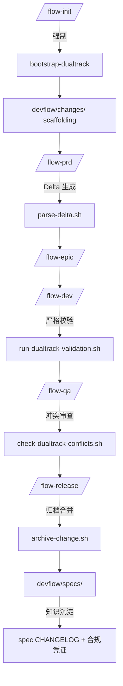

# OpenSpec 深度源码分析与 cc-devflow 精华吸收方案

> **目标**：以 OpenSpec 源码精髓重构 cc-devflow 需求规格轨迹，在既有 `/flow-*` 工作流上强制落地“可验证意图 → 可追溯变更 → 可验证交付”。
> **依据**：结合 `docs/OpenSpec_Deep_Analysis.md`、`docs/OpenSpec_Enhancement_Plan.md`、最新源码复盘成果。

---

## 1. 统一执行摘要
- **保持原工序**：保留 `/flow-*` 七段式主线、`.claude` 脚本体系、Constitution 宪法门槛、`.completed` 任务标记及 `orchestration_status.json` 状态管理。
- **强制引入 OpenSpec 精髓**：Delta AST 解析、四阶段归档、冲突矩阵校验、工具适配框架、任务进度解析全面整合进主流脚本，无选择开关。
- **双轨协同**：`devflow/requirements/<REQ>` 持续管理需求与工作流文档；新增 `devflow/changes/<change-id>` 记录意图差异，并归档到 `devflow/specs/` 作为系统真实源，覆盖全局需求状态。
- **全链追踪**：Delta 机制扩展到任务完成与宪法符合性，形成“文档 → Delta → 实施 → 归档”的强制闭环。

---

## 2. OpenSpec 核心能力速览

| 能力 | 源码位置 | 精髓 | 对 cc-devflow 的价值 |
|------|----------|------|----------------------|
| Delta AST 解析器 | `src/core/parsers/requirement-blocks.ts` | 结构化解析 ADDED/MODIFIED/REMOVED/RENAMED | 显式描述需求变更，提供任务追踪锚点 |
| 四阶段归档算法 | `src/core/archive.ts` | RENAMED→REMOVED→MODIFIED→ADDED 事务合并+冲突检测 | 自动同步批准变更到长期规格，降低漂移 |
| Validator 框架 | `src/core/validation/validator.ts` | Zod Schema + 业务规则 + 指引消息 | 规范 PRD/EPIC/TASKS 格式，避免弱约束 |
| 多工具适配层 | `src/core/configurators/*` | Configurator 注册表 + 模板注入 | 让 cc-devflow 逐步支持 Cursor/Windsurf 等助手 |
| 任务进度解析 | `src/utils/task-progress.ts` | Checkbox 轻量统计 | 为 `/flow-status` 提供细化的完成度指标 |

---

## 3. cc-devflow 现状基线
- `flow-init`~`flow-release` 七阶段模板化流程，依赖 `.claude/scripts` 执行，所有状态写入 `devflow/requirements/<REQ>`。
- constitution v2.0.0 管控质量门槛（Phase -1 Gates、TEST VERIFICATION CHECKPOINT 等）。
- 目前缺乏“变更意图锁定”与“规格差异追踪”，PRD/EPIC/TASKS 由 AI 直接生成/覆盖，难以审计多轮迭代。
- `.completed` 文件 + `mark-task-complete.sh` 管理任务完成度，尚未与 Markdown 勾选状态联动。

---

## 4. 总体设计原则
1. **强制一致性**：所有新建需求必须同时生成 `devflow/requirements/<REQ>` 与 `devflow/changes/<change-id>`，并在归档时更新 `devflow/specs/`。
2. **单一入口**：所有 `/flow-*` 命令原地扩展 Delta 逻辑，禁止绕过；如遇错误需修复后才能继续阶段流转。
3. **幂等安全**：初始化/更新脚本可重复执行；利用标记块（`<!-- OPENSPEC:START -->`）与状态文件避免重复写入；失败时以事务回滚策略恢复上一状态。
4. **显式追踪**：Delta、冲突、归档、任务勾选、宪法检查结果全部写入 `devflow/changes/<id>` 下的结构化文件，并同步 `orchestration_status.json`、`EXECUTION_LOG.md`。
5. **系统级视角**：`devflow/specs/` 作为全局真实源，每次归档必须通过严格验证与冲突消解，确保团队共享一致事实；`devflow/changes/<change-id>` 负责跨需求的意图记录，允许一个 change 同时改动多个历史能力。
6. **上下文加载必达**：所有 Agent（尤其 PRD/EPIC/TASKS）在生成内容前必须读取 `devflow/specs/<capability>` 的最新版本与所有未归档的 `devflow/changes/*/delta.json`，并在输出中引用对应 Requirement/Scenario 编号。缺失上下文时校验直接失败。

---

## 5. 三阶段落地蓝图

### Phase A：基础打通（Week 1-2）
**目标**：重构目录为 `devflow/requirements + devflow/changes + devflow/specs`，并在 `flow-init` 中强制生成。

- **流程钩子**
  - `flow-init` 结束时必须执行 `npx @fission-ai/openspec init --dir devflow`（或等价内嵌逻辑），确保 `devflow/changes`、`devflow/specs`、`devflow/AGENTS.md`、`devflow/project.md` 完成初始化。
  - 根据 `REQ_ID` 生成 `devflow/changes/<change-id>`（约定 `change-id = req-xxx-<slug>`），内含 `proposal.md`、`tasks.md`、`specs/<capability>/spec.md` 基础模板；同步生成/更新 `devflow/requirements/<REQ>`。
- **核心脚本**
  - `.claude/scripts/bootstrap-devflow-dualtrack.sh`：封装初始化与目录校验，支持事务回滚。
  - `.claude/scripts/link-change-id.sh`：在 `orchestration_status.json` 写入 `"change_id": "req-123-auth-upgrade"`，并与 `devflow/changes` 目录保持一一映射。
- **Agent 提示**
  - 更新 PRD/EPIC/TASKS 模板与 agent 指令，要求在输出中显式引用 `devflow/changes/<id>` 中的 delta 结构，并将任务分解映射到 Requirement 名称；增加 `ensure-context-loaded` 检查，确保已加载 `devflow/specs` 与所有 pending delta。

### Phase B：验证与追踪（Week 3-5）
**目标**：将 Delta、冲突检测、任务/宪法追踪融入质量门槛，禁止跳过。

- **Delta 生成**
  - `.claude/scripts/track-delta.sh`（基于 `parseDeltaSpec` 移植）比较 `devflow/requirements/<REQ>` 新旧版本，生成/更新 `devflow/changes/<id>/specs/<capability>/spec.md`，并落地 `delta.json`（结构化 AST）。
  - 每次 `/flow-prd`、`/flow-epic` 执行完成后自动运行；失败即终止流程并要求修复 Markdown 或补充上下文引用。
- **验证闭环**
  - `.claude/scripts/run-dualtrack-validation.sh` 调用移植后的 Validator，对 Delta、PRD、EPIC、TASKS、宪法门槛与上下文引用进行综合校验（包括 SHALL/MUST、Scenario 完整性、任务映射完整性、宪法条款打勾情况、是否引用最新 specs/delta）。未通过时流程停止。
  - `/flow-status` 读取 `devflow/changes/<id>/tasks.md` 与 `.completed`，并利用 `delta.json` 映射 Requirement→Task，给出完成度、宪法条款满足度（如 Article VII/IX 检查结果）。
- **冲突预警**
  - `.claude/scripts/check-dualtrack-conflicts.sh` 运行冲突矩阵，检测多 change-id 对同一 Requirement 的 ADDED/MODIFIED/REMOVED 碰撞；若发生冲突，进入阻塞态并提示影响范围。

### Phase C：归档与持续化（Week 6-8）
**目标**：归档流程写回 `devflow/specs`，并沉淀任务和宪法履约凭证。

- **归档链路**
  - `/flow-release` 结束时自动执行 `openspec archive <change-id> --dir devflow`，将 `devflow/changes/<id>/specs` 合并到 `devflow/specs/<capability>/spec.md`，并生成 `devflow/specs/<capability>/history/<timestamp>-<id>.md`。
  - 归档前强制跑一遍严格验证与冲突检查，确认无误后更新 `EXECUTION_LOG.md`、`TEST_REPORT.md`、`SECURITY_REPORT.md` 中的 Delta 参考。
- **历史沉淀**
  - 生成 `devflow/changes/<id>/summary.md`，记录 Requirement→Task→测试用例→宪法条款满足链路；并在 `devflow/specs` 中维护聚合的 `CHANGELOG.md`。
  - 更新 `docs/` 下的指南，使用新目录结构与强制流程作为培训材料。
- **多工具扩展**
  - 通过 Configurator 将 `devflow/AGENTS.md`、Slash 命令注册到 Cursor/Windsurf/Codex，使其默认支持 change/specs 目录。

---

## 6. Delta 扩展：任务与宪法追踪

- **任务映射 (`devflow/changes/<id>/delta.json`)**
  - `requirements[]`：记录 Requirement 名称、Scenario、所属 capability。
  - `tasks[]`：从 `tasks.md` 解析勾选状态、所属 Phase、对应文件路径。
  - `links[]`：Requirement ↔ Task ↔ 测试用例 ↔ 文档条目的多维映射，支持 `/flow-status`、`/flow-verify` 快速定位漏项。
  - 支持跨多个 `devflow/requirements/<REQ>` 的引用，明确指出哪些历史需求被本次 change 影响。

- **宪法合规 (`devflow/changes/<id>/constitution.json`)**
  - 自动收集 Constitution Article VII~X 的 Gate 结果、责任人、时间戳。
  - Delta 中若新增或修改 Requirement，需要注明受影响的宪法条款，Validator 校验时同步检查。

- **任务完成快照 (`devflow/changes/<id>/tasks.md`)**
  - 勾选状态与 `.completed` 文件保持一致；归档时将最终勾选结果写入 `devflow/specs/<capability>/history/...`。
  - 提供 `task-progress.json` 缓存，供 CLI/仪表盘快速加载。

- **冲突与上下文辅助**
  - 当多个 change-id 触及同一宪法条款、相同任务标签或同一 Requirement 名称时，通过 `constitution.json` 和 `delta.json` 交叉比对实现提前预警。
  - 在 PRD/EPIC/TASKS 中缺少对相关 specs/delta 的引用时，借助 `ensure-context-loaded` 收集的 metadata 提示补充上下文链接。

---

## 7. 实施工单分解

| 编号 | 任务 | 责任对象 | 交付物 | 依赖 |
|------|------|----------|--------|------|
| A1 | 编写 `bootstrap-devflow-dualtrack.sh`、`link-change-id.sh` | Workflow infra | `.claude/scripts/bootstrap-devflow-dualtrack.sh` 等 | 无 |
| A2 | 更新 `/flow-init` 脚本与文档，强制创建 `devflow/changes` | Flow orchestrator | `.claude/commands/flow-init.md`、`.claude/scripts/create-requirement.sh` | A1 |
| B1 | 移植 `parseDeltaSpec` → `parse-delta.sh`（输出 markdown + json AST） | Spec tooling | `.claude/scripts/parse-delta.sh` | A2 |
| B2 | 实现 `run-dualtrack-validation.sh`（Delta + 宪法 + 任务映射） | Dev/QA gate | `.claude/scripts/run-dualtrack-validation.sh` | B1 |
| B3 | `/flow-status`、`/flow-verify` 读取 `devflow/changes` 数据 | Status tooling | `.claude/scripts/check-task-status.sh`、`.claude/scripts/generate-status-report.sh` | B2 |
| C1 | `/flow-release` 自动执行归档与历史记录 | Release manager | `.claude/commands/flow-release.md`、`.claude/scripts/archive-change.sh` | B2 |
| C2 | 生成 `devflow/specs` 聚合 CHANGELOG 与合规凭证 | Spec tooling | `.claude/scripts/generate-spec-changelog.sh` | C1 |
| C3 | IDE Configurator 扩展（Cursor/Windsurf/Codex） | Settings team | `.claude/settings.local.json`、`devflow/AGENTS.md` | A2 |

---

## 8. 风险与回退策略

| 风险 | 描述 | 缓解措施 | 回退方案 |
|------|------|----------|----------|
| Delta 解析失败 | Markdown 未按模板编写导致解析中断 | 运行前置 lint，模板加入固定占位符；失败时提供修复指引 | 使用 `bootstrap-devflow-dualtrack.sh --rollback` 恢复上一版本文档后重试 |
| 校验阻塞开发 | Validator 报错导致阶段终止 | 在输出中指出具体 Requirement/Scenario/任务映射错误，配合自动修复脚本 | 不允许绕过；必要时回滚到上一个 `git` 提交重新生成 |
| 归档合并冲突 | 多 change 同步修改同一 Requirement | 冲突矩阵在 `/flow-qa` 前提前检测；Release 时强制人工审查 Delta | 归档失败则撤销事务（自动恢复 `devflow/specs` 备份），重新分支处理冲突 |
| 团队认知负担 | 新目录/概念增加学习成本 | 发布专用指南、培训与样例；在 `/flow-status` 输出可视化提示 | 不回退到旧结构，必要时安排辅导 Pairing |

---

## 9. 实施后可量化指标
- **意图锁定率**：`devflow/changes/<id>/proposal.md` 审核通过数 / 新需求总数 ≥ 95%。
- **Delta 覆盖率**：存在 ADDED/MODIFIED/RENAMED 区块的变更数 / 总变更数 ≥ 90%。
- **验证合格率**：`run-dualtrack-validation.sh` 一次通过率 ≥ 90%。
- **宪法合规率**：Delta 中记录的 Article VII~X 符合项 / 应完成项 ≥ 95%。
- **归档及时率**：发布后 24h 内完成 `archive-change.sh` ≥ 95%，并同步 `devflow/specs`。

---

## 10. 闭环后的工作流示意

---

## 11. 下一步建议
1. **批准 Phase A 工单**，立刻在主分支实现目录重构与 `flow-init` 扩展。
2. **挑选两个进行中的需求** 全量执行新双轨流程，收集 `delta.json`、`constitution.json`、`task-progress.json` 样例与痛点。
3. **在 QA/Release 阶段运行完整校验与归档链路**，验证冲突检测、宪法追踪及事务回滚逻辑的稳定性。
4. **规划培训资料**：《DevFlow 双轨规范指南》《Delta 与宪法映射实践》《归档流程 SOP》，并安排 Workshop 演练。

---

**附录**
- 参考文档：`docs/OpenSpec_Deep_Analysis.md`、`docs/OpenSpec_Enhancement_Plan.md`
- OpenSpec 源码仓库：`/OpenSpec/src/*`
- 建议阅读文件：`.claude/scripts/create-requirement.sh`、`.claude/agents/planner.md`、`README.md`
