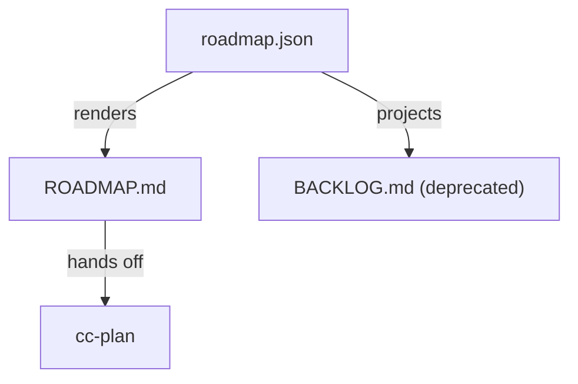

# ROADMAP

## Roadmap Meta

- Roadmap version: `roadmap.v2`
- Skill version: `5.3.1`
- Status: `active`
- Last updated: `2026-04-16`
- Owner / decider: `product-owner`
- Current focus stage: `Stage 2`
- Confidence: `medium`
- Supersedes roadmap version: `roadmap.v1`

## Context Snapshot

- Product / repo: `workspace-lite`
- Project stage: teams actively collaborate after the first-share fixes
- Users: workspace admins managing larger invite waves
- Pain: inviting many users one by one is slow and error-prone
- Existing workaround: admins repeatedly paste emails or use external spreadsheets
- Strongest demand evidence: support calls now ask for admin-scale invite workflows
- Why now: the product graduated past the first-share bottleneck
- Distribution path: direct beta expansion to larger teams
- Deadline / forcing function: larger-team beta starts on `2026-04-30`
- Team / capacity: one engineer plus part-time design help
- Hard constraints: billing and audit behavior must remain trustworthy
- Adoption / trust bottleneck: admins will not trust bulk invite if seat usage and audit logs drift
- Known unknowns: how duplicate users, seat limits, and partial imports should behave

## AI Leverage Route Lens

- Real user / operator: workspace admin onboarding 20-200 collaborators
- Status quo workaround: paste individual invite emails or coordinate in external spreadsheets
- Human-team effort for full scope: multiple weeks across product, engineering, billing, and support review
- CC / agent effort for full scope: several hours once row semantics are approved, but unbounded before that
- AI compression ratio: high after semantics freeze, low while the product contract is ambiguous
- Complete-lake boundary: row classification, admin upload flow, billing-seat checks, and audit mapping after rule approval
- Ocean boundary: SCIM, background retries, rollback wizard, and unspecified billing semantics
- Scope recommendation: `sharp-wedge`
- First success signal: admins can predict duplicate, invalid, and over-limit outcomes
- Kill signal: duplicate and seat-limit semantics remain unresolved
- Verdict: `sharp-wedge`
- Missing evidence before ready-for-cc-plan: none recorded at route handoff; cc-check later reopened duplicate, invalid-row, partial-success, and seat-limit semantics

## Route Options

| Shape | Why this could work | Why this may fail | Decision |
|-------|---------------------|-------------------|----------|
| wedge-first | deliver a minimal CSV import | may hide dangerous admin edge cases | Rejected |
| platform-first | design import rules, billing boundaries, and audit consistency first | slower upfront | Recommended |
| rescue-first | keep manual import and patch docs | does not solve admin pain | Rejected |

## Recommended Route

- Recommendation: `platform-first`
- Why this route wins now: the biggest risk is trust and consistency, not button placement
- Why the rejected routes lose now: a superficially small import flow can corrupt admin expectations if rules are underspecified
- First signal to watch: admins can predict what happens for duplicates, seat limits, and partial success
- Kill signal / stop condition: if the team cannot specify bulk invite semantics before implementation starts

## Implementation Tracking
- Roadmap state source: `roadmap.json`

<!-- roadmap-tracking:start -->
| RM-ID | Item | Stage | Priority | Primary Capability | Secondary Capabilities | Expected Spec Delta | Depends On | Status | REQ | Progress |
|------|------|------|------|------|------|------|------|------|------|------|
| RM-010 | Add CSV bulk invite import for admins | Stage 2 | P1 | cap-bulk-invite-import | cap-workspace-membership | define import semantics before widening current truth | - | Verification blocked | REQ-002 | 80% |
<!-- roadmap-tracking:end -->

## Technical Architecture

