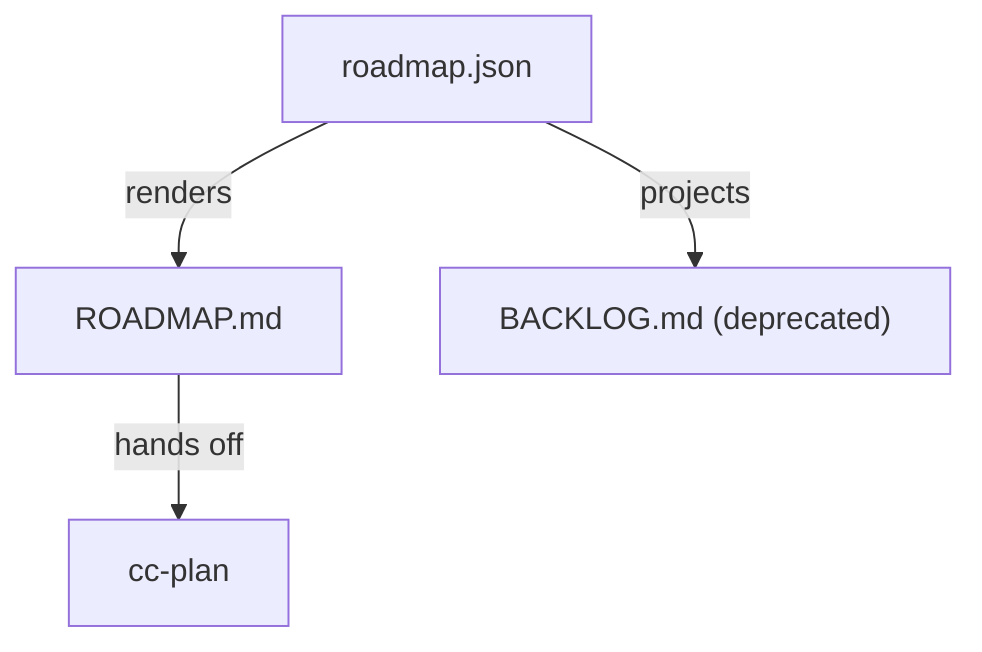

# ROADMAP

## Roadmap Meta

- Roadmap version: `roadmap.v3`
- Skill version: `5.2.0`
- Status: `active`
- Last updated: `2026-04-16`
- Owner / decider: `product-owner`
- Current focus stage: `Stage 2`
- Confidence: `medium`
- Supersedes roadmap version: `roadmap.v2`

## Context Snapshot

- Product / repo: `workspace-lite`
- Project stage: collaboration and admin reporting are now both in use
- Users: workspace admins reviewing activity and sharing reports internally
- Pain: admins can inspect audit events, but cannot export a concise summary
- Existing workaround: manually copy rows into an internal note
- Strongest demand evidence: admins ask for a downloadable summary during weekly reviews
- Why now: admin trust now depends on visibility and operational clarity
- Distribution path: internal admin beta
- Deadline / forcing function: internal ops review on `2026-04-25`
- Team / capacity: one engineer
- Hard constraints: keep export local to the current admin console
- Adoption / trust bottleneck: admins want proof they can take activity history out of the UI cleanly
- Known unknowns: whether CSV alone is enough or if JSON export will be needed later

## AI Leverage Route Lens

- Real user / operator: workspace admin preparing weekly activity review notes
- Status quo workaround: manually copy visible audit rows into an internal note
- Human-team effort for full scope: about one day for an engineer to implement, test, and document the local export
- CC / agent effort for full scope: about 30 minutes for visible-row CSV export plus targeted test and lint
- AI compression ratio: roughly 10x for the bounded local export path
- Complete-lake boundary: visible-row CSV export, panel action, current data source, targeted panel test, and lint
- Ocean boundary: JSON export, scheduled reporting, shared reporting backend, and cross-panel reporting platform
- Scope recommendation: `boil-lake`
- First success signal: admins finish weekly review without manual row copying
- Kill signal: implementation requires shared reporting pipeline redesign
- Verdict: `boil-lake`
- Missing evidence before ready-for-cc-plan: none

## Recommended Route

- Recommendation: `wedge-first`
- Why this route wins now: a simple downloadable summary removes the current reporting pain without broader analytics work
- Why the rejected routes lose now: platform and rescue variants add scope before the current operator need is solved
- First signal to watch: admins can finish weekly review without copying rows manually
- Kill signal / stop condition: if export requires a shared reporting pipeline redesign

## Implementation Tracking
- Roadmap state source: `roadmap.json`

<!-- roadmap-tracking:start -->
| RM-ID | Item | Stage | Priority | Primary Capability | Secondary Capabilities | Expected Spec Delta | Depends On | Status | REQ | Progress |
|------|------|------|------|------|------|------|------|------|------|------|
| RM-020 | Add an audit-log export summary download | Stage 2 | P1 | cap-audit-log-export | - | codify local export summary truth | - | Local handoff | REQ-003 | 100% |
<!-- roadmap-tracking:end -->

## Technical Architecture

